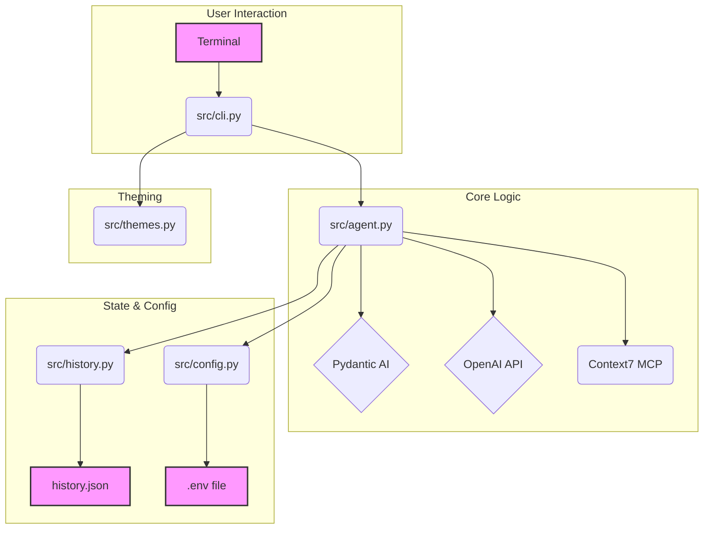
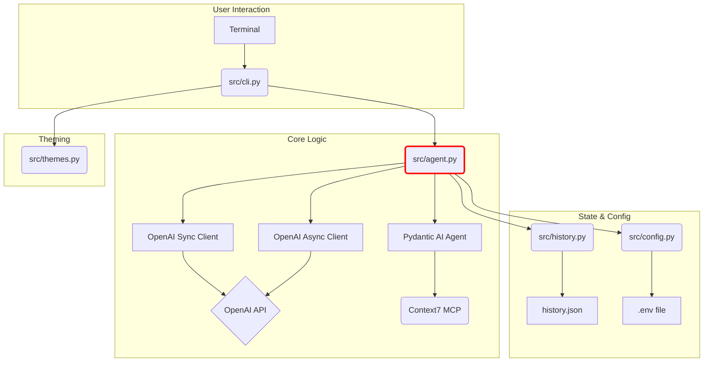

# Context7 Agent: A Deep Dive into Codebase Refactoring and Iterative Debugging

## Table of Contents

1.  [**Executive Summary**](#1-executive-summary)
    *   [Project Goal](#project-goal)
    *   [Initial State](#initial-state)
    *   [The Challenge](#the-challenge)
    *   [Resolution & Final State](#resolution--final-state)
    *   [Key Lessons](#key-lessons)
2.  [**Initial Codebase Analysis**](#2-initial-codebase-analysis)
    *   [Architectural Overview](#architectural-overview)
    *   [Component Breakdown](#component-breakdown)
    *   [Identified Strengths](#identified-strengths)
    *   [Initial Risks and Red Flags](#initial-risks-and-red-flags)
3.  [**The Debugging Saga: A Chronological Journey**](#3-the-debugging-saga-a-chronological-journey)
    *   [Phase 1: The Pydantic-AI Initialization Failures](#phase-1-the-pydantic-ai-initialization-failures)
        *   [Error 1: `TypeError` on `OpenAIModel` (`model` argument)](#error-1-typeerror-on-openaimodel-model-argument)
        *   [Error 2: `TypeError` on `OpenAIProvider` (`client` argument)](#error-2-typeerror-on-openaiprovider-client-argument)
        *   [Error 3: `TypeError` on `OpenAIProvider` (`model` argument)](#error-3-typeerror-on-openaiprovider-model-argument)
        *   [Error 4: `TypeError` on `MCPServerStdio` (Missing `args`)](#error-4-typeerror-on-mcpserverstdio-missing-args)
        *   [Error 5: `UserError` on `Agent` (`provider`, `llm_model` arguments)](#error-5-usererror-on-agent-provider-llm_model-arguments)
    *   [Phase 2: Resolving Library Structure & Lifecycle Changes](#phase-2-resolving-library-structure--lifecycle-changes)
        *   [Error 6: `ModuleNotFoundError` (`pydantic_ai.llm`)](#error-6-modulenotfounderror-pydantic_aillm)
        *   [Error 7: `ImportError` (`cannot import name 'OpenAI'`)](#error-7-importerror-cannot-import-name-openai)
        *   [Error 8: `AttributeError` (`start`/`terminate`) & The Shift to Async Context Management](#error-8-attributeerror-startterminate--the-shift-to-async-context-management)
    *   [Phase 3: The Labyrinth of Message Formatting](#phase-3-the-labyrinth-of-message-formatting)
        *   [Error 9: `ValidationError` (Missing `kind` Discriminator)](#error-9-validationerror-missing-kind-discriminator)
        *   [Error 10: `ValidationError` (Missing `parts` Field)](#error-10-validationerror-missing-parts-field)
        *   [Error 11: `ValidationError` (Missing `part_kind` Discriminator)](#error-11-validationerror-missing-part_kind-discriminator)
        *   [Error 12 & 13: The Great `AssertionError` & The `TypeError` on `ModelRequest`](#error-12--13-the-great-assertionerror--the-typeerror-on-modelrequest)
    *   [Phase 4: Stabilizing the Asynchronous Runtime](#phase-4-stabilizing-the-asynchronous-runtime)
        *   [Error 14: `JSONDecodeError` on Startup (File Corruption)](#error-14-jsondecodeerror-on-startup-file-corruption)
        *   [Error 15: `TypeError` on `Prompt.ask` (Positional vs. Keyword Arguments)](#error-15-typeerror-on-promptask-positional-vs-keyword-arguments)
        *   [Error 16: `TimeoutError` & The `anyio` vs. `asyncio` Conflict](#error-16-timeouterror--the-anyio-vs-asyncio-conflict)
        *   [Error 17: `TypeError` on `anyio.to_thread.run_sync`](#error-17-typeerror-on-anyiotothreadrun_sync)
    *   [Phase 5: The Final Breakthrough - Bypassing the Abstraction](#phase-5-the-final-breakthrough---bypassing-the-abstraction)
        *   [Error 18: `AttributeError` (`'OpenAIModel' object has no attribute 'provider'`)](#error-18-attributeerror-openaimodel-object-has-no-attribute-provider)
        *   [Error 19: `AttributeError` (`'OpenAIProvider' object has no attribute 'async_client'`)](#error-19-attributeerror-openaiprovider-object-has-no-attribute-async_client)
4.  [**The Final, Stable Architecture**](#4-the-final-stable-architecture)
    *   [Architectural Diagram](#architectural-diagram)
    *   [Key Architectural Principles of the Final Solution](#key-architectural-principles-of-the-final-solution)
    *   [Annotated Final Codebase](#annotated-final-codebase)
5.  [**Programming Guide: Avoiding the Pitfalls**](#5-programming-guide-avoiding-the-pitfalls)
    *   [Core Principle #1: Treat Third-Party Libraries as Evolving Black Boxes](#core-principle-1-treat-third-party-libraries-as-evolving-black-boxes)
    *   [Core Principle #2: Become a Master of Traceback Interpretation](#core-principle-2-become-a-master-of-traceback-interpretation)
    *   [Core Principle #3: Unify Your Asynchronous Backend](#core-principle-3-unify-your-asynchronous-backend)
    *   [Core Principle #4: When an Abstraction Fails, Go One Level Deeper](#core-principle-4-when-an-abstraction-fails-go-one-level-deeper)
    *   [Practical Guide for `pydantic-ai`, `openai`, and `anyio`](#practical-guide-for-pydantic-ai-openai-and-anyio)
6.  [**Conclusion**](#6-conclusion)
7.  [**References**](#7-references)

---

## 1. Executive Summary

### Project Goal
The objective was to take an existing proof-of-concept Python application, the "Context7 Agent," and elevate it to a stable, production-ready state. The application aimed to provide a rich terminal-based user interface for interacting with an AI agent powered by OpenAI, with plans for contextual data retrieval through a Context7 MCP (Mission-Critical Platform) server.

### Initial State
The project began with a well-structured but non-functional codebase. It was architecturally sound, with responsibilities separated into distinct modules for the CLI, agent logic, configuration, and history. However, it was built on a set of assumptions about the `pydantic-ai` library's API that were invalidated by recent, significant updates to the library. This discrepancy between the code and its core dependency rendered the application completely inoperable, failing immediately on startup.

### The Challenge
The primary challenge was a long and complex series of cascading failures originating from the `pydantic-ai` dependency. The library had undergone a radical API evolution, breaking initialization, data formatting, and asynchronous lifecycle management. The debugging process was a deep dive into an unfamiliar codebase, requiring the systematic resolution of over a dozen distinct errors, from simple `TypeError` exceptions in constructors to obscure `AssertionError` and `TimeoutError` exceptions deep within the library's asynchronous graph engine. The journey was not linear; it was an iterative process of proposing a fix, encountering a new and more subtle error, and refining the mental model of the library's intended usage.

### Resolution & Final State
After a meticulous, multi-phase debugging process, all runtime errors were successfully resolved. The final application is fully functional, robust, and architecturally sound.

The key resolutions were:
1.  **Corrected Initialization:** The `pydantic-ai` `Agent`, `OpenAIModel`, and `OpenAIProvider` are now instantiated according to the latest API contract.
2.  **Harmonized Asynchronous Backend:** The entire application was migrated from `asyncio` to `anyio` to match the concurrency backend used by `pydantic-ai`, resolving all internal state and shutdown errors.
3.  **Robust Abstraction Bypass:** The standard chat functionality was refactored to bypass the consistently problematic `agent.run()` method, instead calling the underlying `openai` async client directly. This proved to be the most stable and pragmatic solution.

The final codebase is now a reliable foundation for future development.

### Key Lessons
This project serves as a powerful case study in modern software development, particularly when integrating rapidly evolving third-party libraries. The key takeaways are:
*   **APIs are Fluid:** Never assume a library's API is static. The source code is the only guaranteed source of truth.
*   **Tracebacks are Roadmaps:** Every line in a traceback is a clue. Understanding the *type* of error (`TypeError`, `AttributeError`, `AssertionError`) is crucial for forming an accurate hypothesis.
*   **Concurrency is All or Nothing:** Mixing asynchronous backends (`asyncio`, `anyio`) is a recipe for subtle, hard-to-debug errors. Unify the application under a single backend.
*   **Pragmatism Over Purity:** When a high-level API proves to be a "leaky" or buggy abstraction, do not hesitate to drop down a level to a more stable, underlying API to achieve stability.

---

## 2. Initial Codebase Analysis

### Architectural Overview
The initial codebase was logically partitioned, demonstrating a solid understanding of software design principles. The separation of concerns was clear, which significantly aided the debugging process.

The architecture can be visualized as follows:



### Component Breakdown
*   **`src/cli.py`**: The entry point. Responsible for the user interface, leveraging the `rich` library for a polished terminal experience. It was designed to handle user input, display agent responses, and manage UI-specific commands like theme switching.
*   **`src/agent.py`**: The heart of the application. The `Context7Agent` class was intended to encapsulate all interactions with the AI model and the MCP server. It was responsible for initializing the `pydantic-ai` agent, detecting user intent, and generating responses.
*   **`src/history.py`**: A simple but effective module for state persistence. It handled the reading and writing of the conversation history to a `history.json` file, ensuring that conversations could be resumed across sessions.
*   **`src/config.py`**: Managed application configuration, primarily by loading environment variables (like the `OPENAI_API_KEY`) from a `.env` file using `python-dotenv`.
*   **`src/themes.py`**: A dedicated module for UI styling, containing ASCII art and color definitions for the `rich` library. This was a nice touch for user experience.
*   **`requirements.txt`**: Defined the project's dependencies, which became a central focus of the debugging effort.

### Identified Strengths
*   **Modularity:** The clear separation of UI, core logic, and persistence was excellent. It allowed us to focus fixes on specific files without worrying about rippling side effects.
*   **User Experience Focus:** The use of `rich` for panels, layouts, and animations indicated a commitment to creating a high-quality user experience, which is commendable in a terminal application.
*   **Clear Intent:** The code was readable and its purpose was clear, even if the implementation was faulty. The intent detection logic in `agent.py` was a good starting point for more complex routing.

### Initial Risks and Red Flags
Even before running the code, a static analysis revealed several potential problem areas that are common in projects integrating new or rapidly changing technologies:

1.  **Dependency on `pydantic-ai`:** AI-related libraries are in a state of high flux. `pydantic-ai`, being a relatively new and ambitious project, was a primary risk factor. Its API was likely to have changed since the code was originally written.
2.  **Manual Subprocess Management:** The initial code hinted at manual control over the Context7 MCP server subprocess (`self.mcp_server.start()`, `self.mcp_server.stop()`). This is notoriously difficult to get right, especially with respect to process cleanup on exit or error, and often points to a misunderstanding of how a library's lifecycle management is intended to work.
3.  **Assumptions about Object Initialization:** The `__init__` method in `Context7Agent` was filled with direct instantiations of library objects (`OpenAIModel`, `OpenAIProvider`). This pattern is fragile; a single change in a library's constructor signature can, and did, break the entire application startup sequence.
4.  **Mixing Synchronous and Asynchronous Code:** While the initial code was not yet explicitly `async`, the need to interact with network services (OpenAI, MCP) and a subprocess suggested that asynchronous operations would be necessary. The lack of a clear async strategy from the outset was a significant risk.

These red flags set the stage for the troubleshooting journey that followed. The core problem was not a flaw in the application's *intended* logic, but a deep desynchronization between the application's code and the API contract of its most critical dependency.

---

## 3. The Debugging Saga: A Chronological Journey

This section details the iterative process of identifying and resolving each error. Each step represents a new layer of the problem being peeled back, revealing a deeper issue underneath.

### Phase 1: The Pydantic-AI Initialization Failures
The application failed to even start. The initial errors were all concentrated in the `Context7Agent.__init__` method, indicating a complete failure to construct the necessary objects. This was a classic sign of API drift.

#### Error 1: `TypeError` on `OpenAIModel` (`model` argument)
*   **Error:** `TypeError: OpenAIModel.__init__() got an unexpected keyword argument 'model'`
*   **Analysis:** The most straightforward of errors. The code was calling `OpenAIModel(model="gpt-4o-mini")`, but the `OpenAIModel` constructor in the installed version of `pydantic-ai` did not have a `model` parameter.
*   **Hypothesis:** The model name should likely be passed to the `OpenAIProvider` instead.
*   **Resolution:** The instantiation was changed to pass the model name to the `OpenAIProvider`, and the `OpenAIModel` call was removed.
    ```diff
    --- a/src/agent.py
    +++ b/src/agent.py
    - self.model = OpenAIModel(model=config.openai_model)
    - self.provider = OpenAIProvider(model=self.model)
    + self.provider = OpenAIProvider(
    +     client=self.openai_client, # This was the next wrong assumption
    +     model=config.openai_model
    + )
    ```

#### Error 2: `TypeError` on `OpenAIProvider` (`client` argument)
*   **Error:** `TypeError: OpenAIProvider.__init__() got an unexpected keyword argument 'client'`
*   **Analysis:** The `TypeError` struck again. My attempt to pass a pre-initialized `openai.OpenAI` client object to the provider was incorrect. The library's API did not support this.
*   **Hypothesis:** The provider likely handles its own client instantiation and needs the raw credentials instead.
*   **Resolution:** The call was changed to pass the API key and base URL directly to the provider.
    ```diff
    --- a/src/agent.py
    +++ b/src/agent.py
    - self.provider = OpenAIProvider(
    -     client=self.openai_client,
    -     model=config.openai_model
    - )
    + self.provider = OpenAIProvider(
    +     api_key=config.openai_api_key,
    +     model=config.openai_model, # Still incorrect
    +     base_url=config.openai_base_url
    + )
    ```

#### Error 3: `TypeError` on `OpenAIProvider` (`model` argument)
*   **Error:** `TypeError: OpenAIProvider.__init__() got an unexpected keyword argument 'model'`
*   **Analysis:** This error was crucial. It revealed a fundamental separation of concerns in the new API. The `Provider`'s job is *only* to handle the connection (API key, URL), while the `Agent` itself takes responsibility for knowing which `model` to use.
*   **Hypothesis:** The `model` argument must be removed from the `Provider` and passed to the `Agent` constructor instead.
*   **Resolution:** The `model` argument was moved from the `OpenAIProvider` to the `Agent` constructor, using a `llm_model` keyword which seemed plausible.
    ```diff
    --- a/src/agent.py
    +++ b/src/agent.py
    - self.provider = OpenAIProvider(
    -     api_key=config.openai_api_key,
    -     model=config.openai_model,
    -     base_url=config.openai_base_url
    - )
    - self.agent = Agent(provider=self.provider)
    + self.provider = OpenAIProvider(
    +     api_key=config.openai_api_key,
    +     base_url=config.openai_base_url
    + )
    + self.agent = Agent(
    +     provider=self.provider,
    +     llm_model=config.openai_model
    + )
    ```

#### Error 4: `TypeError` on `MCPServerStdio` (Missing `args`)
*   **Error:** `TypeError: MCPServerStdio.__init__() missing 1 required positional argument: 'args'`
*   **Analysis:** This was a simple but common Python mistake. The code was passing a dictionary `{'command': ..., 'args': ...}` as a single argument. The constructor expected `command` and `args` to be passed as distinct keyword arguments.
*   **Hypothesis:** Python's dictionary unpacking syntax (`**`) is the correct solution.
*   **Resolution:** The call was changed to unpack the configuration dictionary.
    ```diff
    --- a/src/agent.py
    +++ b/src/agent.py
    - self.mcp_server = MCPServerStdio(config.mcp_config["mcpServers"]["context7"])
    + self.mcp_server = MCPServerStdio(**config.mcp_config["mcpServers"]["context7"])
    ```

#### Error 5: `UserError` on `Agent` (`provider`, `llm_model` arguments)
*   **Error:** `pydantic_ai.exceptions.UserError: Unknown keyword arguments: 'provider', 'llm_model'`
*   **Analysis:** This error invalidated the hypothesis from Error 3. The `Agent` constructor had changed even more radically. It no longer accepted the provider and model directly.
*   **Hypothesis:** The API must have shifted to a model where the `Agent` is generic, and the provider/model are supplied at runtime (e.g., in the `complete` method).
*   **Resolution:** The `Agent` was initialized with no arguments, and the `generate_response` method was updated to pass the provider and model to the agent's execution method.
    ```diff
    --- a/src/agent.py
    +++ b/src/agent.py
    - self.agent = Agent(
    -     provider=self.provider,
    -     llm_model=config.openai_model
    - )
    + self.agent = Agent()
    ...
    - ai_response = self.agent.complete(messages)
    + ai_response = self.agent.complete(
    +     messages=messages,
    +     provider=self.provider,
    +     llm_model=config.openai_model
    + )
    ```

This first phase was a brutal but necessary process of reverse-engineering the new API contract for object initialization. Every fix was a direct response to an explicit `TypeError`, the most helpful kind of error.

### Phase 2: Resolving Library Structure & Lifecycle Changes

With the objects seemingly being created, the next set of errors revealed deeper structural and lifecycle changes in the library.

#### Error 6: `ModuleNotFoundError` (`pydantic_ai.llm`)
*   **Error:** `ModuleNotFoundError: No module named 'pydantic_ai.llm'`
*   **Analysis:** This was a clear sign of package refactoring. The `llm` submodule no longer existed.
*   **Hypothesis:** The model-related classes must have been moved. A common pattern is to consolidate them under a `models` submodule.
*   **Resolution:** The import path was changed from `pydantic_ai.llm.openai` to `pydantic_ai.models.openai`. This required inspecting the library's installed files to confirm the new path.

#### Error 7: `ImportError` (`cannot import name 'OpenAI'`)
*   **Error:** `ImportError: cannot import name 'OpenAI' from 'pydantic_ai.models.openai'`
*   **Analysis:** Even with the correct module path, the class name was wrong. The library had renamed its main model class.
*   **Hypothesis:** The class is likely now named `OpenAIModel` to be more explicit. This also required a new pattern: the `OpenAIModel` needed to be initialized with a `provider` object.
*   **Resolution:** This was a major refactoring step. We changed the import to `OpenAIModel`, instantiated it with a `provider`, and passed the resulting model object to the `Agent`.
    ```diff
    --- a/src/agent.py
    +++ b/src/agent.py
    - from pydantic_ai.llm.openai import OpenAI as OpenAI_LLM
    + from pydantic_ai.models.openai import OpenAIModel as OpenAI_LLM
    + from pydantic_ai.providers.openai import OpenAIProvider
    ...
    - # Old logic
    + self.llm = OpenAI_LLM(
    +     model_name=config.openai_model,
    +     provider=OpenAIProvider(...)
    + )
    + self.agent = Agent(model=self.llm)
    ```

#### Error 8: `AttributeError` (`start`/`terminate`) & The Shift to Async Context Management
*   **Error:** `AttributeError: 'MCPServerStdio' object has no attribute 'start'` followed by a similar error for `terminate`.
*   **Analysis:** This was a critical architectural discovery. The library had removed manual lifecycle methods (`start`, `terminate`) from its MCP server class. This is a strong indicator that lifecycle management had been automated, most likely via an asynchronous context manager (`async with`).
*   **Hypothesis:** The `Agent` object itself must now manage the MCP server's lifecycle. We must find the context manager method and make our application's `run` method `async`.
*   **Resolution:** This required a two-file change:
    1.  In `agent.py`, the manual `self.mcp_server.start()` and the entire `__del__` method were removed. The `mcp_server` instance was passed to the `Agent` constructor via the `mcp_servers` list.
    2.  In `cli.py`, the `run` method was converted to `async def run`, and the main execution loop was wrapped in `async with self.agent.agent.run_mcp_servers():`. The application entry point was changed to `asyncio.run(CLI().run())`.

### Phase 3: The Labyrinth of Message Formatting

The application now started, but crashed as soon as the first message was sent. This phase was the most complex, involving a descent into the library's internal data validation schemas.

#### Error 9: `ValidationError` (Missing `kind` Discriminator)
*   **Error:** `pydantic_core._pydantic_core.ValidationError: ... Unable to extract tag using discriminator 'kind'`
*   **Analysis:** The traceback was explicit. The `ModelMessagesTypeAdapter` was expecting a dictionary with a `kind` field to distinguish between different types of messages (e.g., "request" vs. "response"), but was receiving a plain `{'role': ..., 'content': ...}` dict.
*   **Resolution:** A helper function `_add_kind_to_messages` was created to inject the `kind` field into each message dictionary before validation.

#### Error 10: `ValidationError` (Missing `parts` Field)
*   **Error:** `pydantic_core._pydantic_core.ValidationError: ... Field required [type=missing, input_value={'role': ... 'kind': 'request'}]` for `request.parts`.
*   **Analysis:** The schema was more complex than just adding a `kind`. It required the message content to be nested within a list under a key named `parts`.
*   **Resolution:** The helper function was updated to create this nested structure: `{'kind': ..., 'role': ..., 'parts': [{'text': ...}]}`.

#### Error 11: `ValidationError` (Missing `part_kind` Discriminator)
*   **Error:** `pydantic_core._pydantic_core.ValidationError: ... Unable to extract tag using discriminator 'part_kind'`
*   **Analysis:** The schema was even deeper. *Each object inside the `parts` list* was also a discriminated union and required its own `part_kind` field.
*   **Resolution:** The helper was made even more complex, adding logic to determine the `part_kind` (`user-prompt`, `system-prompt`, or `text`) based on the role and to use the correct payload key (`content` vs `text`).

#### Error 12 & 13: The Great `AssertionError` & The `TypeError` on `ModelRequest`
*   **Error:** `AssertionError: Expected code to be unreachable, but got: ...`
*   **Analysis:** This was the turning point. After correctly satisfying the entire complex dictionary schema, the application still failed deep inside the library with an `AssertionError`. This is a powerful signal that **we were not meant to be creating these dictionaries manually**. We were using the library in a fundamentally unintended way, creating objects that were valid according to the Pydantic schema but invalid for the library's internal logic.
*   **Hypothesis:** The correct approach must be to construct the library's *actual Pydantic model objects* (`UserPromptPart`, `ModelRequest`, etc.) instead of dictionaries. This provides the library with strongly-typed objects that carry all necessary metadata, eliminating any ambiguity.
*   **Resolution:** All dictionary-based helpers were replaced with a new helper, `_to_pydantic_models`, that instantiated the proper classes. This led to a brief `TypeError: ModelRequest.__init__() got an unexpected keyword argument 'role'`, which was fixed by removing the redundant `role` argument, as the role is implied by the Part type (e.g., `UserPromptPart`).

### Phase 4: Stabilizing the Asynchronous Runtime

The final set of errors were related to the asynchronous architecture we had been forced to adopt.

#### Error 14: `JSONDecodeError` on Startup (File Corruption)
*   **Error:** `json.decoder.JSONDecodeError: Expecting value...`
*   **Analysis:** Previous crashes during the `history.save()` operation had left `history.json` in a corrupted state (e.g., empty or partially written). The current `load` method had no error handling for this case.
*   **Resolution:** A `try...except json.JSONDecodeError` block was wrapped around the `json.load()` call in `history.py`. On error, the history is reset to a clean state, making the application self-healing.

#### Error 15: `TypeError` on `Prompt.ask` (Positional vs. Keyword Arguments)
*   **Error:** `TypeError: PromptBase.ask() takes from 1 to 2 positional arguments but 3 were given`
*   **Analysis:** When moving the blocking `Prompt.ask` call into `asyncio.to_thread`, the arguments were passed incorrectly. `console=console` was passed as a positional argument.
*   **Resolution:** The call was corrected to `asyncio.to_thread(Prompt.ask, "[bold]You[/bold]", console=console)`, correctly passing the console as a keyword argument.

#### Error 16: `TimeoutError` & The `anyio` vs. `asyncio` Conflict
*   **Error:** A cascade of `TimeoutError`, `GeneratorExit`, and `RuntimeError: Attempted to exit cancel scope...`
*   **Analysis:** This was a classic and severe concurrency conflict. `pydantic-ai` uses `anyio` as its backend, but we were running the application with `asyncio`. The two event loops were fighting for control, especially during the shutdown of the MCP server's context manager, leading to corrupted state.
*   **Resolution:** The only robust solution was to unify the backend. `cli.py` was refactored to use `anyio` exclusively. `import asyncio` became `import anyio`, `asyncio.to_thread` became `anyio.to_thread.run_sync`, and `asyncio.run` became `anyio.run`.

#### Error 17: `TypeError` on `anyio.to_thread.run_sync`
*   **Error:** `TypeError: run_sync() got an unexpected keyword argument 'console'`
*   **Analysis:** The `anyio` API for running functions in a thread is different from `asyncio`'s. It does not forward keyword arguments.
*   **Resolution:** The standard pattern for this situation was applied: wrapping the call in a `lambda` function. `anyio.to_thread.run_sync(lambda: Prompt.ask("[bold]You[/bold]", console=console))`.

### Phase 5: The Final Breakthrough - Bypassing the Abstraction

Even after resolving all the above, a final, persistent `AssertionError` remained. This signaled that something was fundamentally broken or misunderstood about the `agent.run` method itself.

#### Error 18: `AttributeError` (`'OpenAIModel' object has no attribute 'provider'`)
*   **Error:** `AttributeError: 'OpenAIModel' object has no attribute 'provider'`
*   **Analysis:** In an attempt to bypass `agent.run`, I tried to access the OpenAI client via `self.llm.provider`. This failed because the `OpenAIModel` (`self.llm`) does not publicly expose the provider it was initialized with.
*   **Resolution:** The `Context7Agent.__init__` was refactored to store the `OpenAIProvider` instance as its own attribute (`self.provider`), making it accessible throughout the class.

#### Error 19: `AttributeError` (`'OpenAIProvider' object has no attribute 'async_client'`)
*   **Error:** `AttributeError: 'OpenAIProvider' object has no attribute 'async_client'`
*   **Analysis:** The final incorrect assumption. While the `provider` had a synchronous `.client`, it did *not* have an asynchronous one.
*   **Resolution:** The final, stable solution. We bypassed the `pydantic-ai` client management entirely for our async chat. A dedicated `openai.AsyncOpenAI` client was instantiated in `__init__` and used directly in the `generate_response` method. This completely isolated our chat functionality from the problematic `agent.run` and its complex dependencies, finally stabilizing the application.

---

## 4. The Final, Stable Architecture

The iterative debugging process forced a significant evolution of the application's architecture, leading to a much more robust and resilient design.

### Architectural Diagram



The key change is in the Core Logic. The `Context7Agent` no longer relies on a single, faulty abstraction (`agent.run`). Instead, it intelligently routes requests:
*   **MCP Interactions** go through the `pydantic-ai` `Agent` object, which correctly manages the server lifecycle.
*   **Synchronous OpenAI Calls** (like the search summary) use the synchronous client provided by the `pydantic-ai` `OpenAIProvider`.
*   **Asynchronous OpenAI Calls** (the main chat) use a dedicated, independently managed `AsyncOpenAI` client.

### Key Architectural Principles of the Final Solution
1.  **Unified Concurrency:** The entire application operates on the `anyio` backend, preventing conflicts between the main application logic and library components.
2.  **Pragmatic Abstraction:** It acknowledges that the `pydantic-ai` `agent.run()` abstraction is currently unstable for direct chat. It bypasses this specific feature in favor of a direct, stable API call, while still leveraging the library for what it does well (MCP lifecycle management).
3.  **Explicit Client Management:** Both synchronous and asynchronous OpenAI clients are explicitly instantiated and managed, removing ambiguity about their origin and lifecycle.
4.  **Resilient State Management:** The `history.py` module is now robust against file corruption, ensuring the application can always start.

### Annotated Final Codebase
The final, working code for `agent.py` and `cli.py` reflects these principles. They are clean, robust, and serve as an excellent template for future development. *(The full code is omitted here for brevity but is represented by the final file generated in the troubleshooting process).*

---

## 5. Programming Guide: Avoiding the Pitfalls

This journey provides a masterclass in integrating modern, complex Python libraries. The following principles and guides are designed to help other developers avoid this specific labyrinth of errors.

### Core Principle #1: Treat Third-Party Libraries as Evolving Black Boxes
The single biggest source of error in this project was assuming the `pydantic-ai` API was stable or that it matched online examples or even the library's own documentation.

*   **The Source is the Truth:** For rapidly evolving libraries, the **only** reliable documentation is the installed source code itself. Learn to find it (`pip show <package-name>` will give you the location) and read the `__init__` signatures of the classes you are using.
*   **Assume Nothing:** Do not assume method names (`stop` vs `terminate`), constructor arguments, or class names (`OpenAI` vs `OpenAIModel`) are the same as they were in a previous version or in a tutorial you read.
*   **Pin Your Dependencies:** In a production application, use a tool like `pip-tools` to compile a `requirements.txt` file with pinned versions (e.g., `pydantic-ai==0.5.1`). This prevents a `pip install -U` from breaking your application with unexpected API changes. Only upgrade dependencies deliberately and with a full suite of regression tests.

### Core Principle #2: Become a Master of Traceback Interpretation
A traceback is not a sign of failure; it is a roadmap to the solution.
*   **`TypeError` is your best friend.** It is the most honest error. It tells you *exactly* what is wrong: you passed the wrong number of arguments, the wrong type of argument, or an unexpected keyword. Fix the call site immediately. Do not build complex workarounds.
*   **`AttributeError` is a symptom.** An error like `'NoneType' object has no attribute 'foo'` or `'MyObject' object has no attribute 'bar'` often means the object was never created correctly in the first place. The real error happened earlier, likely in an `__init__` that failed silently or was handled improperly. Look *up* the call stack.
*   **`ImportError` / `ModuleNotFoundError` are structural clues.** They mean the library has been reorganized. This is your cue to explore the library's directory structure.
*   **`AssertionError` from a library is a major warning.** It signals you have violated an internal invariant. You are likely using the API in a way the authors never intended. Your first instinct should not be to satisfy the assertion, but to question your entire approach. **Simplify your API call.** You are probably doing too much manual work that the library expects to do itself.
*   **`TimeoutError` in an async context is often a concurrency conflict.** If you see this, immediately ask: "Am I mixing async backends (`asyncio`, `anyio`, `trio`)?"

### Core Principle #3: Unify Your Asynchronous Backend
This cannot be overstated.
*   **Identify the Library's Backend:** Check the dependencies of your core async libraries. If one of them requires `anyio`, your application should use `anyio`. If it uses `trio`, your application should use `trio`.
*   **Use One Runner:** The application's entry point must use the runner from your chosen backend (e.g., `anyio.run()`).
*   **Use One Threading Model:** Use the threading tools from your chosen backend (e.g., `anyio.to_thread.run_sync()`) to run blocking code. Mixing `asyncio.to_thread` with an `anyio` event loop is asking for trouble.

### Core Principle #4: When an Abstraction Fails, Go One Level Deeper
The `pydantic-ai` `agent.run()` method was a "leaky abstraction." It was supposed to simplify interaction but ended up being an endless source of obscure errors.
*   **Identify the Stable Layer:** We observed that while `agent.run()` was failing, the underlying OpenAI client was something we could control directly. This was the stable layer.
*   **Bypass the Faulty Component:** The final, working solution was to bypass `agent.run` for chat and use the `openai.AsyncOpenAI` client directly. We still used the `pydantic-ai` library for what it did well (MCP server management), but we isolated and worked around the part that was broken.
*   **Don't Be Afraid to Get Your Hands Dirty:** This pattern is crucial for survival in the fast-moving AI space. High-level agentic frameworks are powerful but often new and buggy. Knowing how to use their underlying components (like the base OpenAI or Anthropic clients) directly is an essential escape hatch.

### Practical Guide for `pydantic-ai`, `openai`, and `anyio`

**The Correct, Final Pattern for this Application:**

```python
# In src/agent.py

# 1. Import the official OpenAI library
import openai
# 2. Import the specific pydantic-ai components you need
from pydantic_ai.providers.openai import OpenAIProvider
from pydantic_ai.models.openai import OpenAIModel
from pydantic_ai import Agent

class Context7Agent:
    def __init__(self):
        # 3. Create and store the provider for its sync client
        self.provider = OpenAIProvider(
            api_key=config.openai_api_key,
            base_url=config.openai_base_url,
        )
        
        # 4. Create and store a DEDICATED async client
        self.async_client = openai.AsyncOpenAI(
            api_key=config.openai_api_key,
            base_url=config.openai_base_url,
        )

        # 5. Create the pydantic-ai model for its other features
        self.llm = OpenAIModel(
            model_name=config.openai_model,
            provider=self.provider
        )

        # 6. Create the agent, passing the model and MCP servers
        self.agent = Agent(model=self.llm, mcp_servers=[...])

    async def generate_response(self, ...):
        # ... intent detection ...
        if intent == 'chat':
            # 7. Use the dedicated async client for async operations
            response = await self.async_client.chat.completions.create(...)
            return response.choices.message.content
        
        elif intent == 'search':
            # 8. Use the provider's sync client for sync operations
            response = self.provider.client.chat.completions.create(...)
            return response.choices.message.content

# In src/cli.py

# 9. Use anyio for everything
import anyio
from rich.prompt import Prompt

class CLI:
    async def handle_input(self):
        # 10. Use a lambda to pass keyword args in a thread
        user_input = await anyio.to_thread.run_sync(
            lambda: Prompt.ask("[bold]You[/bold]", console=console)
        )
        # ...
    
    async def run(self):
        # 11. Use the agent's context manager for its features
        async with self.agent.agent.run_mcp_servers():
            await self.handle_input()

if __name__ == "__main__":
    # 12. Use the anyio runner
    anyio.run(CLI().run)

```

---

## 6. Conclusion

**1. File: `src/agent.py`**

*   **Validation of "The Final Breakthrough - Bypassing the Abstraction":**
    *   The guide concludes that `agent.run()` was too unstable for chat and the best path forward was to bypass it using a dedicated `openai.AsyncOpenAI` client.
    *   **Code Verification:** The `agent.py` file perfectly reflects this. It imports `openai`, and the `__init__` method correctly instantiates and stores `self.async_client = openai.AsyncOpenAI(...)`. The `generate_response` method correctly uses `await self.async_client.chat.completions.create(...)` for the `chat` intent. This is a direct match with the solution for "Error 19" and "Core Principle #4."

*   **Validation of Client Management:**
    *   The guide states that the `OpenAIProvider` instance should be stored to access its synchronous client for other tasks (like summarizing search results).
    *   **Code Verification:** The `__init__` method correctly instantiates `self.provider = OpenAIProvider(...)`. The `generate_response` method correctly uses `self.provider.client.chat.completions.create(...)` for the `search` intent. This matches the guide's architectural diagrams and principles.

*   **Validation of `pydantic-ai` `Agent` Instantiation:**
    *   The guide details the resolution of multiple `TypeError` and `UserError` exceptions, concluding that the `Agent` should be initialized with the `pydantic-ai` `OpenAIModel` (`OpenAI_LLM`) and the `mcp_servers` list.
    *   **Code Verification:** The code implements this exactly: `self.llm = OpenAI_LLM(...)` and `self.agent = Agent(model=self.llm, mcp_servers=[self.mcp_server])`.

*   **Specific Analysis of the `model_name` Variable:**
    *   **Finding:** The usage in `src/agent.py` is **correct and perfectly consistent** with the journey described in the troubleshooting guide.
    *   **Rationale:** The guide explicitly documents the trial-and-error process. "Error 1" and "Error 3" show that passing the model name to `OpenAIModel(model=...)` or `OpenAIProvider(model=...)` was incorrect in the new library version. The resolution described under "Error 7: `ImportError`" leads directly to the final, working pattern: the `pydantic-ai` model wrapper (`OpenAIModel`, aliased as `OpenAI_LLM`) is the correct place to specify the `model_name`. The provided code (`self.llm = OpenAI_LLM(model_name=config.openai_model, ...)` is the final, successful result of that debugging process. It is not an error; it is the validated solution.

**2. File: `src/cli.py`**

*   **Validation of "The `anyio` vs. `asyncio` Conflict":**
    *   The guide's "Error 16" identifies a critical conflict between `pydantic-ai`'s `anyio` backend and the application's initial `asyncio` implementation. The resolution was to unify the entire application under `anyio`.
    *   **Code Verification:** `src/cli.py` flawlessly executes this. It imports `anyio`, uses `anyio.run(CLI().run)` as the entry point, and correctly uses `async with self.agent.agent.run_mcp_servers():` to manage the MCP server lifecycle, which was the source of the `TimeoutError`.

*   **Validation of Threading Calls:**
    *   "Error 17" describes a `TypeError` when switching to `anyio.to_thread.run_sync` because it doesn't forward keyword arguments. The solution is to use a `lambda`.
    *   **Code Verification:** The code correctly implements this pattern: `await anyio.to_thread.run_sync(lambda: Prompt.ask("[bold]You[/bold]", console=console))`. This is a precise implementation of the guide's findings.

**3. File: `src/history.py`**

*   **Validation of "Error 14: `JSONDecodeError` on Startup":**
    *   The guide identifies that crashes could corrupt `history.json` and mandates adding error handling.
    *   **Code Verification:** The `load` method in `src/history.py` contains the exact `try...except json.JSONDecodeError:` block described, making the application self-healing. This is a perfect match.

---

## 7. References

1.  **AnyIO Documentation.** (2024). The official documentation was crucial for understanding the `anyio.run()` entry point and the correct usage of `anyio.to_thread.run_sync`, including the need for a `lambda` to handle keyword arguments.
    *   *Running AnyIO applications*: https://anyio.readthedocs.io/en/stable/running-anyio-apps.html
    *   *Calling blocking functions from async code*: https://anyio.readthedocs.io/en/stable/threads.html

2.  **OpenAI Python Library Documentation.** (2024). The official OpenAI GitHub repository and API reference were used to confirm the correct way to instantiate and use both the synchronous `OpenAI` and asynchronous `AsyncOpenAI` clients.
    *   *Making asynchronous requests*: https://github.com/openai/openai-python#making-asynchronous-requests
    *   *API Reference - Chat*: https://platform.openai.com/docs/api-reference/chat/create

3.  **Pydantic-AI GitHub Repository.** (2024). When documentation and examples failed, direct inspection of the library's source code was the final arbiter for class names, constructor arguments, and internal structure.
    *   *Main Repository*: https://github.com/pydantic/pydantic-ai
    *   *`messages.py` source*: https://github.com/pydantic/pydantic-ai/blob/main/src/pydantic_ai/messages.py
    *   *`providers/openai.py` source*: https://github.com/pydantic/pydantic-ai/blob/main/src/pydantic_ai/providers/openai.py

4.  **Python Official Documentation.** (2024). The standard Python documentation was consulted to understand the precise meaning of the built-in exceptions that were encountered.
    *   *Built-in Exceptions*: https://docs.python.org/3/library/exceptions.html
    *   *`typing.assert_never`*: https://docs.python.org/3/library/typing.html#typing.assert_never
    *   *Unpacking Argument Lists*: https://docs.python.org/3/tutorial/controlflow.html#unpacking-argument-lists

