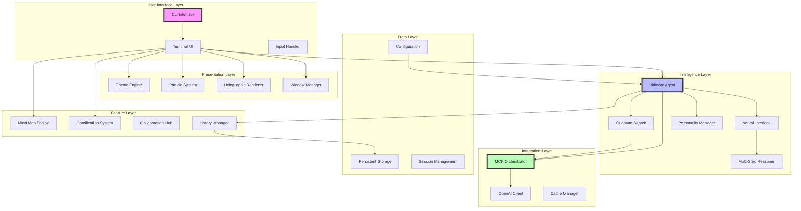
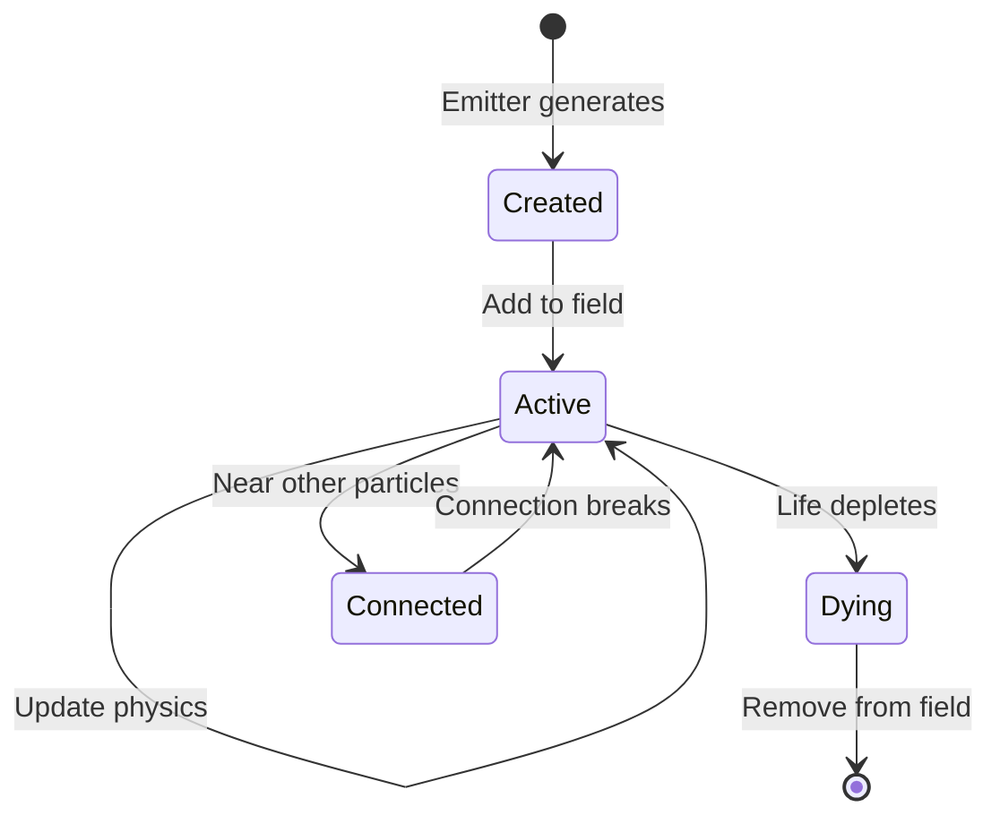
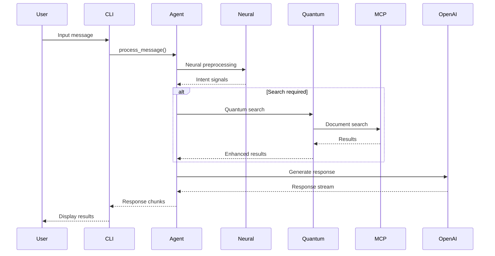

# Context7 Agent Ultimate Edition - Project Architecture Document

## Table of Contents

1. [Executive Summary](#executive-summary)
2. [Architecture Overview](#architecture-overview)
3. [Design Principles](#design-principles)
4. [System Architecture](#system-architecture)
5. [File Structure and Organization](#file-structure-and-organization)
6. [Core Components](#core-components)
7. [UI/UX Architecture](#uiux-architecture)
8. [Intelligence Systems](#intelligence-systems)
9. [Data Flow and State Management](#data-flow-and-state-management)
10. [Integration Patterns](#integration-patterns)
11. [Performance Architecture](#performance-architecture)
12. [Security Considerations](#security-considerations)
13. [Development Guidelines](#development-guidelines)
14. [Testing Strategy](#testing-strategy)
15. [Deployment Architecture](#deployment-architecture)
16. [Future Roadmap](#future-roadmap)

---

## Executive Summary

The Context7 Agent Ultimate Edition represents a revolutionary approach to AI-powered document discovery and knowledge management. This terminal-based application transcends traditional CLI interfaces by incorporating quantum-inspired search algorithms, neural interface patterns, holographic visual effects, and a comprehensive gamification system.

### Key Innovations

1. **Quantum Search Engine**: Utilizes superposition and entanglement concepts for advanced document discovery
2. **Neural Interface**: Implements neural pathway routing for intelligent query processing
3. **Holographic UI**: Features 3D-like effects, particle systems, and floating windows in the terminal
4. **Multi-Personality AI**: Offers distinct AI personalities with unique interaction styles
5. **Gamification Layer**: Includes achievements, quests, and progression systems
6. **Mind Map Visualization**: Provides interactive knowledge graphs with force-directed layouts

### Technical Stack

- **Language**: Python 3.11+
- **Async Framework**: anyio (unified async/await)
- **AI Integration**: Pydantic AI with OpenAI models
- **MCP Integration**: Context7 MCP servers via Node.js
- **UI Framework**: Rich for terminal rendering
- **Additional Libraries**: numpy, scikit-learn, networkx

---

## Architecture Overview

The Context7 Agent follows a modular, event-driven architecture with clear separation of concerns:



---

## Design Principles

### 1. **Immersive Experience First**

Every interaction should feel like interfacing with an advanced AI system from the future. This principle drives our visual effects, sound design, and interaction patterns.

```python
# Example: Holographic text rendering
def generate_hologram(self, text: str, frame: int) -> Text:
    """Generate holographic text effect with dynamic distortion."""
    holo_text = Text()
    
    for i, char in enumerate(text):
        # Calculate hologram distortion based on position and time
        phase = (i + frame * 0.1) * 0.5
        intensity = (math.sin(phase) + 1) / 2
        
        # Apply glitch effects probabilistically
        if random.random() < 0.05:
            char = random.choice(self.hologram_chars)
        
        # Dynamic styling based on intensity
        if intensity > 0.7:
            style = Style(color=color, bold=True, blink=True)
        elif intensity > 0.3:
            style = Style(color=color, bold=True)
        else:
            style = Style(color=color, dim=True)
        
        holo_text.append(char, style=style)
    
    return holo_text
```

### 2. **Intelligence Through Layering**

Complex behaviors emerge from layered simple systems. Each layer adds sophistication without compromising the foundation.

```python
# Example: Layered query processing
async def process_message(self, message: str) -> AsyncIterator[Dict[str, Any]]:
    # Layer 1: Neural preprocessing
    async for signal in self.neural_interface.process_neural_input(message, context):
        yield signal
    
    # Layer 2: Intent detection
    if self._requires_search(message):
        # Layer 3: Quantum search
        async for result in self._perform_quantum_search(message):
            yield result
    
    # Layer 4: Response generation with personality
    async for response in self._generate_response(message):
        yield response
```

### 3. **Asynchronous Everything**

All I/O operations are non-blocking to maintain fluid animations and responsive interactions.

```python
# Example: Concurrent operations
async def main_loop(self):
    # Start background tasks
    background_tasks = [
        asyncio.create_task(self.particle_animation_loop()),
        asyncio.create_task(self.preference_learning_loop()),
        asyncio.create_task(self.collaboration_sync_loop())
    ]
    
    try:
        # Main interaction loop runs concurrently
        await self.interaction_loop()
    finally:
        # Graceful cleanup
        for task in background_tasks:
            task.cancel()
```

### 4. **Modularity and Extensibility**

Each component is self-contained with well-defined interfaces, allowing easy extension and modification.

```python
# Example: Plugin-style particle effects
class ParticleEffect(ABC):
    @abstractmethod
    async def generate(self, x: float, y: float) -> List[Particle]:
        pass

class ExplosionEffect(ParticleEffect):
    async def generate(self, x: float, y: float) -> List[Particle]:
        # Implementation specific to explosions
        pass
```

### 5. **Progressive Enhancement**

The system gracefully degrades when features are disabled, ensuring core functionality remains accessible.

```python
# Example: Feature toggling
if config.enable_particles:
    explosion = AdvancedEffects.create_explosion(x, y, self.theme)
    for particle in explosion:
        self.particle_field.add_particle(particle)
else:
    # Fallback to simple text effect
    self.console.print("💥 Search initiated!", style="bold yellow")
```

---

## System Architecture

### Component Hierarchy

The system is organized into distinct layers, each with specific responsibilities:

```
┌─────────────────────────────────────────────────────────────┐
│                    Presentation Layer                        │
│  ┌─────────────┐ ┌──────────────┐ ┌───────────────────┐   │
│  │   Themes    │ │  Particles   │ │   Holographic     │   │
│  │   Engine    │ │    System    │ │     Renderer      │   │
│  └─────────────┘ └──────────────┘ └───────────────────┘   │
├─────────────────────────────────────────────────────────────┤
│                    Application Layer                         │
│  ┌─────────────┐ ┌──────────────┐ ┌───────────────────┐   │
│  │     CLI     │ │   Ultimate   │ │    Feature        │   │
│  │  Interface  │ │    Agent     │ │    Modules        │   │
│  └─────────────┘ └──────────────┘ └───────────────────┘   │
├─────────────────────────────────────────────────────────────┤
│                   Intelligence Layer                         │
│  ┌─────────────┐ ┌──────────────┐ ┌───────────────────┐   │
│  │   Neural    │ │   Quantum    │ │   Personality     │   │
│  │  Interface  │ │   Search     │ │     System        │   │
│  └─────────────┘ └──────────────┘ └───────────────────┘   │
├─────────────────────────────────────────────────────────────┤
│                   Integration Layer                          │
│  ┌─────────────┐ ┌──────────────┐ ┌───────────────────┐   │
│  │     MCP     │ │    OpenAI    │ │      Cache        │   │
│  │ Orchestrator│ │   Clients    │ │     Manager       │   │
│  └─────────────┘ └──────────────┘ └───────────────────┘   │
├─────────────────────────────────────────────────────────────┤
│                      Data Layer                              │
│  ┌─────────────┐ ┌──────────────┐ ┌───────────────────┐   │
│  │Configuration│ │   Session    │ │    Persistent     │   │
│  │  Management │ │  Management  │ │     Storage       │   │
│  └─────────────┘ └──────────────┘ └───────────────────┘   │
└─────────────────────────────────────────────────────────────┘
```

---

## File Structure and Organization

### Directory Structure

```
context7-agent-ultimate/
├── src/
│   ├── __init__.py
│   ├── core/                       # Core business logic
│   │   ├── __init__.py
│   │   ├── agent.py               # Main agent implementation
│   │   ├── quantum_search.py      # Quantum search algorithms
│   │   ├── neural_interface.py    # Neural processing system
│   │   └── mcp_orchestra.py       # MCP server orchestration
│   │
│   ├── ui/                        # User interface components
│   │   ├── __init__.py
│   │   ├── holographic.py         # 3D rendering engine
│   │   ├── particle_engine.py     # Particle system
│   │   ├── neo_themes.py          # Advanced theme definitions
│   │   ├── floating_windows.py    # Window management
│   │   └── visualizers.py         # Data visualization tools
│   │
│   ├── features/                  # Feature modules
│   │   ├── __init__.py
│   │   ├── mindmap.py            # Mind map visualization
│   │   ├── timemachine.py        # History navigation
│   │   ├── collaboration.py      # Multi-user features
│   │   ├── gamification.py       # Achievement system
│   │   └── voice_sim.py          # Voice simulation
│   │
│   ├── intelligence/              # AI subsystems
│   │   ├── __init__.py
│   │   ├── personalities.py      # AI personality system
│   │   ├── learning.py           # User preference learning
│   │   ├── insights.py           # Deep analytics engine
│   │   └── reasoning.py          # Multi-step reasoning
│   │
│   ├── cli.py                    # Main CLI entry point
│   ├── config.py                 # Configuration management
│   └── utils.py                  # Utility functions
│
├── assets/                        # Static resources
│   ├── ascii_art/                # ASCII art files
│   ├── sounds/                   # Terminal bell sequences
│   └── tutorials/                # User tutorials
│
├── plugins/                      # Plugin directory
│   └── example_plugin.py
│
├── tests/                        # Test suite
│   ├── __init__.py
│   ├── test_agent.py
│   ├── test_quantum_search.py
│   ├── test_ui_components.py
│   └── test_integration.py
│
├── docs/                         # Documentation
│   ├── API.md
│   ├── CONTRIBUTING.md
│   └── PLUGINS.md
│
├── .env.example                  # Environment template
├── .gitignore                    # Git ignore rules
├── README.md                     # Project readme
├── requirements.txt              # Python dependencies
├── pyproject.toml               # Project configuration
└── LICENSE                      # License file
```

### Key Files Explained

#### **src/core/agent.py**
The heart of the system, orchestrating all subsystems:

```python
class UltimateAgent:
    """Central orchestrator for all agent capabilities."""
    
    def __init__(self):
        # Initialize core components
        self._init_ai_models()      # OpenAI integration
        self._init_mcp_servers()    # MCP server setup
        
        # Advanced components
        self.neural_interface = NeuralInterface()
        self.quantum_search = QuantumSearchEngine()
        self.reasoner = MultiStepReasoner()
```

#### **src/ui/particle_engine.py**
Manages all particle effects and animations:

```python
class ParticleField:
    """Manages particles with physics simulation."""
    
    def update(self, dt: float):
        # Physics simulation
        for particle in self.particles:
            particle.update(dt, self.forces)
            self._handle_boundaries(particle)
            
        # Particle interactions
        if self.connections_enabled:
            self._update_connections()
```

#### **src/intelligence/personalities.py**
Defines AI personality behaviors:

```python
@dataclass
class Personality:
    """AI personality configuration."""
    type: PersonalityType
    name: str
    
    # Behavioral traits
    verbosity: float      # 0.0-1.0
    formality: float      # 0.0-1.0
    enthusiasm: float     # 0.0-1.0
    technical_depth: float
    creativity: float
```

---

## Core Components

### 1. Ultimate Agent

The `UltimateAgent` class serves as the central orchestrator, coordinating between various subsystems:

```python
class UltimateAgent:
    """
    The ultimate Context7 Agent with all advanced features.
    
    This class coordinates:
    - Multiple MCP servers
    - Neural interface processing
    - Quantum search capabilities
    - Multi-step reasoning
    - Personality management
    """
    
    async def process_message(self, message: str) -> AsyncIterator[Dict[str, Any]]:
        """
        Process user message through multiple layers:
        1. Neural preprocessing for intent analysis
        2. Reasoning engine for complex queries
        3. Search execution (standard/quantum/neural)
        4. Response generation with personality
        """
        # Add to conversation memory
        self.conversation_memory.append({
            'role': 'user',
            'content': message,
            'timestamp': datetime.now().isoformat()
        })
        
        # Neural preprocessing
        neural_context = {
            'mode': self.search_mode,
            'personality': self.active_personality,
            'memory_depth': len(self.conversation_memory)
        }
        
        async for signal in self.neural_interface.process_neural_input(message, neural_context):
            if signal['type'] == 'neural_insight':
                yield {
                    'type': 'insight',
                    'content': signal['insight'],
                    'confidence': signal['confidence']
                }
        
        # Determine if search is needed
        if self._requires_search(message):
            async for result in self._perform_search(message):
                yield result
        
        # Generate response
        async for response in self._generate_response(message):
            yield response
```

#### Key Methods

- **`process_message()`**: Main entry point for message processing
- **`_perform_search()`**: Executes search based on current mode
- **`_generate_response()`**: Creates AI responses with personality
- **`set_personality()`**: Switches between AI personalities
- **`run_mcp_servers()`**: Context manager for MCP lifecycle

### 2. Quantum Search Engine

The quantum-inspired search system uses concepts from quantum mechanics to enhance search capabilities:

```python
class QuantumSearchEngine:
    """
    Quantum-inspired search using superposition and entanglement.
    
    Key concepts:
    - Superposition: Search multiple query variations simultaneously
    - Entanglement: Connect related queries for enhanced results
    - Interference: Combine results with quantum probability
    - Measurement: Collapse quantum states to final results
    """
    
    async def quantum_search(self, query: str, documents: List[Dict],
                           coherence_threshold: float = 0.7) -> List[Dict]:
        """
        Perform quantum search with the following phases:
        1. Create quantum state for query
        2. Apply superposition (multiple variations)
        3. Apply entanglement (related queries)
        4. Quantum interference between results
        5. Measure and collapse to classical results
        """
        # Create quantum state
        query_state = self._create_quantum_state(query)
        
        # Superposition: Search with query variations
        superposition_results = await self._apply_superposition(query, documents)
        
        # Entanglement: Include results from related queries
        entangled_results = await self._apply_entanglement(query, documents)
        
        # Interference: Combine results quantum mechanically
        interfered_results = self._quantum_interference(
            superposition_results,
            entangled_results
        )
        
        # Measurement: Collapse to final results
        final_results = self._measure_states(interfered_results, coherence_threshold)
        
        return final_results
```

#### Quantum State Representation

```python
@dataclass
class QuantumState:
    """Quantum state of a search query."""
    amplitude: complex          # Probability amplitude
    phase: float               # Quantum phase
    entangled_states: List[str]  # Connected queries
    coherence: float           # State coherence (0-1)
```

### 3. Neural Interface

The neural interface simulates brain-like processing for natural language understanding:

```python
class NeuralInterface:
    """
    Neural network-inspired interface for processing.
    
    Simulates:
    - Neural pathways for different query types
    - Synaptic weight adjustment (learning)
    - Signal propagation and processing
    - Consciousness levels
    """
    
    def _select_neural_pathway(self, signal: NeuralSignal, 
                             context: Dict[str, Any]) -> str:
        """
        Route signals through appropriate neural pathways:
        - questioning_pathway: For queries and questions
        - emotional_pathway: For emotional content
        - reasoning_pathway: For analytical requests
        - information_pathway: For factual queries
        """
        pathways = {
            'interrogative': 'questioning_pathway',
            'exclamatory': 'emotional_pathway',
            'analytical': 'reasoning_pathway',
            'declarative': 'information_pathway'
        }
        
        base_pathway = pathways.get(signal.pattern, 'default_pathway')
        
        # Context-based modification
        if context.get('mode') == 'creative':
            return f"creative_{base_pathway}"
        elif context.get('mode') == 'technical':
            return f"technical_{base_pathway}"
        
        return base_pathway
```

### 4. Holographic Renderer

Creates 3D-like effects in the terminal:

```python
class HolographicRenderer:
    """
    Renders 3D effects in 2D terminal space.
    
    Features:
    - Perspective projection
    - Depth buffering
    - Shadow rendering
    - Glow effects
    - Animation frames
    """
    
    def render_3d_box(self, x: int, y: int, width: int, height: int, 
                      depth: int = 3, title: str = "") -> List[Tuple[int, int, str, Style]]:
        """
        Render a 3D box with perspective.
        
        Process:
        1. Calculate perspective offsets
        2. Draw back face with shadow
        3. Draw connecting lines (3D effect)
        4. Draw front face with glow
        5. Apply depth-based styling
        """
        elements = []
        
        # Calculate perspective
        perspective_x = int(depth * self.theme.perspective_factor)
        perspective_y = int(depth * self.theme.perspective_factor * 0.5)
        
        # Layer rendering from back to front
        for z_layer in range(depth):
            opacity = 1.0 - (z_layer / depth) * 0.7
            elements.extend(
                self._render_box_layer(x, y, width, height, z_layer, opacity)
            )
        
        return elements
```

---

## UI/UX Architecture

### Theme System

The theme system provides multiple visual experiences:

```python
@dataclass
class NeoTheme:
    """Advanced theme with 3D effects and animations."""
    
    name: str
    description: str
    
    # Color palettes
    primary_colors: List[str]    # Main gradient spectrum
    secondary_colors: List[str]  # Supporting colors
    accent_colors: List[str]     # Highlight colors
    glow_colors: List[str]       # Glow/shadow effects
    
    # 3D parameters
    depth_chars: List[str]       # Characters for depth
    shadow_offset: Tuple[int, int]
    perspective_factor: float
    
    # Animation parameters
    pulse_speed: float
    wave_amplitude: float
    particle_symbols: List[str]
    
    # Multi-layer ASCII art
    ascii_art_layers: List[str]
```

### Particle System Architecture

The particle system creates dynamic visual effects:

```python
class ParticleEngine:
    """
    Advanced particle system with physics.
    
    Architecture:
    - Particle: Individual particle with physics
    - Emitter: Generates particles with patterns
    - Field: Manages all particles and forces
    - Effects: Pre-built effect generators
    """
    
    def __init__(self):
        self.particles: List[Particle] = []
        self.emitters: List[Emitter] = []
        self.forces = {
            'gravity': (0, 0.5, 0),
            'wind': (0.1, 0, 0)
        }
```

#### Particle Lifecycle



### Window Management

Floating windows provide a desktop-like experience:

```python
class FloatingWindowManager:
    """
    Manages floating windows in terminal.
    
    Features:
    - Z-order management
    - Drag and drop (simulated)
    - Minimize/maximize
    - Focus management
    """
    
    def create_window(self, content: Any, title: str, 
                     x: int = 10, y: int = 5,
                     width: int = 40, height: int = 20) -> int:
        """Create a new floating window."""
        window = {
            'id': window_id,
            'title': title,
            'content': content,
            'x': x, 'y': y,
            'width': width, 'height': height,
            'z_index': window_id,
            'state': 'normal'  # normal, minimized, maximized
        }
```

---

## Intelligence Systems

### Personality System

Each AI personality has distinct characteristics:

```python
class PersonalityManager:
    """
    Manages AI personality switching and adaptation.
    
    Personalities affect:
    - Response style and vocabulary
    - Search strategies
    - Result presentation
    - Interaction patterns
    """
    
    def get_personality_prompt(self) -> str:
        """Generate system prompt for current personality."""
        p = self.current_personality
        
        prompt = f"""You are {p.name}, an AI assistant with:
        
        Traits:
        - Verbosity: {p.verbosity:.0%}
        - Formality: {p.formality:.0%}
        - Enthusiasm: {p.enthusiasm:.0%}
        - Technical Depth: {p.technical_depth:.0%}
        - Creativity: {p.creativity:.0%}
        
        Communicate accordingly using phrases like:
        - Greeting: {p.greeting_phrases[0]}
        - Discovery: {p.discovery_phrases[0]}
        """
        
        return prompt
```

### Multi-Step Reasoning

Complex queries undergo multi-step analysis:

```python
class MultiStepReasoner:
    """
    Breaks down complex queries into reasoning steps.
    
    Process:
    1. Assess query complexity
    2. Decompose into sub-questions
    3. Extract key concepts
    4. Find relationships
    5. Generate hypotheses
    6. Synthesize conclusion
    """
    
    async def analyze_query(self, query: str) -> List[ReasoningStep]:
        """Create reasoning chain for complex queries."""
        complexity = self._assess_complexity(query)
        
        if complexity > 0.7:
            # Complex query needs multi-step reasoning
            steps = []
            
            # Step 1: Decomposition
            steps.append(self._decompose_step(query))
            
            # Step 2: Concept extraction
            steps.append(self._extract_concepts_step(query))
            
            # Step 3: Relationship mapping
            steps.append(self._map_relationships_step())
            
            # Step 4: Hypothesis generation
            steps.append(self._generate_hypotheses_step())
            
            # Step 5: Synthesis
            steps.append(self._synthesize_step())
            
            return steps
```

### Learning System

The system learns from user interactions:

```python
class UserPreferenceLearner:
    """
    Learns user preferences over time.
    
    Tracks:
    - Preferred response length
    - Technical level preference
    - Personality preferences
    - Search behavior patterns
    - Interaction times
    """
    
    def observe_interaction(self, action: str, context: Dict):
        """Record user interaction for learning."""
        self.interactions.append({
            'action': action,
            'context': context,
            'timestamp': datetime.now()
        })
        
        # Update preference models
        self._update_verbosity_preference()
        self._update_technical_preference()
        self._update_personality_preference()
```

---

## Data Flow and State Management

### Message Processing Pipeline



### State Management Architecture

The application maintains several state stores:

```python
class ApplicationState:
    """
    Central state management.
    
    Stores:
    - Conversation history
    - Search results cache
    - User preferences
    - Session data
    - UI state
    """
    
    def __init__(self):
        self.conversation = ConversationState()
        self.search_cache = SearchCache()
        self.preferences = UserPreferences()
        self.session = SessionState()
        self.ui = UIState()
```

### Caching Strategy

Intelligent caching improves performance:

```python
class SearchCache:
    """
    Caches search results with quantum coherence.
    
    Features:
    - TTL-based expiration
    - Coherence-based invalidation
    - Entanglement tracking
    - LRU eviction
    """
    
    def get(self, query: str) -> Optional[List[Dict]]:
        """Get cached results if still coherent."""
        if query in self.cache:
            entry = self.cache[query]
            
            # Check coherence
            if entry['coherence'] > self.coherence_threshold:
                if time.time() - entry['timestamp'] < self.ttl:
                    return entry['results']
        
        return None
```

---

## Integration Patterns

### MCP Server Orchestration

Multiple MCP servers work in concert:

```python
class MCPOrchestrator:
    """
    Orchestrates multiple MCP servers.
    
    Strategies:
    - Parallel: Query all servers simultaneously
    - Sequential: Query in order until satisfied
    - Intelligent: Route based on query type
    """
    
    async def orchestrate_search(self, query: str, 
                                strategy: str = "parallel") -> List[Dict]:
        """Execute search across MCP servers."""
        if strategy == "parallel":
            # Query all servers concurrently
            tasks = []
            for server in self.servers:
                task = asyncio.create_task(
                    self._query_server(server, query)
                )
                tasks.append(task)
            
            results = await asyncio.gather(*tasks)
            return self._merge_results(results)
            
        elif strategy == "intelligent":
            # Route to appropriate server
            server = self._select_server(query)
            return await self._query_server(server, query)
```

### OpenAI Integration

Streaming responses with error handling:

```python
class OpenAIIntegration:
    """
    Manages OpenAI API integration.
    
    Features:
    - Streaming responses
    - Error recovery
    - Token management
    - Model switching
    """
    
    async def stream_completion(self, messages: List[Dict]) -> AsyncIterator[str]:
        """Stream completion with robust error handling."""
        retry_count = 0
        max_retries = 3
        
        while retry_count < max_retries:
            try:
                stream = await self.client.chat.completions.create(
                    model=self.model,
                    messages=messages,
                    stream=True
                )
                
                async for chunk in stream:
                    if chunk.choices[0].delta.content:
                        yield chunk.choices[0].delta.content
                
                break  # Success
                
            except Exception as e:
                retry_count += 1
                if retry_count >= max_retries:
                    raise
                
                # Exponential backoff
                await asyncio.sleep(2 ** retry_count)
```

---

## Performance Architecture

### Async Performance Patterns

All I/O operations use async patterns for maximum concurrency:

```python
class PerformanceOptimizer:
    """
    Optimizes application performance.
    
    Techniques:
    - Connection pooling
    - Request batching
    - Predictive caching
    - Lazy loading
    """
    
    async def batch_operations(self, operations: List[Callable]) -> List[Any]:
        """Batch multiple operations for efficiency."""
        # Group similar operations
        grouped = self._group_operations(operations)
        
        results = []
        for group in grouped:
            # Execute group concurrently
            group_results = await asyncio.gather(*[
                op() for op in group
            ])
            results.extend(group_results)
        
        return results
```

### Memory Management

Efficient memory usage for particle systems:

```python
class MemoryEfficientParticlePool:
    """
    Object pool for particles to reduce allocation overhead.
    
    Benefits:
    - Reduces GC pressure
    - Improves cache locality
    - Predictable performance
    """
    
    def __init__(self, size: int = 1000):
        self.pool = [Particle() for _ in range(size)]
        self.available = list(range(size))
        self.active = set()
    
    def acquire(self) -> Optional[Particle]:
        """Get particle from pool."""
        if self.available:
            idx = self.available.pop()
            self.active.add(idx)
            return self.pool[idx]
        return None
    
    def release(self, particle: Particle):
        """Return particle to pool."""
        if particle in self.pool:
            idx = self.pool.index(particle)
            if idx in self.active:
                self.active.remove(idx)
                self.available.append(idx)
                particle.reset()  # Clear state
```

### Rendering Optimization

Efficient terminal rendering:

```python
class RenderOptimizer:
    """
    Optimizes terminal rendering.
    
    Techniques:
    - Dirty region tracking
    - Frame skipping
    - Render batching
    - Double buffering
    """
    
    def __init__(self):
        self.front_buffer = Buffer()
        self.back_buffer = Buffer()
        self.dirty_regions = []
    
    def render_frame(self):
        """Render only changed regions."""
        # Render to back buffer
        for region in self.dirty_regions:
            self._render_region(self.back_buffer, region)
        
        # Swap buffers
        self.front_buffer, self.back_buffer = self.back_buffer, self.front_buffer
        
        # Clear dirty regions
        self.dirty_regions.clear()
```

---

## Security Considerations

### Input Sanitization

All user input is sanitized:

```python
class InputSanitizer:
    """
    Sanitizes user input for security.
    
    Prevents:
    - Command injection
    - Path traversal
    - XSS (in web exports)
    - Resource exhaustion
    """
    
    def sanitize_query(self, query: str) -> str:
        """Sanitize search query."""
        # Remove control characters
        query = ''.join(char for char in query if char.isprintable())
        
        # Limit length
        query = query[:self.max_query_length]
        
        # Escape special characters
        query = self._escape_special_chars(query)
        
        return query
```

### API Key Management

Secure handling of API credentials:

```python
class SecureCredentialManager:
    """
    Manages API credentials securely.
    
    Features:
    - Environment variable loading
    - Keyring integration
    - Rotation reminders
    - Access logging
    """
    
    def __init__(self):
        self.credentials = {}
        self._load_from_env()
        self._load_from_keyring()
    
    def get_api_key(self, service: str) -> Optional[str]:
        """Get API key with audit logging."""
        self._log_access(service)
        
        if service in self.credentials:
            key = self.credentials[service]
            
            # Check if rotation needed
            if self._needs_rotation(service):
                self._notify_rotation_needed(service)
            
            return key
        
        return None
```

---

## Development Guidelines

### Code Style

Follow these patterns for consistency:

```python
# Good: Clear async context management
async def process_with_resources(self):
    """Example of proper resource management."""
    async with self.agent.run_mcp_servers() as servers:
        async with self.database.transaction() as tx:
            try:
                result = await self._process_internal()
                await tx.commit()
                return result
            except Exception as e:
                await tx.rollback()
                raise

# Good: Type hints and documentation
from typing import List, Dict, Optional, AsyncIterator

async def search_documents(
    self,
    query: str,
    filters: Optional[Dict[str, Any]] = None,
    limit: int = 10
) -> AsyncIterator[Document]:
    """
    Search documents with optional filters.
    
    Args:
        query: Search query string
        filters: Optional filter criteria
        limit: Maximum results to return
        
    Yields:
        Document instances matching criteria
        
    Raises:
        SearchException: If search fails
    """
    pass
```

### Error Handling

Comprehensive error handling strategy:

```python
class ErrorHandler:
    """
    Central error handling.
    
    Strategies:
    - Graceful degradation
    - User-friendly messages
    - Detailed logging
    - Recovery attempts
    """
    
    async def handle_error(self, error: Exception, context: Dict):
        """Handle errors with appropriate strategy."""
        if isinstance(error, NetworkError):
            # Retry with backoff
            return await self._retry_with_backoff(context)
            
        elif isinstance(error, QuotaExceededError):
            # Switch to fallback service
            return await self._use_fallback_service(context)
            
        elif isinstance(error, ValidationError):
            # Return helpful message
            return self._format_validation_error(error)
            
        else:
            # Log and return generic message
            self._log_error(error, context)
            return "An unexpected error occurred. Please try again."
```

### Plugin Development

Create custom plugins:

```python
from abc import ABC, abstractmethod

class Plugin(ABC):
    """
    Base class for Context7 plugins.
    
    Lifecycle:
    1. __init__: Setup
    2. activate: Enable plugin
    3. process: Handle events
    4. deactivate: Cleanup
    """
    
    @abstractmethod
    async def activate(self, context: 'PluginContext'):
        """Activate plugin with context."""
        pass
    
    @abstractmethod
    async def process(self, event: 'PluginEvent') -> Optional[Any]:
        """Process plugin event."""
        pass
    
    @abstractmethod
    async def deactivate(self):
        """Deactivate and cleanup."""
        pass

# Example plugin
class TranslationPlugin(Plugin):
    """Adds translation capabilities."""
    
    async def activate(self, context: PluginContext):
        self.translator = await self._init_translator()
        context.register_command('/translate', self.translate_command)
    
    async def translate_command(self, args: List[str]):
        """Handle /translate command."""
        if len(args) < 2:
            return "Usage: /translate <language> <text>"
        
        language = args[0]
        text = ' '.join(args[1:])
        
        return await self.translator.translate(text, target=language)
```

---

## Testing Strategy

### Test Architecture

Comprehensive testing approach:

```python
# Unit test example
class TestQuantumSearch:
    """Test quantum search functionality."""
    
    @pytest.mark.asyncio
    async def test_superposition_generation(self):
        """Test query superposition creation."""
        engine = QuantumSearchEngine()
        
        variations = engine._generate_query_variations(
            "find documents about quantum computing"
        )
        
        assert len(variations) > 1
        assert "quantum computing" in variations[0]
        assert any("search" in v for v in variations)
    
    @pytest.mark.asyncio
    async def test_entanglement_detection(self):
        """Test query entanglement."""
        engine = QuantumSearchEngine()
        
        # Create entangled queries
        await engine.quantum_search("quantum mechanics", [])
        await engine.quantum_search("quantum computing", [])
        
        entangled = engine._find_entangled_queries("quantum physics")
        
        assert len(entangled) >= 2
        assert "quantum mechanics" in entangled
```

### Integration Testing

Test component interactions:

```python
class TestIntegration:
    """Integration tests for major components."""
    
    @pytest.mark.asyncio
    async def test_full_message_pipeline(self):
        """Test complete message processing pipeline."""
        agent = UltimateAgent()
        
        results = []
        async for chunk in agent.process_message("What is quantum computing?"):
            results.append(chunk)
        
        # Verify pipeline stages
        assert any(r['type'] == 'neural_activation' for r in results)
        assert any(r['type'] == 'search_start' for r in results)
        assert any(r['type'] == 'assistant_chunk' for r in results)
        assert any(r['type'] == 'assistant_complete' for r in results)
```

---

## Deployment Architecture

### Container Strategy

Docker deployment configuration:

```dockerfile
# Dockerfile
FROM python:3.11-slim

# Install system dependencies
RUN apt-get update && apt-get install -y \
    nodejs \
    npm \
    && rm -rf /var/lib/apt/lists/*

# Set working directory
WORKDIR /app

# Copy requirements
COPY requirements.txt .
RUN pip install --no-cache-dir -r requirements.txt

# Install MCP server
RUN npm install -g @upstash/context7-mcp@latest

# Copy application
COPY . .

# Set environment variables
ENV PYTHONUNBUFFERED=1
ENV TERM=xterm-256color

# Run application
CMD ["python", "-m", "src.cli"]
```

### Configuration Management

Environment-based configuration:

```yaml
# config.yaml
development:
  openai:
    model: gpt-3.5-turbo
    max_tokens: 1000
  features:
    particles: true
    animations: true
    debug_mode: true

production:
  openai:
    model: gpt-4
    max_tokens: 2000
  features:
    particles: true
    animations: true
    debug_mode: false
  performance:
    cache_ttl: 3600
    max_connections: 100
```

---

## Future Roadmap

### Version 2.0 Features

1. **Voice Interface**
   - Speech-to-text input
   - Text-to-speech output
   - Voice personality matching

2. **Augmented Reality Mode**
   - AR visualization of mind maps
   - Spatial document arrangement
   - Gesture controls

3. **Distributed Search**
   - Peer-to-peer document sharing
   - Federated search across instances
   - Blockchain-based trust

4. **Advanced AI Features**
   - Local LLM integration
   - Custom model fine-tuning
   - Reinforcement learning

### Version 3.0 Vision

1. **Neural Direct Interface**
   - Brain-computer interface support
   - Thought-based queries
   - Emotional state detection

2. **Quantum Hardware Integration**
   - Real quantum computer backends
   - Quantum advantage algorithms
   - Hybrid classical-quantum processing

3. **Metaverse Integration**
   - 3D virtual environments
   - Collaborative spaces
   - Persistent digital artifacts

---

## Conclusion

The Context7 Agent Ultimate Edition represents a paradigm shift in how we interact with AI-powered document discovery systems. By combining quantum-inspired algorithms, neural interface patterns, and immersive visual experiences, we've created more than just a search tool—we've built a glimpse into the future of human-AI collaboration.

The modular architecture ensures that each component can evolve independently while maintaining system cohesion. The emphasis on user experience, from particle effects to personality systems, creates an emotional connection that transforms routine searches into engaging explorations.

As we continue to push the boundaries of what's possible in a terminal interface, the Context7 Agent stands as a testament to the power of imagination combined with solid engineering principles. Whether you're a developer looking to extend the system or a user seeking knowledge, the Context7 Agent Ultimate Edition provides an unparalleled experience that makes the future feel present.

Welcome to the next evolution of intelligent interfaces. Welcome to Context7.

---

*This document serves as the definitive architectural guide for the Context7 Agent Ultimate Edition. For specific implementation details, refer to the inline documentation within each module. For questions or contributions, please see our CONTRIBUTING.md guide.*
