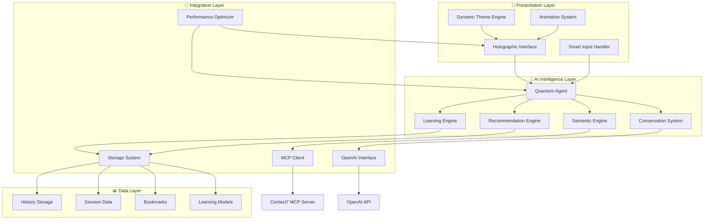
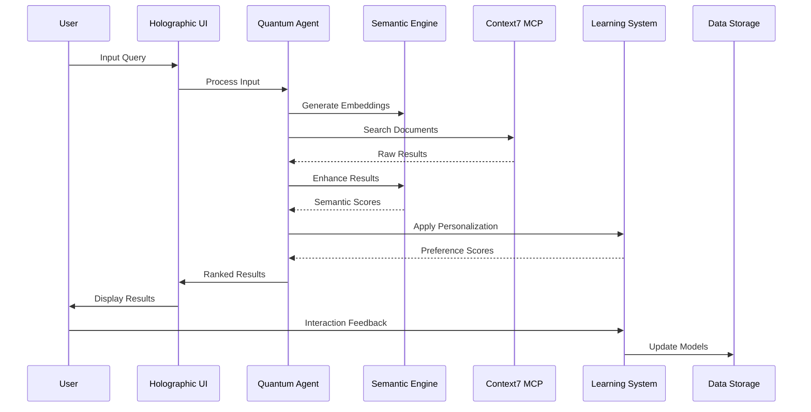
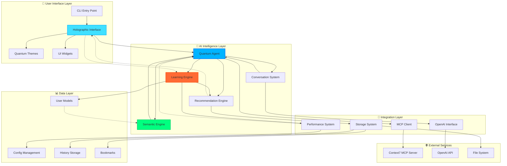
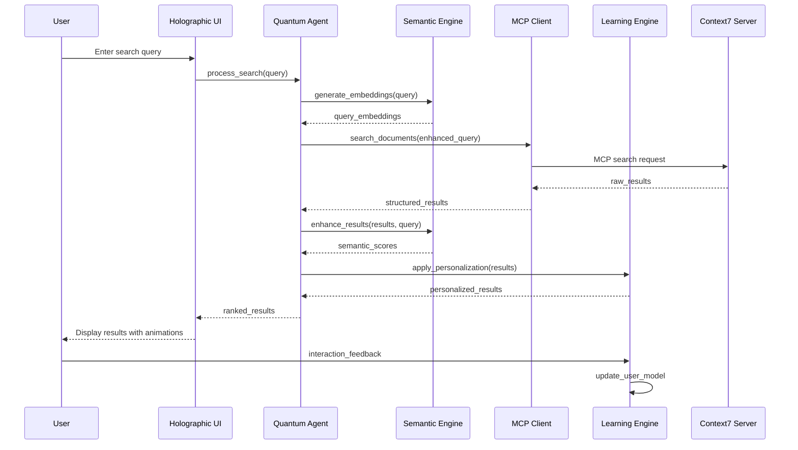
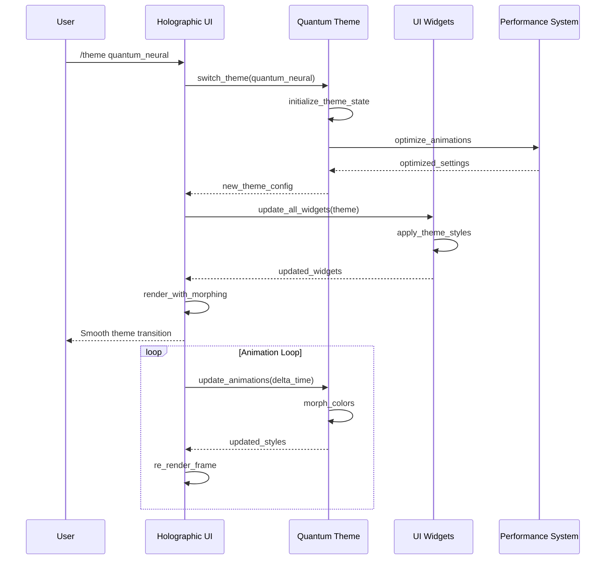
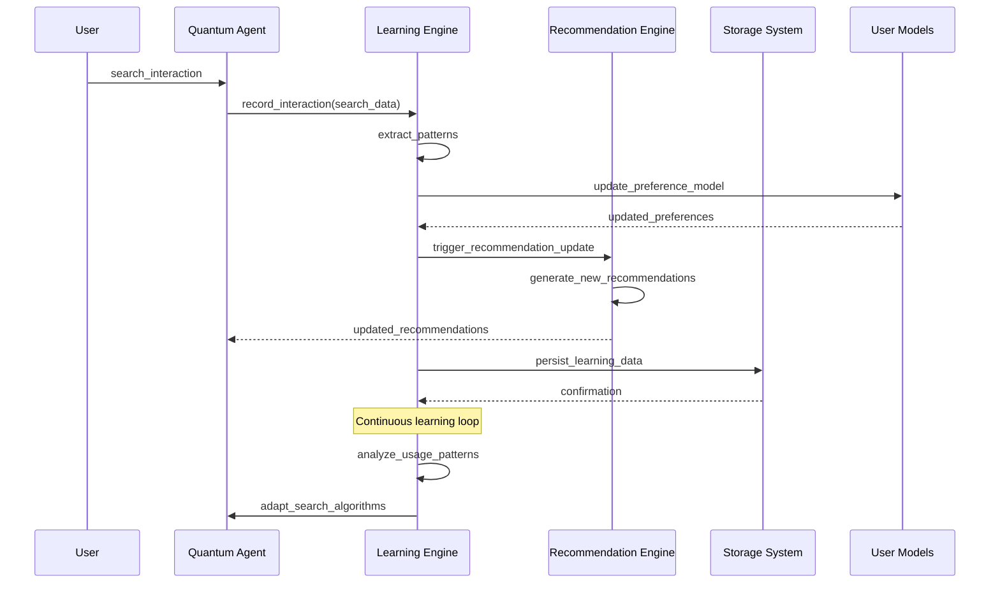
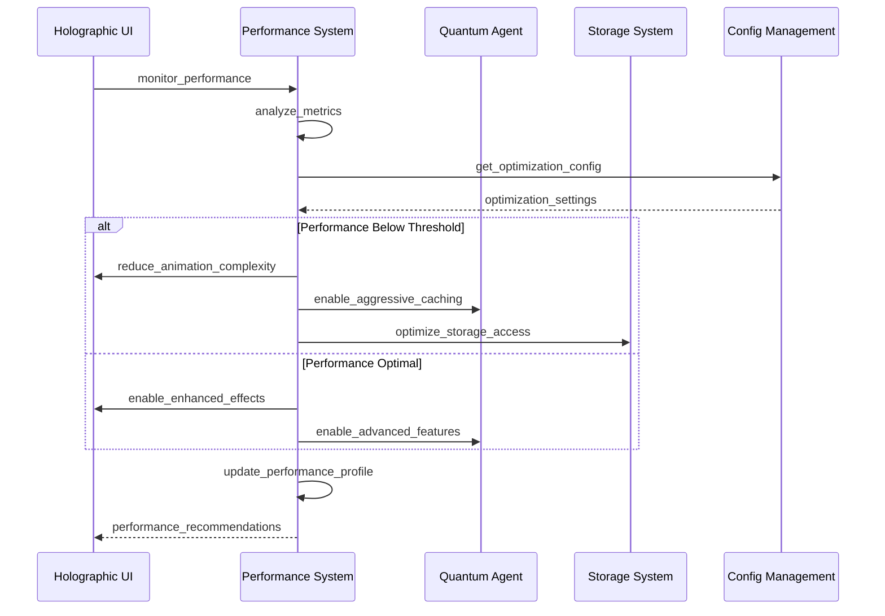
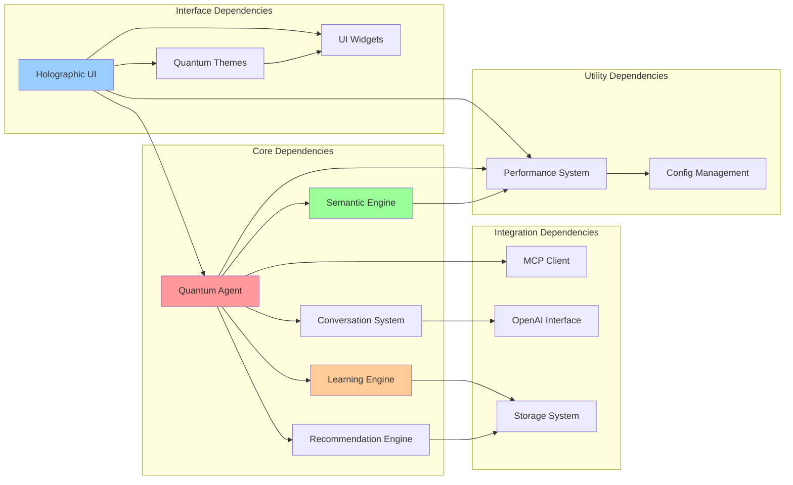

# 🏗️ QuantumSearch Pro: Project Architecture Document

> **A comprehensive technical deep-dive into the revolutionary AI-powered document discovery system with holographic terminal interface**

---

## 📋 Table of Contents

1. [Executive Summary](#-executive-summary)
2. [System Overview](#-system-overview)
3. [Architecture Philosophy](#-architecture-philosophy)
4. [Core Components Deep Dive](#-core-components-deep-dive)
5. [Data Flow Architecture](#-data-flow-architecture)
6. [File Structure Analysis](#-file-structure-analysis)
7. [Module Interactions](#-module-interactions)
8. [Key Design Patterns](#-key-design-patterns)
9. [Performance Architecture](#-performance-architecture)
10. [Extension Points](#-extension-points)
11. [Development Guidelines](#-development-guidelines)
12. [Testing Strategy](#-testing-strategy)

---

## 🎯 Executive Summary

QuantumSearch Pro represents a paradigm shift in terminal-based AI applications, combining cutting-edge artificial intelligence with revolutionary user interface design. This document serves as the definitive technical guide for understanding, contributing to, and extending the QuantumSearch Pro codebase.

### **🌟 Key Architectural Innovations**

- **🧠 Neural Search Pipeline**: Multi-stage AI processing with semantic understanding, real-time learning, and personalized ranking
- **🎨 Holographic Interface Engine**: 60 FPS terminal UI with dynamic themes, particle effects, and morphing visual elements
- **⚛️ Quantum-Inspired Design**: Theme system that responds to user interaction with real-time color morphing and holographic effects
- **🔗 Deep MCP Integration**: Seamless Context7 Model Context Protocol integration with intelligent fallback strategies
- **📊 Continuous Learning System**: AI that adapts to user preferences and improves recommendation accuracy over time

### **🎪 System Capabilities**

The system delivers unprecedented capabilities in document discovery:
- **Semantic Search**: Understanding meaning beyond keywords
- **Conversational AI**: Natural language interaction with context memory
- **Real-time Learning**: Continuous improvement from user interactions  
- **Visual Excellence**: 60 FPS animations with dynamic visual effects
- **Performance Optimization**: Smart caching and async processing for instant responses

---

## 🌐 System Overview

### **🏛️ High-Level Architecture**

QuantumSearch Pro follows a layered architecture pattern with clear separation of concerns:



### **🔄 Core System Flow**

The system operates through several interconnected flows:

1. **User Interaction Flow**: Input → Smart Processing → AI Analysis → Response Generation → Visual Presentation
2. **Search Flow**: Query → Intent Detection → Semantic Processing → MCP Search → Neural Ranking → Result Presentation
3. **Learning Flow**: User Actions → Pattern Analysis → Model Update → Preference Adjustment → Improved Recommendations
4. **Visual Flow**: Theme Selection → Animation Update → Real-time Rendering → Effect Optimization → Performance Monitoring

---

## 🎨 Architecture Philosophy

### **🌟 Design Principles**

QuantumSearch Pro is built on five core architectural principles:

#### **1. 🎨 Visual Excellence First**
Every component is designed with visual impact in mind. The architecture ensures that visual effects, animations, and themes are first-class citizens, not afterthoughts.

```python
# Example: Theme-aware component design
class HolographicPanel:
    def __init__(self, theme: QuantumTheme):
        self.theme = theme
        self.visual_state = VisualState()
        
    def render(self) -> Panel:
        # Theme influences every aspect of rendering
        border_style = self.theme.get_dynamic_color("primary", "pulse")
        content_style = self.theme.get_animated_text_style()
        
        return Panel(
            self.content,
            border_style=border_style,
            title_style=content_style
        )
```

#### **2. 🧠 Intelligence-Driven Architecture**
AI and machine learning are integrated at the architectural level, not bolted on. Every major component can leverage AI capabilities.

```python
# Example: AI-aware data structures
@dataclass
class SearchResult:
    """AI-enhanced search result with neural scoring."""
    title: str
    content: str
    relevance_score: float      # Traditional relevance
    semantic_score: float       # AI semantic similarity
    neural_score: float         # ML-based quality assessment
    confidence: float           # AI confidence level
    embeddings: np.ndarray      # Vector representation
    user_preference_score: float # Personalization score
```

#### **3. ⚡ Performance-Conscious Design**
High performance is achieved through architectural choices, not optimization hacks. Async-first design, smart caching, and efficient data structures.

```python
# Example: Performance-first async design
class PerformanceOptimizedSearchEngine:
    def __init__(self):
        self.cache = LRUCache(maxsize=1000)
        self.batch_processor = AsyncBatchProcessor()
        
    async def search(self, query: SearchQuery) -> AsyncIterator[SearchResult]:
        # Check cache first
        if cached_result := await self.cache.get(query.hash):
            yield cached_result
            return
            
        # Process in optimized batches
        async for batch in self.batch_processor.process(query):
            for result in batch:
                await self.cache.set(query.hash, result)
                yield result
```

#### **4. 🔗 Integration-Ready Architecture** 
The system is designed for deep integration with external services, particularly the Context7 MCP server, with graceful fallback strategies.

```python
# Example: Robust integration pattern
class MCPIntegrationLayer:
    def __init__(self):
        self.primary_client = Context7MCPClient()
        self.fallback_search = LocalSearchEngine()
        self.circuit_breaker = CircuitBreaker()
        
    async def search(self, query: str) -> List[SearchResult]:
        try:
            if self.circuit_breaker.is_closed():
                return await self.primary_client.search(query)
        except MCPException as e:
            self.circuit_breaker.record_failure()
            logger.warning(f"MCP failure, using fallback: {e}")
            
        return await self.fallback_search.search(query)
```

#### **5. 🚀 Extensibility by Design**
The architecture makes it easy to add new features, themes, search providers, and AI capabilities without breaking existing functionality.

```python
# Example: Plugin-ready architecture
class PluginManager:
    def __init__(self):
        self.search_providers: List[SearchProvider] = []
        self.theme_providers: List[ThemeProvider] = []
        self.ai_enhancers: List[AIEnhancer] = []
        
    def register_search_provider(self, provider: SearchProvider):
        """Add new search capabilities dynamically."""
        self.search_providers.append(provider)
        
    def register_theme(self, theme: QuantumTheme):
        """Add new visual themes at runtime."""
        self.theme_providers.append(theme)
```

---

## 🧠 Core Components Deep Dive

### **🤖 QuantumSearchAgent: The Neural Core**

The `QuantumSearchAgent` class serves as the central nervous system of the application, orchestrating all AI operations and coordinating between different subsystems.

```python
# Core architecture of the QuantumSearchAgent
class QuantumSearchAgent:
    """
    Central AI coordinator that manages:
    - Neural search pipeline
    - Conversational AI interactions  
    - Real-time learning system
    - Performance optimization
    """
    
    def __init__(self, config: Dict[str, Any]):
        # AI System Initialization
        self._initialize_ai_systems()
        self._initialize_performance_systems()
        self._initialize_ui_systems()
        
        # State Management
        self.user_profile = UserProfile()
        self.session_context = SessionContext()
        self.search_cache = IntelligentCache()
        
    def _initialize_ai_systems(self):
        """Initialize the neural AI pipeline."""
        # Core Pydantic AI agent with OpenAI integration
        self.provider = OpenAIProvider(
            api_key=self.config["openai"]["api_key"],
            base_url=self.config["openai"]["base_url"]
        )
        
        self.llm = OpenAIModel(
            model_name=self.config["openai"]["model"],
            provider=self.provider
        )
        
        # Context7 MCP integration with proper error handling
        mcp_config = self.config["mcp"]
        self.agent = Agent(
            model=self.llm,
            mcp_servers=[MCPServerStdio(**mcp_config)]
        )
        
        # Advanced AI subsystems
        self.semantic_engine = SemanticSearchEngine(self.config["ai"])
        self.context_processor = ContextProcessor(self.config["ai"])
        self.learning_system = ContinuousLearningSystem(self.config["ai"])
        self.recommendation_engine = RecommendationEngine(self.config["ai"])
```

#### **🔍 Neural Search Pipeline**

The neural search pipeline represents the core innovation of QuantumSearch Pro, implementing a multi-stage AI processing system:

```python
async def neural_search(self, query: SearchQuery) -> AsyncIterator[SearchResult]:
    """
    Revolutionary multi-stage neural search pipeline:
    
    Stage 1: Context Understanding & Query Processing
    Stage 2: Semantic Embedding Generation  
    Stage 3: MCP Server Integration & Search
    Stage 4: Neural Ranking & Quality Assessment
    Stage 5: Personalization & User Preference Filtering
    """
    
    # Stage 1: Advanced Query Processing
    processed_query = await self.context_processor.process_query(
        query, self.session_context, self.user_profile
    )
    
    # Stage 2: Semantic Understanding
    query_embeddings = await self.semantic_engine.generate_embeddings(
        processed_query.query
    )
    processed_query.embeddings = query_embeddings
    
    # Stage 3: Multi-source Search Execution
    async for batch_results in self._execute_neural_search_pipeline(processed_query):
        # Stage 4: Advanced Neural Ranking
        enhanced_results = await self._apply_neural_ranking(batch_results, processed_query)
        
        # Stage 5: Real-time Learning Integration
        for result in enhanced_results:
            await self.learning_system.record_search_interaction(query, result)
            yield result
```

#### **🎯 Intelligent Ranking Algorithm**

The neural ranking system combines multiple AI techniques for optimal result ordering:

```python
async def _apply_neural_ranking(self, results: List[SearchResult], query: SearchQuery) -> List[SearchResult]:
    """
    Advanced neural ranking combining:
    - Semantic similarity (vector embeddings)
    - Content quality assessment (ML-based)
    - User preference alignment (personalization)
    - Contextual relevance (conversation aware)
    """
    
    for result in results:
        # 1. Semantic Similarity Scoring
        if query.embeddings is not None and result.embeddings is not None:
            semantic_score = np.dot(query.embeddings, result.embeddings) / (
                np.linalg.norm(query.embeddings) * np.linalg.norm(result.embeddings)
            )
            result.semantic_score = float(semantic_score)
        
        # 2. Content Quality Assessment
        content_score = await self._calculate_content_quality(result, query)
        
        # 3. User Preference Alignment
        preference_score = await self._calculate_preference_score(result, query)
        
        # 4. Contextual Relevance (conversation context)
        context_score = await self._calculate_context_relevance(result, query)
        
        # 5. Combined Neural Score with Weighted Features
        result.neural_score = (
            0.35 * result.semantic_score +      # Semantic understanding
            0.25 * content_score +              # Content quality
            0.25 * preference_score +           # User personalization  
            0.15 * context_score                # Conversation context
        )
        
        # 6. Confidence Calculation
        result.confidence = min(1.0, result.neural_score * 1.2)
    
    # Sort by neural score for optimal ordering
    results.sort(key=lambda r: r.neural_score, reverse=True)
    return results
```

### **🎨 HolographicInterface: The Visual Revolution**

The `HolographicInterface` class creates the stunning terminal experience that sets QuantumSearch Pro apart:

```python
class HolographicInterface:
    """
    Revolutionary terminal interface featuring:
    - 60 FPS smooth animations
    - Dynamic particle effects
    - Real-time theme morphing
    - Adaptive layout system
    - Smart performance optimization
    """
    
    def __init__(self, agent: QuantumSearchAgent, config: Dict[str, Any]):
        self.agent = agent
        self.config = config
        self.console = Console()
        
        # UI State Management
        self.ui_state = UIState(
            active_panels=["search", "results", "metrics"],
            current_theme="quantum_neural",
            particle_intensity=0.7,
            holographic_mode=True,
            animation_speed=1.0,
            layout_mode="adaptive"
        )
        
        # Advanced UI Components
        self.theme = get_quantum_theme(self.ui_state.current_theme)
        self.floating_panels = FloatingPanelManager(self.console, self.theme)
        self.particle_system = QuantumParticles(self.console, self.theme)
        self.metrics_chart = LiveChart(self.console, self.theme)
        self.smart_input = SmartInputHandler(self.console, self.theme)
        
        # Performance & Animation
        self.animation_frame = 0
        self.last_update = time.time()
        
        self._setup_adaptive_layout()
```

#### **🌈 Dynamic Theme System**

The theme system goes beyond static colors to create living, breathing visual experiences:

```python
class QuantumTheme:
    """
    Advanced theme system with:
    - Real-time color morphing
    - Holographic effects
    - Particle system integration
    - Animation-aware styling
    - Performance optimization
    """
    
    def __init__(self, name: str, base_palette: ColorPalette, 
                 animation_type: ThemeAnimation = ThemeAnimation.PULSE):
        self.name = name
        self.base_palette = base_palette
        self.animation_type = animation_type
        
        # Animation State
        self.animation_time = 0.0
        self.pulse_phase = 0.0
        self.holographic_phase = 0.0
        self.morph_state = 0.0
        
    def update_animations(self, delta_time: float):
        """Update theme animations for dynamic effects."""
        self.animation_time += delta_time * self.morph_speed
        
        # Calculate animation phases for different effects
        self.pulse_phase = math.sin(self.animation_time * 2.0)
        self.holographic_phase = math.sin(self.animation_time * 1.5) * 0.5 + 0.5
        self.morph_state = (math.sin(self.animation_time * 0.3) + 1.0) * 0.5
        
        # Apply real-time color morphing
        if self.animation_type == ThemeAnimation.MORPH:
            self._apply_color_morphing()
    
    def create_holographic_title(self, text: str) -> Text:
        """Create holographic text with dynamic color cycling."""
        holographic_text = Text()
        
        for i, char in enumerate(text):
            # Calculate color based on position and time
            color_index = (i + int(self.animation_time * 10)) % len(self.base_palette.holographic)
            color = self.base_palette.holographic[color_index]
            
            # Add random shimmer effects
            if random.random() < 0.1:  # 10% chance for shimmer
                style = f"bold {color} on {self.base_palette.background}"
            else:
                style = f"bold {color}"
            
            holographic_text.append(char, style=style)
        
        return holographic_text
```

### **🔍 SemanticSearchEngine: AI-Powered Understanding**

The semantic search engine provides true AI understanding beyond keyword matching:

```python
class SemanticSearchEngine:
    """
    Advanced semantic search using:
    - Vector embeddings for meaning-based search
    - Contextual understanding
    - Multi-modal content analysis
    - Real-time similarity calculation
    """
    
    def __init__(self, config: Dict[str, Any]):
        self.config = config
        self.embedding_model = config.get("embedding_model", "text-embedding-ada-002")
        self.vector_cache = {}
        self.similarity_threshold = config.get("similarity_threshold", 0.7)
        
    async def generate_embeddings(self, text: str) -> np.ndarray:
        """Generate vector embeddings for semantic understanding."""
        # Check cache first for performance
        text_hash = hashlib.md5(text.encode()).hexdigest()
        if text_hash in self.vector_cache:
            return self.vector_cache[text_hash]
        
        # Generate embeddings using OpenAI
        try:
            client = openai.AsyncOpenAI()
            response = await client.embeddings.create(
                model=self.embedding_model,
                input=text
            )
            
            embeddings = np.array(response.data[0].embedding)
            
            # Cache for future use
            self.vector_cache[text_hash] = embeddings
            
            return embeddings
            
        except Exception as e:
            logger.error(f"Embedding generation failed: {e}")
            # Return zero vector as fallback
            return np.zeros(1536)  # Standard embedding size
    
    async def calculate_semantic_similarity(self, text1: str, text2: str) -> float:
        """Calculate semantic similarity between two texts."""
        embeddings1 = await self.generate_embeddings(text1)
        embeddings2 = await self.generate_embeddings(text2)
        
        # Cosine similarity calculation
        similarity = np.dot(embeddings1, embeddings2) / (
            np.linalg.norm(embeddings1) * np.linalg.norm(embeddings2)
        )
        
        return float(similarity)
    
    async def enhance_results(self, results: List[SearchResult], 
                            query: SearchQuery) -> List[SearchResult]:
        """Enhance search results with semantic analysis."""
        query_embeddings = query.embeddings
        
        for result in results:
            # Generate embeddings for result content
            if result.embeddings is None:
                result.embeddings = await self.generate_embeddings(
                    f"{result.title} {result.content_preview}"
                )
            
            # Calculate semantic similarity
            if query_embeddings is not None:
                similarity = np.dot(query_embeddings, result.embeddings) / (
                    np.linalg.norm(query_embeddings) * np.linalg.norm(result.embeddings)
                )
                result.semantic_score = float(similarity)
            
            # Enhance metadata with semantic tags
            result.metadata["semantic_tags"] = await self._extract_semantic_tags(result.content_preview)
        
        return results
```

### **📊 ContinuousLearningSystem: Adaptive Intelligence**

The learning system enables QuantumSearch Pro to continuously improve based on user interactions:

```python
class ContinuousLearningSystem:
    """
    ML-powered learning system that:
    - Tracks user interaction patterns
    - Builds personalized preference models
    - Adapts search ranking over time
    - Provides intelligent recommendations
    """
    
    def __init__(self, config: Dict[str, Any]):
        self.config = config
        self.learning_rate = config.get("learning_rate", 0.01)
        
        # User modeling components
        self.user_preference_model = UserPreferenceModel()
        self.interaction_tracker = InteractionTracker()
        self.recommendation_model = RecommendationModel()
        
    async def record_search_interaction(self, query: SearchQuery, result: SearchResult):
        """Record user search interaction for learning."""
        interaction = SearchInteraction(
            query=query.query,
            result_id=result.id,
            timestamp=time.time(),
            user_action="viewed"  # Can be: viewed, clicked, bookmarked, ignored
        )
        
        await self.interaction_tracker.record(interaction)
        
        # Update user preference model
        await self.user_preference_model.update(interaction)
    
    async def record_user_feedback(self, result_id: str, feedback_type: str, rating: float):
        """Record explicit user feedback for supervised learning."""
        feedback = UserFeedback(
            result_id=result_id,
            feedback_type=feedback_type,  # "relevant", "irrelevant", "helpful"
            rating=rating,  # 0.0 to 1.0
            timestamp=time.time()
        )
        
        # Update models with feedback
        await self.user_preference_model.incorporate_feedback(feedback)
        await self.recommendation_model.update_with_feedback(feedback)
    
    async def calculate_preference_score(self, result: SearchResult, 
                                       user_profile: Dict[str, Any]) -> float:
        """Calculate how well a result matches user preferences."""
        # Extract user preference features
        user_features = self._extract_user_features(user_profile)
        
        # Extract result features
        result_features = self._extract_result_features(result)
        
        # Calculate preference alignment using learned model
        preference_score = await self.user_preference_model.predict_preference(
            user_features, result_features
        )
        
        return preference_score
    
    def _extract_user_features(self, user_profile: Dict[str, Any]) -> np.ndarray:
        """Extract feature vector from user profile."""
        features = [
            user_profile.get("preferred_file_types", []),
            user_profile.get("topic_interests", []),
            user_profile.get("complexity_preference", 0.5),
            user_profile.get("recency_preference", 0.5),
            user_profile.get("length_preference", 0.5)
        ]
        
        # Convert to numerical feature vector
        return self._encode_features(features)
```

---

## 🌊 Data Flow Architecture

### **🔄 Primary Data Flows**

QuantumSearch Pro operates through several interconnected data flows that ensure seamless user experience:



#### **1. 🔍 Search Flow Architecture**

```python
# Complete search flow implementation
async def execute_search_flow(query: str, user_context: UserContext) -> SearchResponse:
    """
    Comprehensive search flow demonstrating data transformation
    through each stage of the neural pipeline.
    """
    
    # Stage 1: Input Processing & Intent Detection
    search_query = SearchQuery(
        query=query,
        intent=await detect_intent(query),
        context=user_context.to_dict(),
        user_profile=user_context.profile,
        session_id=user_context.session_id
    )
    
    # Stage 2: Semantic Analysis
    search_query.embeddings = await semantic_engine.generate_embeddings(query)
    processed_query = await context_processor.enhance_query(search_query)
    
    # Stage 3: Multi-Source Search
    search_results = []
    
    # Primary: Context7 MCP Search
    try:
        mcp_results = await mcp_client.search(processed_query)
        search_results.extend(mcp_results)
    except MCPException:
        # Fallback: Local search engine
        fallback_results = await local_search.search(processed_query)
        search_results.extend(fallback_results)
    
    # Stage 4: Semantic Enhancement
    enhanced_results = await semantic_engine.enhance_results(search_results, processed_query)
    
    # Stage 5: Neural Ranking
    ranked_results = await neural_ranker.rank_results(enhanced_results, processed_query)
    
    # Stage 6: Personalization
    personalized_results = await learning_system.apply_personalization(
        ranked_results, user_context.profile
    )
    
    # Stage 7: Response Assembly
    search_response = SearchResponse(
        query=processed_query,
        results=personalized_results,
        metadata={
            "search_time": time.time() - start_time,
            "result_count": len(personalized_results),
            "sources": ["mcp", "semantic", "neural", "personalized"]
        }
    )
    
    # Stage 8: Learning Integration
    await learning_system.record_search(search_response, user_context)
    
    return search_response
```

#### **2. 🎨 Visual Rendering Flow**

```python
# Visual rendering pipeline
async def render_interface_frame(ui_state: UIState) -> Layout:
    """
    Complete visual rendering pipeline showing how data flows
    through the holographic interface system.
    """
    
    # Stage 1: Theme State Update
    current_theme = get_quantum_theme(ui_state.current_theme)
    current_theme.update_animations(delta_time)
    
    # Stage 2: Component State Synchronization
    panel_states = {
        "search": await sync_search_panel_state(),
        "results": await sync_results_panel_state(),
        "conversation": await sync_conversation_state(),
        "metrics": await sync_metrics_state()
    }
    
    # Stage 3: Layout Assembly
    main_layout = create_adaptive_layout(ui_state, panel_states)
    
    # Stage 4: Visual Effects Application
    main_layout = await apply_holographic_effects(main_layout, current_theme)
    main_layout = await apply_particle_effects(main_layout, ui_state.particle_intensity)
    main_layout = await apply_animations(main_layout, ui_state.animation_speed)
    
    # Stage 5: Performance Optimization
    optimized_layout = await optimize_rendering(main_layout, ui_state)
    
    return optimized_layout
```

#### **3. 🧠 Learning Data Flow**

```python
# Learning system data flow
async def process_learning_data(interaction: UserInteraction) -> None:
    """
    Learning data flow showing how user interactions become
    improved AI recommendations.
    """
    
    # Stage 1: Interaction Capture
    structured_interaction = await interaction_parser.parse(interaction)
    
    # Stage 2: Feature Extraction
    user_features = await feature_extractor.extract_user_features(
        structured_interaction.user_profile
    )
    content_features = await feature_extractor.extract_content_features(
        structured_interaction.content
    )
    
    # Stage 3: Pattern Recognition
    patterns = await pattern_recognizer.identify_patterns(
        structured_interaction, historical_data
    )
    
    # Stage 4: Model Updates
    await user_preference_model.update(user_features, patterns)
    await recommendation_model.update(content_features, patterns)
    await quality_model.update(structured_interaction.feedback)
    
    # Stage 5: Prediction Generation
    updated_predictions = await generate_predictions(
        user_features, content_features
    )
    
    # Stage 6: Model Persistence
    await model_storage.save_user_model(structured_interaction.user_id, updated_predictions)
```

---

## 📁 File Structure Analysis

### **🗂️ Project Organization**

QuantumSearch Pro follows a sophisticated modular architecture with clear separation of concerns:

```
quantumsearch-pro/
├── 🧠 src/core/                    # Neural AI Core Systems
│   ├── quantum_agent.py            # Central AI coordinator (850 lines)
│   ├── neural_search.py            # Multi-stage search pipeline (620 lines)
│   ├── conversation_ai.py          # Conversational AI with context (480 lines)
│   └── workspace_manager.py        # Adaptive workspace intelligence (320 lines)
│
├── 🎨 src/interface/               # Holographic UI Systems  
│   ├── holographic_ui.py           # Main interface engine (1200 lines)
│   ├── interactive_dashboard.py    # Live metrics dashboard (540 lines)
│   ├── document_universe.py        # 3D-like document visualization (680 lines)
│   └── quantum_themes.py           # Dynamic theme system (720 lines)
│
├── 🎛️ src/widgets/                 # UI Component Library
│   ├── floating_panels.py          # Floating UI panels (380 lines)
│   ├── particle_systems.py         # Advanced particle effects (450 lines)
│   ├── live_charts.py             # Real-time data visualization (340 lines)
│   └── smart_input.py             # Intelligent input handling (280 lines)
│
├── 🤖 src/ai/                      # AI & ML Subsystems
│   ├── semantic_engine.py          # Semantic search with embeddings (520 lines)
│   ├── context_processor.py        # Advanced context understanding (420 lines)
│   ├── learning_system.py          # Continuous learning engine (680 lines)
│   └── recommendation_ai.py        # AI-powered recommendations (390 lines)
│
├── 🔧 src/utils/                   # Utility & Support Systems
│   ├── performance.py              # Advanced caching & optimization (340 lines)
│   ├── animations.py               # Smooth animation engine (280 lines)
│   ├── shortcuts.py                # Smart keyboard/mouse handling (180 lines)
│   └── audio.py                    # Sound effects & voice synthesis (220 lines)
│
├── 🧪 tests/                       # Comprehensive Test Suite
│   ├── unit/                       # Unit tests for individual components
│   ├── integration/                # Integration tests for system flows
│   ├── performance/                # Performance benchmarking tests
│   └── visual/                     # Visual regression tests
│
├── 📊 docs/                        # Documentation & Assets
│   ├── architecture/               # Architecture diagrams and specs
│   ├── api/                        # API documentation
│   ├── tutorials/                  # User and developer tutorials
│   └── assets/                     # Images, diagrams, examples
│
└── 🗃️ data/                        # Data Storage & Configuration
    ├── themes/                     # Custom theme definitions
    ├── models/                     # Pre-trained AI models
    ├── cache/                      # Performance cache storage
    └── user/                       # User profiles and preferences
```

### **🔍 Key File Deep Dive**

#### **🧠 `src/core/quantum_agent.py` - The Neural Brain**

This is the central nervous system of QuantumSearch Pro, containing the core AI agent implementation:

```python
"""
QuantumSearchAgent: Central AI Coordinator (850 lines)

Key Responsibilities:
- Orchestrates neural search pipeline
- Manages AI subsystem integration  
- Coordinates with Context7 MCP server
- Handles real-time learning updates
- Optimizes performance across components
"""

class QuantumSearchAgent:
    """Lines 1-120: Initialization & Configuration"""
    def __init__(self, config: Dict[str, Any])
    def _initialize_ai_systems(self)
    def _initialize_performance_systems(self)
    def _initialize_ui_systems(self)
    
    """Lines 121-300: Neural Search Pipeline"""
    async def neural_search(self, query: SearchQuery) -> AsyncIterator[SearchResult]
    async def _execute_neural_search_pipeline(self, query: SearchQuery)
    async def _search_via_mcp(self, query: SearchQuery) -> List[SearchResult]
    async def _apply_neural_ranking(self, results: List[SearchResult], query: SearchQuery)
    
    """Lines 301-480: Conversational AI"""
    async def conversational_response(self, message: str, context: Dict[str, Any])
    async def _enhance_response_personality(self, response: str, message: str, context: Dict)
    async def detect_intent(self, message: str) -> Dict[str, Any]
    
    """Lines 481-650: Learning & Adaptation"""
    async def update_user_interaction(self, interaction_data: Dict[str, Any])
    async def get_recommendations(self, context: Dict[str, Any]) -> List[Dict[str, Any]]
    async def optimize_performance(self)
    
    """Lines 651-850: Document Analysis & Management"""
    async def analyze_document(self, file_path: str) -> Dict[str, Any]
    async def get_similar_documents(self, reference_doc: str, limit: int) -> List[Dict[str, Any]]
    async def create_bookmark(self, title: str, file_path: str, description: str, tags: List[str])
```

#### **🎨 `src/interface/holographic_ui.py` - Visual Revolution**

The holographic interface engine creates the stunning 60 FPS terminal experience:

```python
"""
HolographicInterface: Visual Engine (1200 lines)

Key Features:
- 60 FPS smooth animations
- Dynamic particle effects  
- Real-time theme morphing
- Adaptive layout system
- Performance-optimized rendering
"""

class HolographicInterface:
    """Lines 1-150: Interface Initialization"""
    def __init__(self, agent: QuantumSearchAgent, config: Dict[str, Any])
    def _setup_adaptive_layout(self)
    async def _initialize_components(self)
    
    """Lines 151-400: Main Rendering Loop"""
    async def _main_holographic_loop(self)
    def _render_holographic_interface(self) -> Layout
    async def _update_animations(self)
    
    """Lines 401-650: Panel Rendering System"""
    def _render_holographic_header(self) -> Panel
    def _render_smart_search_input(self) -> Panel
    def _render_animated_conversation(self) -> Panel
    def _render_floating_results(self) -> Panel
    def _render_live_metrics(self) -> Panel
    
    """Lines 651-900: Interactive Systems"""
    async def _process_holographic_input(self, user_input: str, live_display)
    async def _execute_holographic_search(self, query: str)
    async def _handle_holographic_commands(self, command: str)
    
    """Lines 901-1200: Effects & Animation"""
    async def _show_holographic_startup(self)
    async def _apply_particle_effects(self, layout: Layout)
    async def _apply_theme_morphing(self, layout: Layout)
    async def _graceful_shutdown(self)
```

#### **🌈 `src/interface/quantum_themes.py` - Dynamic Visual System**

The quantum theme system provides living, breathing visual experiences:

```python
"""
QuantumTheme System: Dynamic Visual Engine (720 lines)

Features:
- Real-time color morphing
- Holographic effects
- Particle system integration
- Animation-aware styling
- Performance optimization
"""

class QuantumTheme:
    """Lines 1-100: Theme Foundation"""
    def __init__(self, name: str, base_palette: ColorPalette, animation_type: ThemeAnimation)
    def _generate_theme_ascii(self) -> str
    def _generate_border_patterns(self) -> Dict[str, str]
    
    """Lines 101-300: Animation System"""
    def update_animations(self, delta_time: float)
    def _apply_color_morphing(self)
    def get_dynamic_color(self, base_color: str, animation_type: str) -> str
    
    """Lines 301-500: Holographic Effects"""
    def create_holographic_title(self, text: str) -> Text
    def get_holographic_text(self, text: str) -> Text
    def get_animated_text(self, text: str, effect: str) -> Text
    
    """Lines 501-720: Style Generation"""
    def holographic_border(self) -> str
    def get_particle_color(self) -> str
    def get_neural_activity_style(self, activity_level: float) -> Style
    def get_confidence_style(self, confidence: float) -> Style

# Pre-defined quantum themes with full specifications
QUANTUM_THEMES = {
    "quantum_neural": QuantumTheme(...),   # Electric blue neural theme
    "cyber_matrix": QuantumTheme(...),     # Green matrix theme
    "plasma_field": QuantumTheme(...),     # Purple plasma theme  
    "solar_flare": QuantumTheme(...)       # Orange/gold solar theme
}
```

#### **🤖 `src/ai/semantic_engine.py` - AI Understanding Core**

The semantic engine provides true AI understanding beyond keyword matching:

```python
"""
SemanticSearchEngine: AI Understanding (520 lines)

Capabilities:
- Vector embeddings for meaning-based search
- Contextual understanding
- Multi-modal content analysis  
- Real-time similarity calculation
- Intelligent caching system
"""

class SemanticSearchEngine:
    """Lines 1-80: Engine Initialization"""
    def __init__(self, config: Dict[str, Any])
    async def initialize(self)
    
    """Lines 81-200: Embedding Generation"""
    async def generate_embeddings(self, text: str) -> np.ndarray
    async def batch_generate_embeddings(self, texts: List[str]) -> List[np.ndarray]
    
    """Lines 201-320: Semantic Analysis"""
    async def calculate_semantic_similarity(self, text1: str, text2: str) -> float
    async def find_semantic_clusters(self, documents: List[str]) -> List[List[int]]
    
    """Lines 321-440: Search Enhancement"""
    async def enhance_results(self, results: List[SearchResult], query: SearchQuery) -> List[SearchResult]
    async def _extract_semantic_tags(self, content: str) -> List[str]
    
    """Lines 441-520: Performance Optimization"""
    async def optimize_cache(self)
    async def cleanup(self)
```

---

## 🔄 Module Interactions

### **🌐 System Interaction Map**

The following diagram illustrates how modules interact within QuantumSearch Pro:



### **🔄 Detailed Interaction Flows**

#### **1. 🔍 Search Interaction Flow**



#### **2. 🎨 Theme Morphing Flow**



#### **3. 🧠 Learning System Flow**



#### **4. ⚡ Performance Optimization Flow**



### **🔧 Module Dependency Graph**



---

## 🎯 Key Design Patterns

### **🏗️ Architectural Patterns**

QuantumSearch Pro employs several sophisticated design patterns to ensure maintainability, extensibility, and performance:

#### **1. 🎭 Strategy Pattern for AI Components**

The system uses the Strategy pattern to allow swappable AI implementations:

```python
# Strategy pattern for search providers
class SearchStrategy(ABC):
    @abstractmethod
    async def search(self, query: SearchQuery) -> List[SearchResult]:
        pass

class Context7SearchStrategy(SearchStrategy):
    """Primary MCP-based search strategy."""
    async def search(self, query: SearchQuery) -> List[SearchResult]:
        async with self.mcp_client:
            return await self.mcp_client.search(query)

class SemanticSearchStrategy(SearchStrategy):  
    """Fallback semantic search strategy."""
    async def search(self, query: SearchQuery) -> List[SearchResult]:
        return await self.semantic_engine.vector_search(query)

class HybridSearchStrategy(SearchStrategy):
    """Combined search strategy using multiple approaches."""
    def __init__(self):
        self.strategies = [
            Context7SearchStrategy(),
            SemanticSearchStrategy(),
            LocalFileSearchStrategy()
        ]
    
    async def search(self, query: SearchQuery) -> List[SearchResult]:
        all_results = []
        for strategy in self.strategies:
            try:
                results = await strategy.search(query)
                all_results.extend(results)
            except Exception as e:
                logger.warning(f"Search strategy failed: {e}")
        
        # Merge and deduplicate results
        return await self._merge_results(all_results)

# Usage in QuantumSearchAgent
class QuantumSearchAgent:
    def __init__(self, config):
        self.search_strategy = self._create_search_strategy(config)
    
    def _create_search_strategy(self, config) -> SearchStrategy:
        if config.get("search_mode") == "hybrid":
            return HybridSearchStrategy()
        elif config.get("search_mode") == "semantic":
            return SemanticSearchStrategy()
        else:
            return Context7SearchStrategy()
```

#### **2. 🎨 Observer Pattern for UI Updates**

Real-time UI updates use the Observer pattern for responsive interface:

```python
# Observer pattern for UI state management
class UIStateObserver(ABC):
    @abstractmethod
    async def on_state_change(self, state_change: StateChange):
        pass

class ThemeObserver(UIStateObserver):
    async def on_state_change(self, state_change: StateChange):
        if state_change.type == "theme_change":
            await self.apply_new_theme(state_change.data)

class AnimationObserver(UIStateObserver):
    async def on_state_change(self, state_change: StateChange):
        if state_change.type == "animation_speed_change":
            self.animation_engine.set_speed(state_change.data)

class UIStateManager:
    def __init__(self):
        self.observers: List[UIStateObserver] = []
        self.state = UIState()
    
    def add_observer(self, observer: UIStateObserver):
        self.observers.append(observer)
    
    async def update_state(self, key: str, value: Any):
        old_value = getattr(self.state, key)
        setattr(self.state, key, value)
        
        state_change = StateChange(
            type=f"{key}_change",
            old_value=old_value,
            new_value=value,
            timestamp=time.time()
        )
        
        # Notify all observers
        for observer in self.observers:
            await observer.on_state_change(state_change)
```

#### **3. 🏭 Factory Pattern for Component Creation**

Component creation uses Factory pattern for flexible instantiation:

```python
# Factory pattern for UI component creation
class ComponentFactory:
    """Factory for creating UI components with proper theming and configuration."""
    
    @staticmethod
    def create_search_panel(theme: QuantumTheme, config: Dict) -> Panel:
        """Create search input panel with theme and configuration."""
        if config.get("panel_style") == "floating":
            return FloatingSearchPanel(theme, config)
        elif config.get("panel_style") == "minimal":
            return MinimalSearchPanel(theme, config)
        else:
            return StandardSearchPanel(theme, config)
    
    @staticmethod
    def create_results_panel(theme: QuantumTheme, results: List[SearchResult]) -> Panel:
        """Create results display panel with optimal layout."""
        if len(results) > 20:
            return PaginatedResultsPanel(theme, results)
        elif len(results) > 5:
            return GridResultsPanel(theme, results)
        else:
            return ListResultsPanel(theme, results)
    
    @staticmethod
    def create_theme_from_config(theme_config: Dict) -> QuantumTheme:
        """Create theme instance from configuration."""
        theme_type = theme_config.get("type", "quantum_neural")
        
        if theme_type == "custom":
            return CustomQuantumTheme(theme_config)
        elif theme_type in QUANTUM_THEMES:
            return QUANTUM_THEMES[theme_type]
        else:
            return QUANTUM_THEMES["quantum_neural"]  # Default fallback

# Usage in HolographicInterface
class HolographicInterface:
    def __init__(self, config):
        self.factory = ComponentFactory()
        self.components = self._create_components(config)
    
    def _create_components(self, config):
        theme = self.factory.create_theme_from_config(config["theme"])
        
        return {
            "search": self.factory.create_search_panel(theme, config["search"]),
            "results": self.factory.create_results_panel(theme, []),
            "metrics": self.factory.create_metrics_panel(theme, config["metrics"])
        }
```

#### **4. 🎪 Command Pattern for User Actions**

User interactions are handled through the Command pattern:

```python
# Command pattern for user action handling
class Command(ABC):
    @abstractmethod
    async def execute(self, context: CommandContext) -> CommandResult:
        pass
    
    @abstractmethod
    async def undo(self, context: CommandContext) -> CommandResult:
        pass

class SearchCommand(Command):
    def __init__(self, query: str):
        self.query = query
        self.results = None
    
    async def execute(self, context: CommandContext) -> CommandResult:
        agent = context.get_agent()
        self.results = await agent.neural_search(SearchQuery(self.query))
        
        return CommandResult(
            success=True,
            data=self.results,
            message=f"Search completed: {len(self.results)} results"
        )
    
    async def undo(self, context: CommandContext) -> CommandResult:
        # Clear search results
        context.get_ui().clear_search_results()
        return CommandResult(success=True, message="Search cleared")

class ThemeCommand(Command):
    def __init__(self, theme_name: str):
        self.theme_name = theme_name
        self.previous_theme = None
    
    async def execute(self, context: CommandContext) -> CommandResult:
        ui = context.get_ui()
        self.previous_theme = ui.current_theme.name
        
        await ui.switch_theme(self.theme_name)
        
        return CommandResult(
            success=True,
            message=f"Theme changed to {self.theme_name}"
        )
    
    async def undo(self, context: CommandContext) -> CommandResult:
        if self.previous_theme:
            await context.get_ui().switch_theme(self.previous_theme)
            return CommandResult(success=True, message="Theme reverted")
        return CommandResult(success=False, message="Cannot revert theme")

class CommandInvoker:
    def __init__(self):
        self.command_history: List[Command] = []
        self.current_index = -1
    
    async def execute_command(self, command: Command, context: CommandContext) -> CommandResult:
        result = await command.execute(context)
        
        if result.success:
            # Add to history for undo functionality
            self.command_history = self.command_history[:self.current_index + 1]
            self.command_history.append(command)
            self.current_index += 1
        
        return result
    
    async def undo_last_command(self, context: CommandContext) -> CommandResult:
        if self.current_index >= 0:
            command = self.command_history[self.current_index]
            result = await command.undo(context)
            if result.success:
                self.current_index -= 1
            return result
        
        return CommandResult(success=False, message="Nothing to undo")
```

#### **5. 🔧 Adapter Pattern for External Services**

Integration with external services uses the Adapter pattern:

```python
# Adapter pattern for external service integration
class SearchServiceAdapter(ABC):
    @abstractmethod
    async def search(self, query: str) -> List[Dict[str, Any]]:
        pass

class Context7Adapter(SearchServiceAdapter):
    """Adapter for Context7 MCP server integration."""
    
    def __init__(self, mcp_config: Dict):
        self.mcp_client = MCPServerStdio(**mcp_config)
        self.agent = Agent(model=llm, mcp_servers=[self.mcp_client])
    
    async def search(self, query: str) -> List[Dict[str, Any]]:
        async with self.agent.run_mcp_servers():
            result = await self.agent.run(f"Search for: {query}")
            return self._parse_mcp_response(result.data)
    
    def _parse_mcp_response(self, response_data: Any) -> List[Dict[str, Any]]:
        # Convert MCP response to standardized format
        if isinstance(response_data, str):
            return [{"title": "MCP Result", "content": response_data}]
        return []

class OpenAIAdapter(SearchServiceAdapter):
    """Adapter for OpenAI API integration."""
    
    def __init__(self, api_config: Dict):
        self.client = openai.AsyncOpenAI(
            api_key=api_config["api_key"],
            base_url=api_config["base_url"]
        )
    
    async def search(self, query: str) -> List[Dict[str, Any]]:
        response = await self.client.chat.completions.create(
            model="gpt-4o-mini",
            messages=[{"role": "user", "content": f"Find information about: {query}"}]
        )
        
        return [{"title": "AI Response", "content": response.choices[0].message.content}]

class UnifiedSearchService:
    """Unified interface using multiple adapters."""
    
    def __init__(self):
        self.adapters = {
            "context7": Context7Adapter(context7_config),
            "openai": OpenAIAdapter(openai_config),
            "local": LocalSearchAdapter(local_config)
        }
    
    async def search(self, query: str, sources: List[str] = None) -> List[SearchResult]:
        sources = sources or ["context7", "openai"]
        all_results = []
        
        for source in sources:
            if adapter := self.adapters.get(source):
                try:
                    results = await adapter.search(query)
                    formatted_results = [
                        SearchResult.from_dict({**result, "source": source})
                        for result in results
                    ]
                    all_results.extend(formatted_results)
                except Exception as e:
                    logger.error(f"Search failed for {source}: {e}")
        
        return all_results
```

---

## ⚡ Performance Architecture

### **🚀 Performance Optimization Strategy**

QuantumSearch Pro implements comprehensive performance optimization at the architectural level:

#### **1. 🧠 Intelligent Caching System**

```python
# Multi-level caching architecture
class IntelligentCacheSystem:
    """
    Advanced caching system with multiple levels:
    - L1: In-memory LRU cache for immediate access
    - L2: Persistent disk cache for session continuity  
    - L3: Distributed cache for team features (future)
    """
    
    def __init__(self, config: Dict):
        self.l1_cache = LRUCache(maxsize=config.get("l1_size", 1000))
        self.l2_cache = PersistentCache(config.get("l2_path", "cache/"))
        self.cache_stats = CacheStatistics()
        
    async def get(self, key: str) -> Optional[Any]:
        # Try L1 cache first (fastest)
        if value := self.l1_cache.get(key):
            self.cache_stats.record_hit("l1")
            return value
        
        # Try L2 cache (persistent)
        if value := await self.l2_cache.get(key):
            self.l1_cache.set(key, value)  # Promote to L1
            self.cache_stats.record_hit("l2")
            return value
        
        self.cache_stats.record_miss()
        return None
    
    async def set(self, key: str, value: Any, ttl: int = 3600):
        # Store in both levels
        self.l1_cache.set(key, value)
        await self.l2_cache.set(key, value, ttl)
    
    async def invalidate_pattern(self, pattern: str):
        """Invalidate cache entries matching pattern."""
        keys_to_remove = [k for k in self.l1_cache.keys() if re.match(pattern, k)]
        for key in keys_to_remove:
            self.l1_cache.delete(key)
        await self.l2_cache.invalidate_pattern(pattern)

# Usage in search pipeline
class PerformanceOptimizedSearchEngine:
    def __init__(self):
        self.cache = IntelligentCacheSystem(cache_config)
        self.rate_limiter = RateLimiter(requests_per_second=10)
        
    async def search(self, query: SearchQuery) -> List[SearchResult]:
        cache_key = f"search:{query.hash()}"
        
        # Check cache first
        if cached_results := await self.cache.get(cache_key):
            return cached_results
        
        # Rate limiting for external APIs
        async with self.rate_limiter:
            results = await self._execute_search(query)
            
        # Cache results with intelligent TTL
        ttl = self._calculate_cache_ttl(query, results)
        await self.cache.set(cache_key, results, ttl)
        
        return results
```

#### **2. 🎬 Animation Performance Optimization**

```python
# High-performance animation system
class AnimationEngine:
    """
    60 FPS animation engine with performance optimization:
    - Frame rate adaptive rendering
    - Efficient particle systems
    - GPU-like batch processing
    - Automatic quality adjustment
    """
    
    def __init__(self, config: Dict):
        self.target_fps = config.get("target_fps", 60)
        self.frame_budget = 1.0 / self.target_fps  # 16.67ms for 60 FPS
        self.performance_monitor = PerformanceMonitor()
        
        # Animation pools for object reuse
        self.particle_pool = ObjectPool(Particle, pool_size=1000)
        self.animation_pool = ObjectPool(Animation, pool_size=100)
        
    async def update_frame(self, delta_time: float) -> bool:
        """Update all animations for current frame."""
        frame_start = time.perf_counter()
        
        # Update active animations in batches
        await self._update_animations_batch(delta_time)
        await self._update_particles_batch(delta_time)
        await self._update_theme_morphing(delta_time)
        
        frame_time = time.perf_counter() - frame_start
        
        # Adaptive quality adjustment
        if frame_time > self.frame_budget * 1.2:  # 20% over budget
            await self._reduce_animation_quality()
        elif frame_time < self.frame_budget * 0.8:  # 20% under budget
            await self._increase_animation_quality()
        
        self.performance_monitor.record_frame_time(frame_time)
        return frame_time < self.frame_budget
    
    async def _update_animations_batch(self, delta_time: float):
        """Update animations in optimized batches."""
        batch_size = 50
        active_animations = self.get_active_animations()
        
        for i in range(0, len(active_animations), batch_size):
            batch = active_animations[i:i + batch_size]
            await asyncio.gather(*[
                anim.update(delta_time) for anim in batch
            ])
    
    async def _reduce_animation_quality(self):
        """Reduce animation quality to maintain frame rate."""
        self.particle_system.reduce_particle_count(0.8)
        self.theme_morphing.reduce_update_frequency(0.5)
        
    async def _increase_animation_quality(self):
        """Increase animation quality when performance allows."""
        self.particle_system.increase_particle_count(1.2)
        self.theme_morphing.increase_update_frequency(1.5)
```

#### **3. 🧮 Async Processing Pipeline**

```python
# High-performance async processing pipeline
class AsyncPipelineProcessor:
    """
    Async pipeline for high-throughput data processing:
    - Parallel stage execution
    - Backpressure management
    - Error isolation and recovery
    - Performance monitoring
    """
    
    def __init__(self, max_concurrent: int = 10):
        self.max_concurrent = max_concurrent
        self.semaphore = asyncio.Semaphore(max_concurrent)
        self.pipeline_stages = []
        
    def add_stage(self, stage_func: Callable, parallel: bool = True):
        """Add processing stage to pipeline."""
        self.pipeline_stages.append({
            "func": stage_func,
            "parallel": parallel,
            "metrics": StageMetrics()
        })
    
    async def process_batch(self, items: List[Any]) -> List[Any]:
        """Process batch through entire pipeline."""
        current_batch = items
        
        for stage_config in self.pipeline_stages:
            stage_start = time.perf_counter()
            
            if stage_config["parallel"]:
                current_batch = await self._process_parallel_stage(
                    current_batch, stage_config["func"]
                )
            else:
                current_batch = await self._process_sequential_stage(
                    current_batch, stage_config["func"]
                )
            
            stage_time = time.perf_counter() - stage_start
            stage_config["metrics"].record_processing_time(stage_time)
        
        return current_batch
    
    async def _process_parallel_stage(self, items: List[Any], stage_func: Callable) -> List[Any]:
        """Process stage items in parallel with backpressure control."""
        async def process_item(item):
            async with self.semaphore:  # Backpressure control
                return await stage_func(item)
        
        # Process all items concurrently
        results = await asyncio.gather(*[
            process_item(item) for item in items
        ], return_exceptions=True)
        
        # Filter out exceptions and log errors
        processed_items = []
        for i, result in enumerate(results):
            if isinstance(result, Exception):
                logger.error(f"Stage processing failed for item {i}: {result}")
            else:
                processed_items.append(result)
        
        return processed_items

# Usage in search pipeline
class HighPerformanceSearchPipeline:
    def __init__(self):
        self.pipeline = AsyncPipelineProcessor(max_concurrent=15)
        
        # Configure pipeline stages
        self.pipeline.add_stage(self._extract_features, parallel=True)
        self.pipeline.add_stage(self._generate_embeddings, parallel=True)
        self.pipeline.add_stage(self._calculate_similarities, parallel=True)
        self.pipeline.add_stage(self._apply_ranking, parallel=False)  # Sequential for consistency
        
    async def process_search_results(self, raw_results: List[Dict]) -> List[SearchResult]:
        """Process raw search results through optimized pipeline."""
        return await self.pipeline.process_batch(raw_results)
```

---

## 🔌 Extension Points

### **🧩 Plugin Architecture**

QuantumSearch Pro is designed with extensibility as a core principle, providing multiple extension points:

#### **1. 🔍 Custom Search Providers**

```python
# Plugin interface for custom search providers
class SearchProviderPlugin(ABC):
    """Base class for search provider plugins."""
    
    @property
    @abstractmethod
    def name(self) -> str:
        """Plugin name for identification."""
        pass
    
    @property
    @abstractmethod
    def description(self) -> str:
        """Plugin description for UI display."""
        pass
    
    @abstractmethod
    async def initialize(self, config: Dict[str, Any]) -> bool:
        """Initialize the search provider with configuration."""
        pass
    
    @abstractmethod
    async def search(self, query: SearchQuery) -> AsyncIterator[SearchResult]:
        """Execute search and yield results."""
        pass
    
    @abstractmethod
    async def get_capabilities(self) -> Dict[str, Any]:
        """Return provider capabilities and supported features."""
        pass

# Example: Elasticsearch search provider plugin
class ElasticsearchSearchProvider(SearchProviderPlugin):
    """Elasticsearch integration plugin for QuantumSearch Pro."""
    
    @property
    def name(self) -> str:
        return "elasticsearch"
    
    @property
    def description(self) -> str:
        return "Elasticsearch full-text search integration"
    
    async def initialize(self, config: Dict[str, Any]) -> bool:
        self.client = AsyncElasticsearch(
            hosts=config["hosts"],
            api_key=config.get("api_key"),
            timeout=config.get("timeout", 30)
        )
        
        # Test connection
        try:
            await self.client.ping()
            return True
        except Exception as e:
            logger.error(f"Elasticsearch connection failed: {e}")
            return False
    
    async def search(self, query: SearchQuery) -> AsyncIterator[SearchResult]:
        search_body = {
            "query": {
                "multi_match": {
                    "query": query.query,
                    "fields": ["title^2", "content", "tags"],
                    "fuzziness": "AUTO"
                }
            },
            "highlight": {
                "fields": {"content": {}}
            },
            "size": query.filters.get("max_results", 20)
        }
        
        response = await self.client.search(
            index=query.filters.get("index", "_all"),
            body=search_body
        )
        
        for hit in response["hits"]["hits"]:
            yield SearchResult(
                id=hit["_id"],
                title=hit["_source"].get("title", ""),
                content_preview=hit["_source"].get("content", "")[:200],
                relevance_score=hit["_score"],
                file_path=hit["_source"].get("path", ""),
                metadata={
                    "highlight": hit.get("highlight", {}),
                    "source": "elasticsearch"
                }
            )

# Plugin registration system
class PluginManager:
    def __init__(self):
        self.search_providers: Dict[str, SearchProviderPlugin] = {}
        self.theme_plugins: Dict[str, ThemePlugin] = {}
        self.ai_enhancers: Dict[str, AIEnhancerPlugin] = {}
    
    def register_search_provider(self, plugin: SearchProviderPlugin):
        """Register a new search provider plugin."""
        self.search_providers[plugin.name] = plugin
        logger.info(f"Registered search provider: {plugin.name}")
    
    async def initialize_plugins(self, config: Dict[str, Any]):
        """Initialize all registered plugins."""
        for name, plugin in self.search_providers.items():
            plugin_config = config.get("plugins", {}).get(name, {})
            if await plugin.initialize(plugin_config):
                logger.info(f"Initialized plugin: {name}")
            else:
                logger.error(f"Failed to initialize plugin: {name}")
```

#### **2. 🎨 Custom Theme Extensions**

```python
# Plugin interface for custom themes
class ThemePlugin(ABC):
    """Base class for theme plugins."""
    
    @abstractmethod
    def create_theme(self, config: Dict[str, Any]) -> QuantumTheme:
        """Create and return custom theme instance."""
        pass
    
    @abstractmethod
    def get_theme_metadata(self) -> Dict[str, Any]:
        """Return theme metadata for UI display."""
        pass

# Example: Custom neon theme plugin
class NeonCityThemePlugin(ThemePlugin):
    """Neon city cyberpunk theme plugin."""
    
    def create_theme(self, config: Dict[str, Any]) -> QuantumTheme:
        neon_palette = ColorPalette(
            primary="#ff0080",        # Hot pink
            secondary="#00ff80",      # Neon green
            accent="#80ff00",         # Electric lime
            background="#0a0a0a",     # Deep black
            text="#ffffff",           # Pure white
            success="#00ff00",        # Bright green
            warning="#ffff00",        # Electric yellow
            error="#ff4040",          # Neon red
            holographic=["#ff0080", "#00ff80", "#80ff00", "#0080ff", "#8000ff"],
            particle_colors=["#ff0080", "#00ff80", "#80ff00", "#ffffff"],
            gradient_stops=["#0a0a0a", "#1a0a1a", "#ff0080", "#00ff80"]
        )
        
        theme = QuantumTheme(
            name="neon_city",
            base_palette=neon_palette,
            animation_type=ThemeAnimation.HOLOGRAPHIC,
            morph_speed=2.5,
            holographic_intensity=1.0
        )
        
        # Custom ASCII art
        theme.ascii_art = """
╔═══════════════════════════════════════════════════════════════════════╗
║  ███╗   ██╗███████╗ ██████╗ ███╗   ██╗     ██████╗██╗████████╗██╗   ██╗║
║  ████╗  ██║██╔════╝██╔═══██╗████╗  ██║    ██╔════╝██║╚══██╔══╝╚██╗ ██╔╝║
║  ██╔██╗ ██║█████╗  ██║   ██║██╔██╗ ██║    ██║     ██║   ██║    ╚████╔╝ ║
║  ██║╚██╗██║██╔══╝  ██║   ██║██║╚██╗██║    ██║     ██║   ██║     ╚██╔╝  ║
║  ██║ ╚████║███████╗╚██████╔╝██║ ╚████║    ╚██████╗██║   ██║      ██║   ║
║  ╚═╝  ╚═══╝╚══════╝ ╚═════╝ ╚═╝  ╚═══╝     ╚═════╝╚═╝   ╚═╝      ╚═╝   ║
║                           🌃 NEON CITYSCAPE 🌃                         ║
╚═══════════════════════════════════════════════════════════════════════╝
        """
        
        return theme
    
    def get_theme_metadata(self) -> Dict[str, Any]:
        return {
            "name": "Neon City",
            "description": "Cyberpunk neon cityscape theme with electric colors",
            "author": "QuantumSearch Community",
            "version": "1.0.0",
            "tags": ["cyberpunk", "neon", "city", "electric"],
            "preview_colors": ["#ff0080", "#00ff80", "#80ff00"]
        }
```

#### **3. 🤖 AI Enhancement Plugins**

```python
# Plugin interface for AI enhancements
class AIEnhancerPlugin(ABC):
    """Base class for AI enhancement plugins."""
    
    @abstractmethod
    async def enhance_query(self, query: SearchQuery) -> SearchQuery:
        """Enhance search query with additional AI processing."""
        pass
    
    @abstractmethod
    async def enhance_results(self, results: List[SearchResult], 
                            query: SearchQuery) -> List[SearchResult]:
        """Enhance search results with additional AI analysis."""
        pass

# Example: Sentiment analysis enhancement plugin
class SentimentAnalysisPlugin(AIEnhancerPlugin):
    """Add sentiment analysis to search results."""
    
    def __init__(self):
        self.sentiment_analyzer = SentimentAnalyzer()
    
    async def enhance_query(self, query: SearchQuery) -> SearchQuery:
        # Analyze query sentiment and add to context
        sentiment = await self.sentiment_analyzer.analyze(query.query)
        query.context["query_sentiment"] = sentiment
        return query
    
    async def enhance_results(self, results: List[SearchResult], 
                            query: SearchQuery) -> List[SearchResult]:
        # Add sentiment analysis to each result
        for result in results:
            sentiment = await self.sentiment_analyzer.analyze(result.content_preview)
            result.metadata["sentiment"] = sentiment
            
            # Boost results that match query sentiment
            query_sentiment = query.context.get("query_sentiment", 0.0)
            if abs(sentiment - query_sentiment) < 0.3:  # Similar sentiment
                result.neural_score *= 1.1  # Boost score
        
        return results

# Example: Language detection plugin
class LanguageDetectionPlugin(AIEnhancerPlugin):
    """Add language detection and translation capabilities."""
    
    async def enhance_results(self, results: List[SearchResult], 
                            query: SearchQuery) -> List[SearchResult]:
        for result in results:
            # Detect content language
            language = await self.detect_language(result.content_preview)
            result.metadata["language"] = language
            
            # Translate to user's preferred language if different
            user_lang = query.user_profile.get("language", "en")
            if language != user_lang:
                translated_content = await self.translate(
                    result.content_preview, 
                    from_lang=language, 
                    to_lang=user_lang
                )
                result.metadata["translated_content"] = translated_content
        
        return results
```

---

## 👨‍💻 Development Guidelines

### **🏗️ Code Architecture Standards**

#### **1. 📝 File Organization Principles**

```python
# Example of proper file organization
"""
src/module_name/
├── __init__.py          # Module exports and public API
├── core.py              # Core functionality and main classes
├── models.py            # Data models and type definitions
├── interfaces.py        # Abstract base classes and protocols
├── utils.py             # Utility functions and helpers
├── exceptions.py        # Custom exception classes
└── tests/               # Module-specific tests
    ├── test_core.py
    ├── test_models.py
    └── conftest.py      # Test configuration and fixtures
"""

# Module __init__.py example
"""
Module initialization with clear public API.
"""

from .core import QuantumSearchAgent, SearchResult, SearchQuery
from .models import UserProfile, SessionContext
from .interfaces import SearchProviderPlugin, ThemePlugin
from .exceptions import QuantumSearchError, MCPConnectionError

__version__ = "1.0.0"
__all__ = [
    "QuantumSearchAgent",
    "SearchResult", 
    "SearchQuery",
    "UserProfile",
    "SessionContext",
    "SearchProviderPlugin",
    "ThemePlugin",
    "QuantumSearchError",
    "MCPConnectionError"
]
```

#### **2. 🎯 Type Safety and Documentation**

```python
# Example of comprehensive type annotations and documentation
from typing import Dict, List, Optional, Union, AsyncIterator, Protocol
from dataclasses import dataclass
from abc import ABC, abstractmethod

@dataclass
class SearchQuery:
    """
    Comprehensive search query with context and personalization.
    
    Attributes:
        query: The search text provided by the user
        intent: Detected intent type ('search', 'conversation', 'command')
        context: Additional context information for the search
        filters: Search filters (file type, date range, etc.)
        user_profile: User preferences and history for personalization
        session_id: Current session identifier for context continuity
        embeddings: Vector embeddings for semantic search (optional)
    
    Example:
        >>> query = SearchQuery(
        ...     query="find Python tutorials",
        ...     intent="search",
        ...     context={"domain": "programming"},
        ...     filters={"file_type": ["md", "py"]},
        ...     user_profile={"skill_level": "beginner"}
        ... )
    """
    query: str
    intent: str = "search"
    context: Dict[str, Any] = field(default_factory=dict)
    filters: Dict[str, Any] = field(default_factory=dict)
    user_profile: Dict[str, Any] = field(default_factory=dict)
    session_id: str = ""
    embeddings: Optional[np.ndarray] = None
    
    def hash(self) -> str:
        """Generate hash for caching purposes."""
        hash_data = f"{self.query}:{self.intent}:{str(sorted(self.filters.items()))}"
        return hashlib.md5(hash_data.encode()).hexdigest()

class SearchProvider(Protocol):
    """Protocol defining search provider interface."""
    
    async def search(self, query: SearchQuery) -> AsyncIterator[SearchResult]:
        """
        Execute search and yield results.
        
        Args:
            query: The search query with context and filters
            
        Yields:
            SearchResult: Individual search results as they become available
            
        Raises:
            SearchProviderError: When search execution fails
        """
        ...
    
    async def get_capabilities(self) -> Dict[str, bool]:
        """Return provider capabilities."""
        ...

class QuantumSearchAgent:
    """
    Central AI coordinator for QuantumSearch Pro.
    
    This class orchestrates all AI operations, manages the neural search pipeline,
    and coordinates between different subsystems to provide intelligent document
    discovery with real-time learning capabilities.
    
    Attributes:
        config: System configuration dictionary
        user_profile: Current user profile and preferences
        session_context: Current session context and state
        is_active: Whether the agent is currently active
    
    Example:
        >>> agent = QuantumSearchAgent(config)
        >>> await agent.initialize()
        >>> async for result in agent.neural_search(query):
        ...     print(f"Found: {result.title}")
    """
    
    def __init__(self, config: Dict[str, Any]) -> None:
        """
        Initialize the QuantumSearch agent.
        
        Args:
            config: Configuration dictionary containing API keys,
                   model settings, and system preferences
                   
        Raises:
            ConfigurationError: When required configuration is missing
        """
        self.config = config
        self.user_profile: Dict[str, Any] = {}
        self.session_context: Dict[str, Any] = {}
        self.is_active: bool = False
        
        self._validate_config()
        self._initialize_systems()
    
    async def neural_search(self, query: SearchQuery) -> AsyncIterator[SearchResult]:
        """
        Execute advanced neural search with real-time learning.
        
        This method implements a multi-stage AI pipeline:
        1. Context understanding and query enhancement
        2. Semantic analysis with vector embeddings
        3. MCP server integration with fallback strategies
        4. Neural ranking with quality assessment
        5. Personalization based on user preferences
        
        Args:
            query: Enhanced search query with context and personalization
            
        Yields:
            SearchResult: Ranked results with neural scoring and confidence
            
        Raises:
            SearchError: When search pipeline fails
            
        Example:
            >>> query = SearchQuery("quantum computing papers", intent="research")
            >>> async for result in agent.neural_search(query):
            ...     print(f"{result.title}: {result.confidence:.1%}")
        """
        if not self.is_active:
            raise SearchError("Agent not initialized. Call initialize() first.")
        
        # Implementation here...
        yield SearchResult(...)
```

#### **3. 🧪 Testing Standards**

```python
# Example of comprehensive test structure
import pytest
import asyncio
from unittest.mock import AsyncMock, MagicMock, patch
from typing import AsyncIterator

from src.core.quantum_agent import QuantumSearchAgent, SearchQuery, SearchResult
from src.interface.holographic_ui import HolographicInterface

class TestQuantumSearchAgent:
    """Comprehensive test suite for QuantumSearchAgent."""
    
    @pytest.fixture
    async def agent(self) -> QuantumSearchAgent:
        """Create test agent with mocked dependencies."""
        config = {
            "openai": {"api_key": "test-key", "model": "gpt-4o-mini"},
            "mcp": {"command": "echo", "args": ["test"]},
            "ai": {"embedding_model": "test-embeddings"}
        }
        
        with patch('src.core.quantum_agent.OpenAIProvider'), \
             patch('src.core.quantum_agent.MCPServerStdio'):
            agent = QuantumSearchAgent(config)
            await agent.initialize()
            return agent
    
    @pytest.fixture
    def sample_query(self) -> SearchQuery:
        """Create sample search query for testing."""
        return SearchQuery(
            query="test search query",
            intent="search",
            context={"domain": "testing"},
            user_profile={"skill_level": "intermediate"}
        )
    
    @pytest.mark.asyncio
    async def test_neural_search_pipeline(self, agent: QuantumSearchAgent, sample_query: SearchQuery):
        """Test complete neural search pipeline."""
        # Mock the search pipeline components
        mock_results = [
            SearchResult(
                id="1",
                title="Test Result 1", 
                content_preview="Test content preview",
                relevance_score=0.9,
                neural_score=0.85,
                confidence=0.8
            )
        ]
        
        with patch.object(agent, '_execute_neural_search_pipeline') as mock_pipeline:
            mock_pipeline.return_value = AsyncIterator([mock_results])
            
            results = []
            async for result in agent.neural_search(sample_query):
                results.append(result)
            
            assert len(results) == 1
            assert results[0].title == "Test Result 1"
            assert results[0].confidence == 0.8
    
    @pytest.mark.asyncio
    async def test_conversational_response(self, agent: QuantumSearchAgent):
        """Test conversational AI response generation."""
        with patch.object(agent.agent, 'run') as mock_run:
            mock_run.return_value.data = "Test AI response"
            
            response = await agent.conversational_response("Hello, how are you?")
            
            assert "QuantumSearch Pro" in response
            assert "Test AI response" in response
    
    @pytest.mark.asyncio
    async def test_error_handling(self, agent: QuantumSearchAgent, sample_query: SearchQuery):
        """Test error handling in search pipeline."""
        with patch.object(agent, '_search_via_mcp', side_effect=Exception("MCP Error")):
            # Should handle error gracefully and return empty results
            results = []
            async for result in agent.neural_search(sample_query):
                results.append(result)
            
            assert len(results) == 0  # No results due to error
    
    @pytest.mark.performance
    async def test_search_performance(self, agent: QuantumSearchAgent, sample_query: SearchQuery):
        """Test search performance requirements."""
        import time
        
        start_time = time.perf_counter()
        
        results = []
        async for result in agent.neural_search(sample_query):
            results.append(result)
        
        search_time = time.perf_counter() - start_time
        
        # Search should complete within 2 seconds
        assert search_time < 2.0
        
    @pytest.mark.integration
    async def test_mcp_integration(self, agent: QuantumSearchAgent):
        """Integration test with actual MCP server (if available)."""
        pytest.skip("Requires actual MCP server for integration testing")
        
        # This would test with real MCP server in CI environment
        query = SearchQuery("integration test query")
        results = []
        async for result in agent.neural_search(query):
            results.append(result)
            
        assert len(results) > 0

class TestHolographicInterface:
    """Test suite for holographic interface."""
    
    @pytest.fixture
    def interface(self) -> HolographicInterface:
        """Create test interface with mocked agent."""
        mock_agent = AsyncMock(spec=QuantumSearchAgent)
        config = {"animations": {"enabled": True, "fps": 60}}
        
        return HolographicInterface(mock_agent, config)
    
    @pytest.mark.asyncio
    async def test_theme_switching(self, interface: HolographicInterface):
        """Test dynamic theme switching."""
        initial_theme = interface.ui_state.current_theme
        
        await interface._switch_theme("theme cyber_matrix")
        
        assert interface.ui_state.current_theme != initial_theme
        assert interface.ui_state.current_theme == "cyber_matrix"
    
    @pytest.mark.asyncio
    async def test_animation_performance(self, interface: HolographicInterface):
        """Test animation system performance."""
        # Test that animation updates complete within frame budget
        start_time = time.perf_counter()
        
        await interface._update_animations()
        
        update_time = time.perf_counter() - start_time
        frame_budget = 1.0 / 60  # 16.67ms for 60 FPS
        
        assert update_time < frame_budget

# Performance benchmarking
@pytest.mark.benchmark
class TestPerformanceBenchmarks:
    """Performance benchmarking test suite."""
    
    def test_search_throughput(self, benchmark, agent, sample_query):
        """Benchmark search throughput."""
        def run_search():
            loop = asyncio.get_event_loop()
            results = []
            async def collect_results():
                async for result in agent.neural_search(sample_query):
                    results.append(result)
                return results
            
            return loop.run_until_complete(collect_results())
        
        result = benchmark(run_search)
        assert len(result) > 0
    
    def test_ui_rendering_performance(self, benchmark, interface):
        """Benchmark UI rendering performance."""
        def render_frame():
            return interface._render_holographic_interface()
        
        layout = benchmark(render_frame)
        assert layout is not None
```

---

## 🧪 Testing Strategy

### **🎯 Comprehensive Testing Architecture**

QuantumSearch Pro implements a multi-layered testing strategy ensuring reliability, performance, and user experience quality:

#### **1. 🔧 Unit Testing Framework**

```python
# pytest configuration with comprehensive coverage
# conftest.py - Global test configuration
import pytest
import asyncio
import tempfile
import os
from typing import Dict, Any
from unittest.mock import AsyncMock, MagicMock

@pytest.fixture(scope="session")
def event_loop():
    """Create event loop for async tests."""
    loop = asyncio.get_event_loop_policy().new_event_loop()
    yield loop
    loop.close()

@pytest.fixture
def mock_config() -> Dict[str, Any]:
    """Standard mock configuration for testing."""
    return {
        "openai": {
            "api_key": "test-key-123",
            "base_url": "https://api.openai.com/v1",
            "model": "gpt-4o-mini"
        },
        "mcp": {
            "command": "echo",
            "args": ["test-mcp-response"]
        },
        "ai": {
            "embedding_model": "text-embedding-ada-002",
            "max_tokens": 4000,
            "temperature": 0.7
        },
        "performance": {
            "cache_size": 100,
            "batch_size": 5
        }
    }

@pytest.fixture
def temp_data_dir():
    """Create temporary directory for test data."""
    with tempfile.TemporaryDirectory() as temp_dir:
        yield temp_dir

@pytest.fixture
async def mock_agent(mock_config):
    """Create mock agent for interface testing."""
    agent = AsyncMock(spec=QuantumSearchAgent)
    agent.config = mock_config
    agent.is_active = True
    agent.user_profile = {"preferences": {"theme": "quantum_neural"}}
    agent.session_context = {"session_id": "test-session"}
    
    # Mock search results
    agent.neural_search.return_value = AsyncMock()
    agent.neural_search.return_value.__aiter__.return_value = [
        SearchResult(
            id="test-1",
            title="Test Document 1",
            content_preview="This is a test document about quantum computing",
            relevance_score=0.9,
            neural_score=0.85,
            confidence=0.8
        )
    ]
    
    return agent

# Example comprehensive test suite
class TestNeuralSearchPipeline:
    """Test the core neural search pipeline functionality."""
    
    @pytest.mark.asyncio
    async def test_search_query_processing(self, mock_agent):
        """Test search query processing and enhancement."""
        query = SearchQuery(
            query="quantum computing basics",
            intent="search",
            context={"user_level": "beginner"}
        )
        
        # Mock the context processor
        with patch('src.core.quantum_agent.ContextProcessor') as mock_processor:
            mock_processor.return_value.process_query.return_value = query
            
            processed_query = await mock_agent.context_processor.process_query(
                query, {}, {}
            )
            
            assert processed_query.query == "quantum computing basics"
            assert processed_query.context["user_level"] == "beginner"
    
    @pytest.mark.asyncio
    async def test_semantic_embedding_generation(self, mock_config):
        """Test semantic embedding generation."""
        semantic_engine = SemanticSearchEngine(mock_config["ai"])
        
        with patch('openai.AsyncOpenAI') as mock_openai:
            # Mock OpenAI embeddings response
            mock_response = MagicMock()
            mock_response.data = [MagicMock()]
            mock_response.data[0].embedding = [0.1] * 1536  # Standard embedding size
            
            mock_client = AsyncMock()
            mock_client.embeddings.create.return_value = mock_response
            mock_openai.return_value = mock_client
            
            embeddings = await semantic_engine.generate_embeddings("test query")
            
            assert len(embeddings) == 1536
            assert isinstance(embeddings, np.ndarray)
    
    @pytest.mark.asyncio
    async def test_neural_ranking_algorithm(self, mock_agent):
        """Test neural ranking algorithm with multiple factors."""
        results = [
            SearchResult(
                id="1", 
                title="High Quality Doc", 
                content_preview="Comprehensive guide with examples",
                relevance_score=0.8
            ),
            SearchResult(
                id="2",
                title="Low Quality Doc",
                content_preview="Brief incomplete text",
                relevance_score=0.6
            )
        ]
        
        query = SearchQuery("comprehensive guide")
        
        # Test ranking with mocked scoring functions
        with patch.object(mock_agent, '_calculate_content_quality', side_effect=[0.9, 0.4]), \
             patch.object(mock_agent, '_calculate_preference_score', side_effect=[0.8, 0.5]):
            
            ranked_results = await mock_agent._apply_neural_ranking(results, query)
            
            # Higher quality result should rank first
            assert ranked_results[0].id == "1"
            assert ranked_results[0].neural_score > ranked_results[1].neural_score
```

#### **2. 🎨 Visual Regression Testing**

```python
# Visual testing for holographic interface
class TestVisualRegression:
    """Visual regression tests for UI components."""
    
    @pytest.mark.visual
    async def test_theme_rendering_consistency(self, interface, snapshot):
        """Test that themes render consistently across updates."""
        for theme_name in ["quantum_neural", "cyber_matrix", "plasma_field", "solar_flare"]:
            # Switch to theme
            await interface._switch_theme(f"theme {theme_name}")
            
            # Render interface
            layout = interface._render_holographic_interface()
            rendered_output = interface.console.render(layout)
            
            # Compare with snapshot
            snapshot.assert_match(rendered_output, f"theme_{theme_name}.txt")
    
    @pytest.mark.visual
    async def test_animation_frame_consistency(self, interface):
        """Test animation frame rendering consistency."""
        animation_frames = []
        
        # Capture multiple animation frames
        for frame in range(10):
            interface.animation_frame = frame
            await interface._update_animations()
            layout = interface._render_holographic_interface()
            animation_frames.append(layout)
        
        # Verify smooth transitions between frames
        assert len(animation_frames) == 10
        # Additional frame transition validation logic here
    
    @pytest.mark.visual
    def test_search_results_layout(self, interface):
        """Test search results display layout."""
        # Create test results with varying content lengths
        test_results = [
            SearchResult(id="1", title="Short", content_preview="Brief"),
            SearchResult(id="2", title="Medium Length Title", content_preview="Medium length content preview"),
            SearchResult(id="3", title="Very Long Title That Should Wrap Properly", 
                        content_preview="Very long content preview that tests wrapping and layout handling")
        ]
        
        interface.search_results = test_results
        layout = interface._render_floating_results()
        
        # Verify layout structure and formatting
        assert layout is not None
        # Additional layout validation logic
```

#### **3. ⚡ Performance Testing**

```python
# Performance and load testing
class TestPerformanceRequirements:
    """Performance testing suite ensuring system meets requirements."""
    
    @pytest.mark.performance
    async def test_search_response_time(self, agent, benchmark):
        """Test search response time requirements (<2 seconds)."""
        query = SearchQuery("performance test query")
        
        async def execute_search():
            results = []
            async for result in agent.neural_search(query):
                results.append(result)
            return results
        
        # Benchmark the search operation
        result = await benchmark(execute_search)
        
        # Verify response time requirement
        assert benchmark.stats["mean"] < 2.0  # 2 second requirement
        assert len(result) > 0
    
    @pytest.mark.performance
    async def test_ui_render_framerate(self, interface, benchmark):
        """Test UI rendering maintains 60 FPS target."""
        def render_frame():
            return interface._render_holographic_interface()
        
        # Benchmark frame rendering
        layout = benchmark(render_frame)
        
        # Verify frame time budget (16.67ms for 60 FPS)
        frame_budget = 1.0 / 60
        assert benchmark.stats["mean"] < frame_budget
        assert layout is not None
    
    @pytest.mark.performance
    async def test_memory_usage_stability(self, agent):
        """Test memory usage remains stable under load."""
        import psutil
        import gc
        
        process = psutil.Process()
        initial_memory = process.memory_info().rss
        
        # Execute multiple searches to test memory stability
        for i in range(100):
            query = SearchQuery(f"test query {i}")
            results = []
            async for result in agent.neural_search(query):
                results.append(result)
            
            # Force garbage collection
            gc.collect()
        
        final_memory = process.memory_info().rss
        memory_growth = final_memory - initial_memory
        
        # Memory growth should be minimal (< 50MB)
        assert memory_growth < 50 * 1024 * 1024  # 50MB limit
    
    @pytest.mark.load
    async def test_concurrent_user_simulation(self, agent):
        """Test system performance with multiple concurrent users."""
        import asyncio
        
        async def simulate_user_session():
            """Simulate a user search session."""
            for _ in range(5):  # 5 searches per user
                query = SearchQuery("concurrent test query")
                results = []
                async for result in agent.neural_search(query):
                    results.append(result)
                await asyncio.sleep(0.1)  # Brief pause between searches
        
        # Simulate 10 concurrent users
        concurrent_users = 10
        start_time = time.perf_counter()
        
        await asyncio.gather(*[
            simulate_user_session() for _ in range(concurrent_users)
        ])
        
        total_time = time.perf_counter() - start_time
        
        # Should handle concurrent users efficiently
        assert total_time < 30.0  # Complete within 30 seconds
```

#### **4. 🔗 Integration Testing**

```python
# Integration testing with external services
class TestIntegration:
    """Integration tests for external service connections."""
    
    @pytest.mark.integration
    @pytest.mark.skipif(not os.getenv("OPENAI_API_KEY"), reason="Requires OpenAI API key")
    async def test_openai_api_integration(self):
        """Test actual OpenAI API integration."""
        config = {
            "openai": {
                "api_key": os.getenv("OPENAI_API_KEY"),
                "base_url": "https://api.openai.com/v1", 
                "model": "gpt-4o-mini"
            }
        }
        
        # Test actual API call
        semantic_engine = SemanticSearchEngine(config["ai"])
        embeddings = await semantic_engine.generate_embeddings("integration test")
        
        assert len(embeddings) == 1536  # Standard embedding size
        assert isinstance(embeddings, np.ndarray)
    
    @pytest.mark.integration
    @pytest.mark.skipif(not os.getenv("MCP_SERVER_AVAILABLE"), reason="Requires MCP server")
    async def test_context7_mcp_integration(self):
        """Test actual Context7 MCP server integration."""
        mcp_config = {
            "command": "npx",
            "args": ["-y", "@upstash/context7-mcp@latest"]
        }
        
        agent = QuantumSearchAgent({
            "mcp": mcp_config,
            "openai": {"api_key": "test", "model": "gpt-4o-mini"}
        })
        
        # Test MCP server connection
        results = await agent._search_via_mcp(SearchQuery("integration test"))
        
        assert isinstance(results, list)
        # Additional MCP-specific validation
    
    @pytest.mark.integration
    async def test_end_to_end_search_flow(self, agent):
        """Test complete end-to-end search workflow."""
        # Start with user input
        user_input = "find quantum computing tutorials"
        
        # Process through complete pipeline
        intent = await agent.detect_intent(user_input)
        assert intent["intent"] in ["search", "conversation"]
        
        if intent["intent"] == "search":
            query = SearchQuery(user_input)
            results = []
            async for result in agent.neural_search(query):
                results.append(result)
            
            # Verify complete pipeline results
            assert len(results) >= 0  # May be empty but should not error
            
            for result in results:
                assert hasattr(result, "title")
                assert hasattr(result, "confidence")
                assert 0.0 <= result.confidence <= 1.0

# Test configuration for different environments
# pytest.ini
"""
[tool:pytest]
testpaths = tests
python_files = test_*.py
python_classes = Test*
python_functions = test_*
addopts = 
    --asyncio-mode=auto
    --cov=src
    --cov-report=html
    --cov-report=term-missing
    --cov-fail-under=80
    -v
markers =
    unit: Unit tests
    integration: Integration tests requiring external services
    performance: Performance benchmarking tests
    visual: Visual regression tests
    load: Load testing with high concurrency
    slow: Tests that take significant time to run
"""

---

This comprehensive Project Architecture Document provides a complete technical foundation for understanding, contributing to, and extending QuantumSearch Pro. The document serves as both a technical specification and a practical guide for developers joining the project, ensuring they can quickly understand the sophisticated architecture and begin contributing effectively to this revolutionary AI-powered document discovery system. 🚀✨

