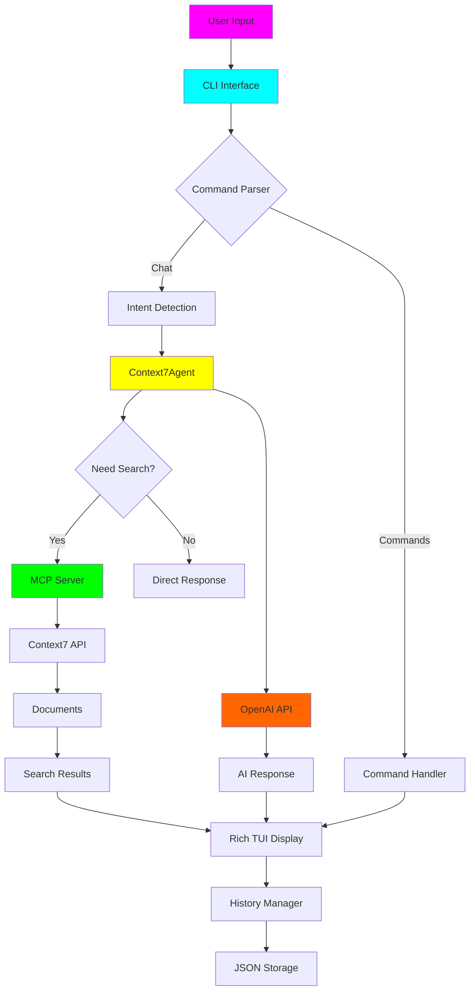

<p align="center">
  <a href="#">
    
  </a>
</p>

<div align="center">

# 🤖 Context7 AI Agent

### *Stunning Terminal AI with Pydantic AI & Context7 MCP Integration*

[](https://www.python.org/downloads/)
[](https://opensource.org/licenses/MIT)
[](https://python-poetry.org/)
[](https://github.com/Textualize/rich)

*Meet your intelligent document discovery companion with 4 stunning visual themes*


</div>

## ✨ Features

### 🎯 **Current Features**
- **🧠 Advanced AI Agent** - Powered by Pydantic AI with OpenAI integration
- **🔌 Context7 MCP Integration** - Intelligent document discovery via MCP protocol
- **🎨 4 Stunning Themes** - Cyberpunk, Ocean, Forest, Sunset with gradient effects
- **💬 Real-time Chat** - Interactive terminal interface with streaming responses
- **📄 Document Management** - Search, preview, bookmark, and organize documents
- **📊 Analytics Dashboard** - Usage statistics and conversation insights
- **💾 Session Persistence** - Save/resume conversations across sessions
- **🎯 Intent Detection** - Automatic document search based on chat context
- **✨ Rich TUI** - Beautiful terminal interface with animations and effects

### 🗺️ **Roadmap**

#### 🎯 **Immediate Goals** (Next 2-4 weeks)
- [ ] **🎤 Voice Input Support** - Add speech-to-text for hands-free interaction
- [ ] **📋 Document Previews** - Rich document rendering with syntax highlighting
- [ ] **🔍 Advanced Search Filters** - Date ranges, file types, content categories
- [ ] **📤 Export Formats** - PDF, Markdown, and HTML conversation exports
- [ ] **🔌 Plugin System** - Allow custom MCP server integrations
- [ ] **🐳 Docker Support** - Containerized deployment with Docker Compose

#### 🔮 **Long-term Vision** (3-6 months)
- [ ] **🌐 Web Interface** - Browser-based UI alongside terminal
- [ ] **👥 Multi-user Support** - Collaborative sessions and shared workspaces
- [ ] **🗄️ Vector Database** - Pinecone/Chroma integration for semantic search
- [ ] **🔗 API Server** - RESTful API for programmatic access
- [ ] **📱 Mobile App** - iOS/Android companion applications
- [ ] **🏢 Enterprise Features** - SSO, audit logs, admin dashboard
- [ ] **🎭 Multi-modal** - Image and audio document support

## 📁 Codebase File Hierarchy

```
context7-agent/
├── 📁 src/                       # Core application code
│   ├── 🧠 agent.py              # Pydantic AI agent with MCP integration
│   ├── 💻 cli.py                # Rich terminal interface & commands
│   ├── ⚙️  config.py            # Configuration management
│   ├── 📚 history.py            # Conversation persistence & analytics
│   ├── 🎨 themes.py             # Visual themes & animations
│   └── 🔧 utils.py              # Utility functions
├── 🧪 tests/                     # Test suite
├── 📖 docs/                      # Documentation
├── 📦 pyproject.toml            # Poetry configuration
├── 📋 requirements.txt          # Dependencies
├── 📄 README.md                 # This file
└── 🔐 .env.example              # Environment template
```

## 🏗️ System Architecture Flow



## 📋 File Descriptions

| File | Purpose | Key Features |
|------|---------|--------------|
| `src/agent.py` | 🧠 AI Brain | Pydantic AI agent, MCP integration, intent detection |
| `src/cli.py` | 💻 Terminal UI | Rich interface, 4 themes, command system |
| `src/config.py` | ⚙️ Configuration | Environment variables, MCP setup |
| `src/history.py` | 📚 Persistence | Conversation storage, JSON serialization |
| `src/themes.py` | 🎨 Visual System | 4 themes, animations, gradient effects |
| `src/utils.py` | 🔧 Utilities | Helper functions and shared utilities |

## 🚀 Deployment Guide

### 📋 Prerequisites
- **Python 3.12+** (required for Pydantic AI)
- **Node.js 16+** (for Context7 MCP server)
- **Poetry** (recommended) or **pip**

### 💻 Local Development Setup

#### 1. Clone Repository
```bash
git clone https://github.com/context7/context7-agent.git
cd context7-agent
```

#### 2. Install Dependencies
```bash
# Using Poetry (recommended)
poetry install

# Or using pip
pip install -r requirements.txt
```

#### 3. Environment Configuration
```bash
# Copy environment template
cp .env.example .env

# Edit .env file with your settings
nano .env
```

**Required Environment Variables:**
```bash
# OpenAI Configuration
OPENAI_API_KEY=your_openai_api_key_here
OPENAI_BASE_URL=https://api.openai.com/v1  # Optional
OPENAI_MODEL=gpt-4o-mini                  # Optional

# MCP Configuration
MCP_SERVER_COMMAND=npx                    # Optional
DEFAULT_THEME=cyberpunk                   # Optional
```

#### 4. Install Context7 MCP Server
```bash
# Install Context7 MCP globally
npm install -g @upstash/context7-mcp@latest

# Or use npx (auto-handled by agent)
```

### 🐳 Docker Deployment

#### 1. Docker Compose Setup
Create `docker-compose.yml`:
```yaml
version: '3.8'
services:
  context7-agent:
    build: .
    environment:
      - OPENAI_API_KEY=${OPENAI_API_KEY}
      - OPENAI_MODEL=${OPENAI_MODEL:-gpt-4o-mini}
      - DEFAULT_THEME=${DEFAULT_THEME:-cyberpunk}
    volumes:
      - ./data:/root/.context7-agent
    stdin_open: true
    tty: true
    ports:
      - "8080:8080"  # For future web interface

  # Optional: Database for enterprise features
  postgres:
    image: postgres:15
    environment:
      POSTGRES_DB: context7
      POSTGRES_USER: context7
      POSTGRES_PASSWORD: ${DB_PASSWORD:-context7}
    volumes:
      - postgres_data:/var/lib/postgresql/data
    ports:
      - "5432:5432"

volumes:
  postgres_data:
```

#### 2. Dockerfile
Create `Dockerfile`:
```dockerfile
FROM python:3.12-slim

# Install Node.js for MCP server
RUN apt-get update && apt-get install -y \
    curl \
    nodejs \
    npm \
    && rm -rf /var/lib/apt/lists/*

# Install Context7 MCP
RUN npm install -g @upstash/context7-mcp@latest

# Set working directory
WORKDIR /app

# Copy requirements
COPY pyproject.toml poetry.lock* ./

# Install Python dependencies
RUN pip install poetry && \
    poetry config virtualenvs.create false && \
    poetry install --no-dev

# Copy application code
COPY src/ ./src/

# Create data directory
RUN mkdir -p /root/.context7-agent

# Set entrypoint
ENTRYPOINT ["python", "-m", "src.cli"]
```

#### 3. Deploy with Docker
```bash
# Build and run
docker-compose up --build

# Or run standalone
docker build -t context7-agent .
docker run -it --env-file .env context7-agent
```

## 📖 User Guide

### 🚀 Getting Started

#### 1. Quick Start
```bash
# Run the application
python -m src.cli

# Or if installed globally
context7
```

#### 2. First Run Setup
When you first run Context7, you'll see:
1. **Welcome Screen** - Animated introduction with theme preview
2. **Initialization** - MCP server connection and agent setup
3. **Main Interface** - Ready to chat!

### 💬 Basic Usage

#### Chat Mode
```
🤖 Welcome to Context7 AI Agent!
You > Hello, can you help me understand quantum computing?
Context7 > [AI response with automatic document search...]
```

#### Available Commands
| Command | Description | Example |
|---------|-------------|---------|
| `/help` | Show all commands | `/help` |
| `/theme [name]` | Change visual theme | `/theme ocean` |
| `/search [query]` | Manual document search | `/search ai ethics` |
| `/preview [id]` | Preview document | `/preview 1` |
| `/bookmark [id]` | Save document | `/bookmark 3` |
| `/bookmarks` | View saved documents | `/bookmarks` |
| `/history [n]` | View recent messages | `/history 10` |
| `/analytics` | Usage statistics | `/analytics` |
| `/clear` | Clear conversation | `/clear` |
| `/export [format]` | Export conversation | `/export json` |
| `/session [name]` | Switch sessions | `/session work` |
| `/quit` | Exit application | `/quit` |

### 🎨 Theme Showcase

#### Switch Themes
```bash
/theme cyberpunk  # 🌃 Futuristic neon
/theme ocean      # 🌊 Calm blue tones
/theme forest     # 🌲 Natural green
/theme sunset     # 🌅 Warm orange
```

### 🔍 Document Discovery

#### Automatic Search
Context7 automatically searches for documents when you:
- Ask technical questions
- Mention specific topics
- Use keywords like "explain", "how to", "guide"

#### Manual Search
```bash
/search machine learning best practices
/search Python async programming
/search quantum computing basics
```

### 💾 Session Management

#### Save Current Session
```bash
/session my-work-project
```

#### Switch Sessions
```bash
/session personal
/session research
```

#### Export Conversations
```bash
/export json  # JSON format with metadata
/export txt   # Plain text format
```

### 📊 Analytics Dashboard
View your usage patterns:
- Total messages and searches
- Average message length
- Recent activity (24h)
- Bookmarked documents
- Session statistics

### 💡 Pro Tips

1. **Use Natural Language** - Ask questions naturally, Context7 will understand
2. **Bookmark Important Docs** - Save useful documents with `/bookmark [id]`
3. **Switch Themes** - Use `/theme` to match your mood or environment
4. **Session Management** - Use different sessions for different projects
5. **Export Regularly** - Backup important conversations with `/export`

### 🔧 Troubleshooting

#### Common Issues

**MCP Server Connection Failed**
```bash
# Ensure Node.js is installed
node --version

# Install Context7 MCP globally
npm install -g @upstash/context7-mcp@latest
```

**OpenAI API Key Error**
```bash
# Check environment variable
echo $OPENAI_API_KEY

# Set in .env file
echo "OPENAI_API_KEY=your-key" >> .env
```

**Theme Not Changing**
```bash
# Available themes: cyberpunk, ocean, forest, sunset
/theme ocean
```

**Performance Issues**
- Reduce history size in `.env`: `MAX_HISTORY_SIZE=100`
- Use smaller model: `OPENAI_MODEL=gpt-3.5-turbo`
- Clear conversation: `/clear`

## 🤝 Contributing

We welcome contributions! Please see our [Contributing Guide](CONTRIBUTING.md) for details.

### Quick Contribution Steps
1. Fork the repository
2. Create a feature branch: `git checkout -b feature/amazing-feature`
3. Make your changes
4. Run tests: `pytest`
5. Commit: `git commit -m 'Add amazing feature'`
6. Push: `git push origin feature/amazing-feature`
7. Open a Pull Request

## 📜 License

This project is licensed under the MIT License - see the [LICENSE](LICENSE) file for details.

## 🙏 Acknowledgments

- **Pydantic AI** - For the amazing AI framework
- **Rich** - For the beautiful terminal interface
- **Context7** - For the document discovery MCP server
- **OpenAI** - For the powerful language models

## 💬 Support

- **Issues**: [GitHub Issues](https://github.com/context7/context7-agent/issues)
- **Discussions**: [GitHub Discussions](https://github.com/context7/context7-agent/discussions)
- **Discord**: [Join our community](https://discord.gg/context7)

---

<div align="center">

**Made with ❤️ by the Context7 Team**

*Bringing intelligent document discovery to your terminal*

</div>
