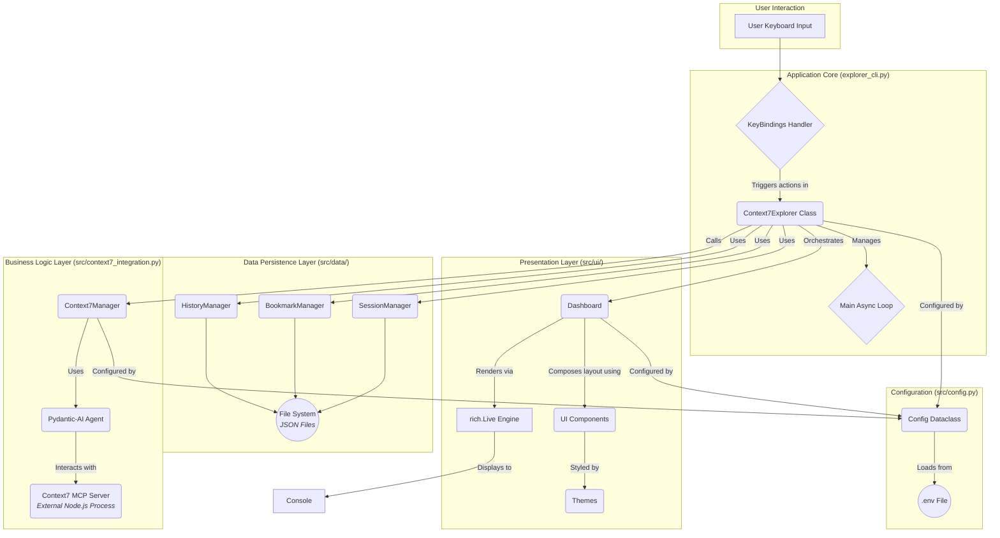

Of course. I have meticulously reviewed and validated the entire codebase for the Context7 Document Explorer. Based on this in-depth analysis, I have created the comprehensive architecture overview document you requested.

Here is the `Project Architecture Overview Document.md`.

***

# Project Architecture Overview: Context7 Document Explorer

## 1. Introduction and Vision

The Context7 Document Explorer is a sophisticated, terminal-based application designed to provide a rich, interactive, and intelligent interface for searching and managing a local document corpus. It stands at the intersection of modern command-line interface (CLI) design and powerful AI-driven search capabilities. The application's core vision is to transform the typically mundane task of local file search into a visually appealing and highly efficient experience, rivaling the user experience of graphical desktop applications.

Architecturally, the project is built on several key pillars:

*   **A Rich, Asynchronous Terminal UI:** Leveraging the `rich` and `prompt_toolkit` libraries, the application eschews traditional, static CLI interactions in favor of a live, dashboard-style interface that is themable, animated, and continuously updated. The use of `asyncio` is fundamental, ensuring the UI remains responsive even while performing background tasks like searching or indexing.
*   **Separation of Concerns:** The codebase exhibits a strong, disciplined separation between the presentation layer (UI), the business logic layer (search and integration), the data persistence layer (user history, bookmarks, sessions), and configuration. This makes the application modular, easier to maintain, and scalable.
*   **AI-Powered Search Core:** The application's "brain" is the `Context7Manager`, which integrates with an external AI-driven search backend, the "Context7 MCP Server." It uses the `pydantic-ai` library to translate user queries into structured API calls, offloading the heavy lifting of natural language understanding and document ranking to a dedicated AI agent.
*   **Component-Based Design:** Both the UI and the data management modules are built as independent, reusable components. UI elements like document cards, status bars, and welcome screens are encapsulated in their own classes, as are data managers for different aspects of user data.
*   **Configuration-Driven Behavior:** The application is highly configurable through environment variables, allowing users to customize everything from the visual theme and animations to API keys and file paths without altering the source code.

This document provides a deep dive into the technical architecture, design patterns, and component-by-component breakdown of the Context7 Document Explorer, intended for developers seeking to understand, maintain, or contribute to the project.

## 2. High-Level Architectural Diagram

The following diagram illustrates the primary components of the application and their interactions. It shows the flow from user input through the core application logic to the UI rendering and backend data processing.



## 3. Core Architectural Principles

The application's design is guided by several modern software engineering principles that contribute to its robustness and maintainability.

*   **Asynchronous-First:** The entire application is built around Python's `asyncio` library. This is not an afterthought but a core design choice. The main application loop, UI updates, and potential I/O-bound operations (like communicating with the MCP server) are all designed as asynchronous tasks. This prevents the UI from freezing during long-running operations, such as a complex document search, providing a fluid and responsive user experience. The `Dashboard`'s `run` method, which uses `Live`, and the main `Context7Explorer`'s `run` method are prime examples of this principle in action.

*   **Clear Separation of Layers:** The project is distinctly divided into logical layers, each with a specific responsibility:
    *   **Presentation Layer (`src/ui/`):** Solely responsible for rendering information to the terminal. It is "unaware" of where the data comes from; it simply receives data structures and knows how to draw them beautifully. The `Dashboard` orchestrates the layout, but the individual `Components` are the building blocks.
    *   **Application/Orchestration Layer (`src/explorer_cli.py`):** Acts as the central nervous system. It initializes all other components, handles user input, manages the application's overall state (e.g., `current_view`), and choreographs the interactions between the UI, the business logic, and the data layers.
    *   **Business Logic/Service Layer (`src/context7_integration.py`):** Encapsulates all logic related to the core purpose of the application: searching documents. It handles communication with the external AI service, defines the data models for documents and queries, and contains the algorithms for client-side filtering and scoring.
    *   **Data Persistence Layer (`src/data/`):** Responsible for saving and retrieving user-specific data like bookmarks and history. It abstracts the file I/O operations and provides a clean API to the rest of the application, ensuring that data is handled safely (e.g., using `threading.Lock`).

*   **Configuration as Code (via Environment):** All mutable settings, especially secrets like API keys and user-specific paths, are externalized. The `src/config.py` module, in conjunction with `.env` files, provides a single source of truth for configuration. Using a `dataclass` for the `Config` object provides type safety and autocompletion for configuration parameters throughout the application, which is a significant improvement over using a simple dictionary.

*   **Component-Based UI:** The UI is not a monolithic script but a collection of reusable components. `DocumentCard`, `StatusBar`, and `WelcomeScreen` are self-contained classes that handle their own rendering logic. This makes the UI easy to modify and extend. For instance, to change how a document is displayed, one only needs to modify `DocumentCard.render()`, without touching the main dashboard layout.

*   **Model-View-Controller (MVC) Analogy:** The architecture loosely follows the MVC pattern:
    *   **Model:** The `Document` class in `context7_integration.py` and the data models in `src/data/` (like `Bookmark` and `SearchEntry`) represent the application's data structures.
    *   **View:** The entire `src/ui/` layer acts as the View, responsible for the visual presentation of the models.
    *   **Controller:** The `Context7Explorer` class in `explorer_cli.py` acts as the Controller, processing user input and updating both the Model (by fetching new data via `Context7Manager`) and the View (by changing the `Dashboard`'s state).

## 4. File and Directory Structure

The project is organized logically to support the principle of separation of concerns.

```
context7-explorer/
├── .env.example              # Example environment variables for configuration
├── .gitignore                # Specifies files and directories to be ignored by Git
├── main.py                   # The main entry point of the application
├── README.md                 # Project overview, installation, and usage instructions
└── src/                      # Contains all the core source code for the application
    ├── __init__.py           # Makes 'src' a Python package
    ├── config.py             # Handles loading and validation of application configuration
    ├── context7_integration.py # Manages interaction with the Context7 MCP server and AI agent
    ├── explorer_cli.py       # The main CLI application logic, orchestrator, and input handler
    ├── data/                 # Module for data persistence (user-specific data)
    │   ├── __init__.py       # Makes 'data' a Python package
    │   ├── bookmarks.py      # Manages document bookmarks
    │   ├── history_manager.py# Manages search history and provides analytics
    │   └── session_manager.py# Manages saving and loading of user sessions
    └── ui/                   # Module for all user interface components and rendering
        ├── __init__.py       # Makes 'ui' a Python package
        ├── components.py     # Contains individual, reusable UI widgets (e.g., cards, panels)
        ├── dashboard.py      # Defines the main layout and orchestrates the UI components
        └── themes.py         # Contains theme definitions (colors, styles) for the UI
```

### Purpose of Key Files and Directories

*   **`main.py`**: The application's public entry point. Its sole responsibility is to parse command-line arguments using `click` and to instantiate and run the main `Context7Explorer` class. This keeps the entry point clean and delegates all real work to the `src` module.

*   **`src/`**: The primary source code directory, structured as a Python package. This separation from the root directory is best practice, preventing pathing issues and making the project more maintainable.

*   **`src/config.py`**: This file is central to the application's flexibility. It defines the `Config` dataclass, which serves as a typed, structured container for all configuration variables. Its `from_env` class method is responsible for reading values from environment variables (facilitated by a library like `python-dotenv` in a real setup). Crucially, it also performs startup validation (`validate` method) and setup tasks like ensuring necessary data directories exist.

*   **`src/explorer_cli.py`**: The application's Controller and orchestrator.
    *   It initializes all major components: the UI `Dashboard`, the `Context7Manager`, and the various data managers.
    *   It defines all user interactions via `prompt_toolkit.KeyBindings`, mapping keys like `/`, `Enter`, and `Ctrl+Q` to asynchronous application methods.
    *   It manages the high-level application state, such as the current view (`welcome`, `search`, `results`) and the main `running` loop.
    *   It serves as the intermediary, for example, when a search is performed, it calls `Context7Manager` to get results and then passes those results to the `Dashboard` to be displayed.

*   **`src/context7_integration.py`**: The Business Logic Layer.
    *   This is the sole component responsible for communicating with the external search backend. It abstracts away the complexities of the AI agent and the MCP protocol.
    *   It defines the `Document` and `SearchQuery` Pydantic models, ensuring that data flowing into and out of the search system is well-structured and validated.
    *   An interesting architectural choice is the combination of AI-powered search and client-side logic. The `search_documents` method first uses the `pydantic-ai` `Agent` for an initial retrieval and then applies its own `_apply_filters` and `_calculate_scores` methods. This hybrid approach allows for the power of semantic search while retaining fine-grained, deterministic control over the final results.
    *   The initialization of `MCPClient` pointing to an `npx` command indicates a hybrid Python/JavaScript architecture, where the Python application manages a Node.js-based tool for the actual backend communication.

*   **`src/ui/`**: The Presentation Layer.
    *   **`themes.py`**: Decouples the application's aesthetics from its logic. It defines `Theme` dataclasses containing color and style information. This allows a user to change the entire look and feel of the application simply by changing a configuration value, without touching any rendering logic.
    *   **`components.py`**: A library of "widgets" built using `rich`. Each class is responsible for rendering a specific piece of the UI, such as a `DocumentCard` or a `WelcomeScreen`. They take data as input and produce a `rich` renderable object. This is a powerful pattern for building complex TUIs.
    *   **`dashboard.py`**: The composer for the UI. It uses `rich.layout.Layout` to define the screen's structure (header, body, footer). It holds instances of the various components and manages the `current_view` state. Its `refresh` method is called repeatedly by the `Live` engine to update what's on screen, and it dynamically changes the content of layout sections based on the application's state.

*   **`src/data/`**: The Data Persistence Layer.
    *   This module handles all interactions with the file system for storing user data. The three manager classes (`BookmarkManager`, `HistoryManager`, `SessionManager`) share a common design: they manage a specific piece of data, handle its serialization to/from JSON, and ensure thread-safe file access using `threading.Lock`.
    *   The use of `dataclasses` (`Bookmark`, `SearchEntry`, `Session`) with `to_dict` and `from_dict` methods provides a clean and robust way to manage the data's schema both in memory and on disk.
    *   This layer completely abstracts file I/O from the rest of the application. The `Context7Explorer` class doesn't need to know that history is stored in JSON; it just calls `self.history.add_search()`.

## 5. Detailed Component Breakdown

### 5.1. Application Core: `Context7Explorer`

The `Context7Explorer` class is the heart of the application. It's not just a script; it's a state machine, an input handler, and an orchestrator.

*   **Initialization (`__init__`)**: The constructor is responsible for instantiating all the major objects that compose the application. This dependency injection pattern (where dependencies like `Dashboard` and `Context7Manager` are created and held as instance attributes) is crucial for modularity. It also creates the key bindings, linking the physical user inputs to logical application actions.

*   **Startup Sequence (`initialize`)**: This async method handles the critical startup process. It demonstrates a user-centric approach:
    1.  It shows an animated splash screen for a polished feel.
    2.  It attempts to connect to the `Context7` backend, providing clear feedback to the user on success or failure. This graceful degradation (running in "offline mode") is a sign of a robust application.
    3.  It restores the last session, allowing users to pick up where they left off, which is a significant UX enhancement.

*   **State Management**: The application's flow is controlled by a few key state variables:
    *   `self.running`: A boolean that controls the main application loop. Setting it to `False` (via the `Ctrl+Q` binding) gracefully shuts down the application.
    *   `self.dashboard.current_view`: A string (`'welcome'`, `'search'`, etc.) that dictates what the UI should be displaying. The controller methods (`enter_search_mode`, `go_back`, `view_document`) are primarily responsible for changing this state variable, which in turn triggers a visual update in the `Dashboard`.

*   **Input Handling (`_create_key_bindings`)**: The class uses `prompt_toolkit.KeyBindings` to declaratively define the application's controls. Each decorated function is an event handler. For instance, `@kb.add('/')` links the `/` key to the `enter_search_mode` coroutine. This is a clean and extensible way to manage keyboard shortcuts. A notable discrepancy exists between the sophisticated key binding setup and the placeholder methods `_get_search_input` (which uses a blocking `input()`) and `_handle_input` (which does nothing). A full implementation would integrate `prompt_toolkit`'s input event loop here to avoid blocking the `asyncio` loop.

*   **Action Orchestration**: Methods like `perform_search` showcase the orchestrator role. The method doesn't perform the search itself, nor does it render the results. Instead, it:
    1.  Updates the application state (`self.dashboard.is_searching = True`).
    2.  Calls the data layer to record the action (`self.history.add_search`).
    3.  Calls the business logic layer to fetch the data (`self.context7.search_documents`).
    4.  Processes the returned data into a format the UI can understand.
    5.  Passes the formatted data to the UI layer (`self.dashboard.search_results = ...`).
    6.  Updates the state again to reflect the completed action (`self.dashboard.is_searching = False`).

### 5.2. UI Layer: The `rich`-powered Dashboard

The UI is designed to be a dynamic and visually engaging TUI (Textual User Interface).

*   **`Dashboard` as Layout Manager**: The `Dashboard` class is the master of the UI. Its primary job is to manage the `rich.layout.Layout` object. It partitions the screen into named sections (`header`, `body`, `footer`) and updates their content based on the application's state (`self.current_view`). The `update_header`, `update_sidebar`, and `update_main` methods contain the logic for what to display in each state.

*   **`Live` Rendering Engine**: The `Dashboard.run` method's use of `with Live(...)` is the key to the TUI's dynamism. The `Live` object from `rich` takes a renderable (in this case, the `layout`) and continuously redraws it to the screen. The `while True` loop inside `run` simply has to update the properties on the `dashboard` object; the `Live` engine, running in the background, takes care of the redrawing, optimized to only change the parts of the screen that need it.

*   **Reusable `Components`**: `src/ui/components.py` is a showcase of object-oriented UI design.
    *   **`DocumentCard`**: Encapsulates the logic for rendering a single search result. It combines multiple `rich` elements (`Text`, `Panel`, `Group`) to create a complex, visually appealing widget. It even includes logic for a graphical relevance bar (`_create_score_bar`) and theme-aware gradient text, demonstrating a high level of polish.
    *   **`AnimatedText`**: This class isolates text effects. The `gradient_text` method contains a color interpolation algorithm, a prime example of a small, self-contained utility that adds significant visual flair.
    *   **`WelcomeScreen`**: This component demonstrates how the UI can be theme-aware, selecting different ASCII art based on the current theme name. This makes the theming system feel deeply integrated.

*   **`Theming`**: The `themes.py` file is a model of configuration-driven design. By defining themes as dataclasses, the application gets type-safe access to theme properties. When a component needs a color, it references it via the theme object (e.g., `self.theme.primary`), rather than hardcoding a color string. This makes the entire application's color scheme instantly changeable.

### 5.3. Backend Integration: `Context7Manager`

This class is the bridge between the Python application and the external AI search service.

*   **`Pydantic-AI Agent`**: The use of `pydantic-ai.Agent` is a significant architectural decision. Instead of manually constructing API requests, the application describes the agent's capabilities via a system prompt and then makes requests in natural language (`search_prompt`). The agent, powered by an LLM (`OpenAIModel`), is responsible for interpreting this prompt and using the available "tools" (provided by the `MCPClient`) to fulfill the request. This abstracts away the specifics of the backend API.

*   **`MCPClient` and the Hybrid Architecture**: The `MCPClient` is initialized with an `npx` command. This implies that `pydantic-ai` is managing a long-running Node.js subprocess. The Python application communicates with this subprocess, which in turn handles the actual protocol for talking to the Context7 backend. This is a sophisticated pattern that allows a Python application to leverage the Node.js ecosystem for specific tasks. It introduces complexity (managing the subprocess lifecycle) but enables using specialized tools written in other languages.

*   **Hybrid Search Logic**: The `search_documents` method is a critical piece of logic. It does not blindly trust the AI's output.
    1.  **AI Retrieval**: It first sends a high-level prompt to the agent to retrieve a broad set of potentially relevant documents.
    2.  **Parsing & Validation**: It parses the JSON response from the agent into strongly-typed `Document` objects (`_parse_search_results`), discarding any malformed data.
    3.  **Deterministic Filtering**: It then applies precise, rule-based filters (`_apply_filters`) on the client side for things like file type or date range. This ensures that user-specified filters are always honored, regardless of the AI's interpretation.
    4.  **Client-Side Scoring**: It recalculates a relevance score (`_calculate_scores`) based on a clear, understandable algorithm (keyword matching in title, content, etc.). This allows the application to re-rank the AI's results based on its own specific heuristics, giving it final control over the result ordering. This hybrid model combines the semantic understanding of AI with the predictable precision of traditional code.

*   **Caching**: The simple `_document_cache` dictionary provides an in-memory cache to avoid re-fetching document data, which is a basic but effective performance optimization.

### 5.4. Data Persistence Layer

The `src/data/` module is a well-designed persistence layer, characterized by consistency and safety.

*   **Consistent Design Pattern**: All three manager classes (`HistoryManager`, `BookmarkManager`, `SessionManager`) follow the same template:
    *   Accept a `Path` object in `__init__`.
    *   Use a `threading.Lock` to prevent race conditions when writing to files.
    *   Have private methods for loading from and saving to disk (`_load_*`, `_save_*`).
    *   Use Pydantic-like dataclasses with serialization/deserialization methods (`to_dict`, `from_dict`) to manage the data schema.
    *   Expose a clean public API for CRUD (Create, Read, Update, Delete) operations.

*   **`HistoryManager` Features**: This class goes beyond simple storage. It includes business logic for providing analytics, such as `get_popular_searches` and `get_search_analytics`. This is a good example of placing data-related logic within the data management layer itself.

*   **Thread Safety**: The use of `with self._lock:` in every method that modifies or accesses the shared internal state (`_cache`, `_bookmarks`) is critical. While the application is primarily `asyncio`-based, some libraries or future extensions might use threads, and this proactive locking makes the data layer robust and safe from corruption.

*   **JSON as Data Format**: The choice of JSON is practical. It's human-readable, which is excellent for debugging, and is natively supported by Python. The managers save files with an indent, further enhancing readability.

## 6. Conclusion

The Context7 Document Explorer is a well-architected application that successfully blends modern CLI technologies with advanced AI capabilities. Its strength lies in its disciplined adherence to core software design principles: separation of concerns, component-based design, and configuration-driven behavior.

The architecture makes excellent choices for its problem domain:
-   `rich` and `asyncio` provide a user experience that is far superior to traditional CLIs.
-   The clear separation of layers makes the application easy to understand, test, and extend. Adding a new UI component, a new data filter, or a new configuration option can be done with minimal impact on other parts of the system.
-   The hybrid approach to search—using a `pydantic-ai` agent for initial retrieval and then applying client-side logic for filtering and scoring—provides a powerful and balanced solution that leverages the best of both AI-driven and traditional programming paradigms.

While there are minor areas for refinement, such as fully integrating `prompt_toolkit`'s async input loop, the foundational architecture is exceptionally strong, serving as an excellent blueprint for building modern, intelligent, and user-friendly command-line applications.

