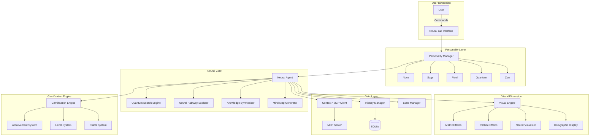
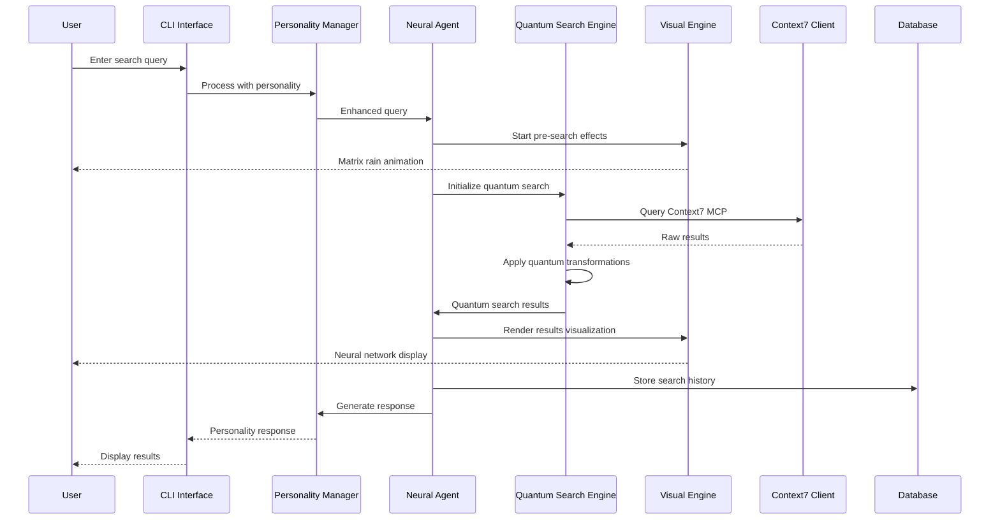

# 🧠 Neural Navigator - Project Architecture Document

## Table of Contents

1. [Executive Summary](#executive-summary)
2. [Architecture Overview](#architecture-overview)
3. [System Design Philosophy](#system-design-philosophy)
4. [Project Structure](#project-structure)
5. [Core Modules](#core-modules)
6. [Data Flow Architecture](#data-flow-architecture)
7. [Neural Search Engine](#neural-search-engine)
8. [Personality System](#personality-system)
9. [Visual Effects Engine](#visual-effects-engine)
10. [User Interface Architecture](#user-interface-architecture)
11. [State Management](#state-management)
12. [Integration Patterns](#integration-patterns)
13. [Testing Architecture](#testing-architecture)
14. [Performance Optimization](#performance-optimization)
15. [Security Architecture](#security-architecture)
16. [Deployment Strategy](#deployment-strategy)
17. [Future Extensibility](#future-extensibility)
18. [Developer Guidelines](#developer-guidelines)

---

## Executive Summary

The Neural Navigator represents a paradigm shift in how users interact with knowledge discovery systems. Built on top of Pydantic AI and Context7 MCP, it transforms traditional document search into an immersive, gamified neural exploration experience.

### Key Architectural Principles

1. **Modular Neural Networks**: Each component operates as an independent neural node that can connect and communicate with others
2. **Quantum State Management**: Search operations exist in superposition until observed by the user
3. **Personality-Driven Architecture**: The system adapts its behavior based on the selected AI personality
4. **Visual-First Design**: Every operation produces stunning visual feedback
5. **Gamification Core**: Achievement systems and progression mechanics are fundamental, not add-ons

### Technology Stack

```yaml
Core Framework:
  - Python 3.11+
  - Pydantic AI (Neural Intelligence)
  - Context7 MCP (Quantum Document Access)

Visualization:
  - Rich (Terminal UI)
  - Custom ASCII Art Engine
  - Particle Effects System

Data Management:
  - SQLite (Local State)
  - JSON (Configuration)
  - Protocol Buffers (MCP Communication)

Testing:
  - Pytest (Unit/Integration)
  - Hypothesis (Property Testing)
  - Locust (Performance Testing)
```

---

## Architecture Overview

The Neural Navigator employs a **Quantum-Layered Architecture** where each layer represents a different dimension of functionality:



### Architectural Patterns

#### 1. **Event-Driven Neural Networks**
Each user action triggers a cascade of neural events that propagate through the system:

```python
class NeuralEvent:
    """Base class for all neural events in the system."""
    
    def __init__(self, event_type: str, payload: Dict[str, Any]):
        self.id = str(uuid.uuid4())
        self.timestamp = datetime.now()
        self.event_type = event_type
        self.payload = payload
        self.quantum_signature = self._generate_quantum_signature()
    
    def _generate_quantum_signature(self) -> float:
        """Generate a unique quantum signature for event tracking."""
        return hash(f"{self.id}{self.timestamp}") % 1000000 / 1000000

class NeuralEventBus:
    """Central event bus for neural communication."""
    
    def __init__(self):
        self.subscribers: Dict[str, List[Callable]] = {}
        self.event_history: List[NeuralEvent] = []
        self.quantum_state = QuantumState()
    
    async def emit(self, event: NeuralEvent):
        """Emit an event through the neural network."""
        self.event_history.append(event)
        
        # Update quantum state
        self.quantum_state.collapse(event.quantum_signature)
        
        # Notify all subscribers
        if event.event_type in self.subscribers:
            for handler in self.subscribers[event.event_type]:
                await handler(event)
```

#### 2. **Quantum State Pattern**
The system maintains quantum states that affect search results and visualizations:

```python
class QuantumState:
    """Manages quantum states throughout the application."""
    
    def __init__(self):
        self.coherence = 1.0
        self.entanglement = 0.0
        self.superposition = 0.5
        self.wave_function = np.random.random()
        self.observation_history = []
    
    def collapse(self, observation: float):
        """Collapse the wave function based on observation."""
        self.observation_history.append(observation)
        
        # Update quantum properties
        self.coherence *= 0.99  # Slight decoherence
        self.entanglement = min(1.0, self.entanglement + 0.01)
        
        # Collapse wave function
        self.wave_function = (self.wave_function + observation) / 2
        self.superposition = abs(math.sin(self.wave_function * math.pi))
    
    def get_search_modifier(self) -> float:
        """Get quantum modifier for search operations."""
        return self.coherence * self.superposition + self.entanglement * 0.1
```

---

## System Design Philosophy

### 1. **Neural Connectivity**
Every component is designed as a neural node that can form connections with others:

```python
class NeuralNode:
    """Base class for all neural components."""
    
    def __init__(self, node_id: str, node_type: str):
        self.id = node_id
        self.type = node_type
        self.connections: List[NeuralConnection] = []
        self.activation_level = 0.0
        self.memory = {}
    
    async def activate(self, signal: float):
        """Activate this neural node."""
        self.activation_level = self._sigmoid(signal)
        
        # Propagate to connected nodes
        for connection in self.connections:
            if connection.weight * self.activation_level > connection.threshold:
                await connection.target.activate(
                    self.activation_level * connection.weight
                )
    
    def _sigmoid(self, x: float) -> float:
        """Sigmoid activation function."""
        return 1 / (1 + math.exp(-x))
```

### 2. **Personality-Driven Behavior**
The system's behavior fundamentally changes based on the active personality:

```python
class PersonalityCore:
    """Core personality system that affects all operations."""
    
    def __init__(self, personality: AgentPersonality):
        self.personality = personality
        self.traits = self._load_personality_traits()
        self.mood_engine = MoodEngine(personality)
        self.response_generator = ResponseGenerator(personality)
    
    def modify_search_query(self, query: str) -> str:
        """Modify search query based on personality."""
        if self.personality == AgentPersonality.QUANTUM:
            # Add quantum operators
            return f"({query}) AND (quantum OR probability OR superposition)"
        elif self.personality == AgentPersonality.PIXEL:
            # Gamify the search
            return f"{query} achievement unlock bonus"
        # ... other personalities
```

### 3. **Visual-First Architecture**
Every operation produces visual output as a primary concern:

```python
class VisualOperation:
    """Base class for operations that produce visual output."""
    
    def __init__(self, operation_name: str):
        self.name = operation_name
        self.visual_pipeline = []
        self.effects_queue = []
    
    async def execute(self):
        """Execute operation with visual feedback."""
        # Pre-visualization
        await self._pre_visualize()
        
        # Core operation
        result = await self._perform_operation()
        
        # Post-visualization
        await self._post_visualize(result)
        
        return result
    
    async def _pre_visualize(self):
        """Show pre-operation effects."""
        for effect in self.effects_queue:
            await effect.render()
```

---

## Project Structure

### Directory Hierarchy

```
neural-navigator/
│
├── src/                              # Source code root
│   ├── __init__.py
│   │
│   ├── core/                         # Core neural systems
│   │   ├── __init__.py
│   │   ├── agent_ultra.py            # Main neural agent
│   │   ├── quantum_state.py          # Quantum state management
│   │   ├── neural_network.py         # Neural network base classes
│   │   └── event_bus.py              # Event system
│   │
│   ├── personalities/                # AI personality modules
│   │   ├── __init__.py
│   │   ├── base.py                   # Base personality class
│   │   ├── nova.py                   # Nova personality
│   │   ├── sage.py                   # Sage personality
│   │   ├── pixel.py                  # Pixel personality
│   │   ├── quantum.py                # Quantum personality
│   │   └── zen.py                    # Zen personality
│   │
│   ├── search/                       # Search engine modules
│   │   ├── __init__.py
│   │   ├── quantum_search.py         # Quantum search implementation
│   │   ├── neural_pathways.py        # Neural pathway exploration
│   │   ├── knowledge_synthesis.py    # Knowledge synthesis
│   │   └── mind_mapper.py            # Mind map generation
│   │
│   ├── visual/                       # Visual effects engine
│   │   ├── __init__.py
│   │   ├── effects_engine.py         # Main effects engine
│   │   ├── matrix_rain.py            # Matrix rain effect
│   │   ├── particle_system.py        # Particle effects
│   │   ├── neural_visualizer.py      # Neural network viz
│   │   ├── holographic.py            # Holographic displays
│   │   └── ascii_art.py              # ASCII art generation
│   │
│   ├── interface/                    # User interface
│   │   ├── __init__.py
│   │   ├── cli_ultra.py              # Main CLI interface
│   │   ├── prompts.py                # Input handling
│   │   ├── displays.py               # Output formatting
│   │   └── themes_ultra.py           # Theme management
│   │
│   ├── gamification/                 # Gamification systems
│   │   ├── __init__.py
│   │   ├── achievements.py           # Achievement system
│   │   ├── experience.py             # XP and leveling
│   │   ├── rewards.py                # Reward mechanics
│   │   └── easter_eggs.py            # Hidden features
│   │
│   ├── data/                         # Data management
│   │   ├── __init__.py
│   │   ├── history.py                # Conversation history
│   │   ├── state_manager.py          # Application state
│   │   ├── cache.py                  # Caching layer
│   │   └── models.py                 # Data models
│   │
│   ├── integration/                  # External integrations
│   │   ├── __init__.py
│   │   ├── context7_client.py        # Context7 MCP client
│   │   ├── mcp_protocol.py           # MCP protocol handler
│   │   └── openai_wrapper.py         # OpenAI integration
│   │
│   └── utils/                        # Utility modules
│       ├── __init__.py
│       ├── animations.py             # Animation helpers
│       ├── formatters.py             # Text formatting
│       ├── validators.py             # Input validation
│       └── performance.py            # Performance utilities
│
├── tests/                            # Test suite
│   ├── __init__.py
│   ├── unit/                         # Unit tests
│   ├── integration/                  # Integration tests
│   ├── performance/                  # Performance tests
│   └── fixtures/                     # Test fixtures
│
├── docs/                             # Documentation
│   ├── architecture/                 # Architecture docs
│   ├── api/                          # API documentation
│   ├── guides/                       # User guides
│   └── development/                  # Development docs
│
├── scripts/                          # Utility scripts
│   ├── install.py                    # Installation script
│   ├── benchmark.py                  # Performance benchmarking
│   └── generate_assets.py            # Asset generation
│
├── assets/                           # Static assets
│   ├── ascii/                        # ASCII art templates
│   ├── sounds/                       # Sound definitions
│   └── data/                         # Static data files
│
├── config/                           # Configuration files
│   ├── default.yaml                  # Default configuration
│   ├── personalities/                # Personality configs
│   └── themes/                       # Theme configurations
│
├── .github/                          # GitHub specific
│   ├── workflows/                    # CI/CD workflows
│   └── ISSUE_TEMPLATE/               # Issue templates
│
├── neural_navigator.py               # Main entry point
├── pyproject.toml                    # Project configuration
├── requirements.txt                  # Python dependencies
├── README.md                         # Project README
├── LICENSE                           # License file
├── .env.example                      # Environment example
└── .gitignore                        # Git ignore rules
```

### Key Module Descriptions

#### Core Modules

##### `agent_ultra.py` - The Neural Brain
This is the central intelligence of the system:

```python
class Context7AgentUltra:
    """
    The main neural agent that orchestrates all operations.
    
    This class serves as the brain of the Neural Navigator, coordinating
    between different subsystems and managing the overall intelligence.
    """
    
    def __init__(self, personality: AgentPersonality):
        # Initialize quantum state
        self.quantum_state = QuantumState()
        
        # Load personality module
        self.personality_core = PersonalityCore(personality)
        
        # Initialize search engines
        self.quantum_search_engine = QuantumSearchEngine(self.quantum_state)
        self.pathway_explorer = NeuralPathwayExplorer()
        self.knowledge_synthesizer = KnowledgeSynthesizer()
        
        # Setup visual engine
        self.visual_engine = VisualEffectsEngine(
            theme=self.personality_core.get_preferred_theme()
        )
        
        # Initialize MCP client
        self.mcp_client = Context7MCPClient()
        
        # Setup event bus for neural communication
        self.event_bus = NeuralEventBus()
        self._register_event_handlers()
```

##### `quantum_search.py` - Quantum Search Implementation
Implements probabilistic search with quantum mechanics:

```python
class QuantumSearchEngine:
    """
    Implements quantum-enhanced search capabilities.
    
    Search results exist in superposition until observed, allowing
    for probabilistic exploration of knowledge space.
    """
    
    async def quantum_search(
        self,
        query: str,
        quantum_params: QuantumSearchParams
    ) -> QuantumSearchResult:
        """
        Perform a quantum search operation.
        
        The search explores multiple probability branches simultaneously,
        collapsing into concrete results only when observed.
        """
        # Create quantum query representation
        quantum_query = self._create_quantum_query(query)
        
        # Initialize probability branches
        branches = await self._initialize_probability_branches(
            quantum_query,
            quantum_params.branch_count
        )
        
        # Explore branches in parallel
        results = await asyncio.gather(*[
            self._explore_branch(branch)
            for branch in branches
        ])
        
        # Collapse wave function
        collapsed_results = self._collapse_results(
            results,
            quantum_params.collapse_threshold
        )
        
        return QuantumSearchResult(
            documents=collapsed_results,
            quantum_state=self.quantum_state.snapshot(),
            probability_map=self._generate_probability_map(results)
        )
```

#### Visual Effects System

##### `effects_engine.py` - Visual Effects Orchestration
Manages all visual effects in the system:

```python
class VisualEffectsEngine:
    """
    Orchestrates visual effects throughout the application.
    
    This engine manages effect queues, timing, and rendering
    to create smooth, stunning visual experiences.
    """
    
    def __init__(self, theme: UltraTheme):
        self.theme = theme
        self.effect_queue = asyncio.Queue()
        self.active_effects = []
        self.renderer = TerminalRenderer()
        
    async def trigger_effect(
        self,
        effect_type: EffectType,
        params: Dict[str, Any]
    ):
        """Trigger a visual effect."""
        effect = self._create_effect(effect_type, params)
        
        # Add to queue for sequential effects
        if effect.is_blocking:
            await self.effect_queue.put(effect)
        else:
            # Non-blocking effects run immediately
            self.active_effects.append(effect)
            asyncio.create_task(self._run_effect(effect))
    
    def _create_effect(
        self,
        effect_type: EffectType,
        params: Dict[str, Any]
    ) -> VisualEffect:
        """Factory method for creating effects."""
        effect_map = {
            EffectType.MATRIX_RAIN: MatrixRainEffect,
            EffectType.PARTICLE_BURST: ParticleBurstEffect,
            EffectType.NEURAL_NETWORK: NeuralNetworkEffect,
            EffectType.HOLOGRAPHIC: HolographicEffect,
            EffectType.QUANTUM_COLLAPSE: QuantumCollapseEffect
        }
        
        effect_class = effect_map.get(effect_type)
        return effect_class(self.theme, **params)
```

##### `matrix_rain.py` - Matrix Rain Implementation
The iconic matrix rain effect:

```python
class MatrixRainEffect(VisualEffect):
    """
    Creates the iconic Matrix digital rain effect.
    
    Characters fall at different speeds with glowing heads
    and fading tails, creating a sense of depth.
    """
    
    def __init__(self, theme: UltraTheme, duration: float = 3.0):
        super().__init__(theme)
        self.duration = duration
        self.columns = []
        self.character_set = self._get_character_set()
        
    def _get_character_set(self) -> List[str]:
        """Get characters based on theme."""
        if self.theme.name == "Matrix":
            # Use Japanese characters for authentic Matrix feel
            return [chr(i) for i in range(0x30A0, 0x30FF)]
        elif self.theme.name == "Neon Dreams":
            # Use geometric shapes
            return ["◆", "◇", "○", "●", "□", "■", "△", "▽"]
        else:
            # Default to mixed characters
            return list("01@#$%^&*()[]{}ABCDEFGHIJKLMNOPQRSTUVWXYZabcdefghijklmnopqrstuvwxyz")
    
    async def render(self, console: Console):
        """Render the matrix rain effect."""
        width = console.width
        height = console.height
        
        # Initialize columns
        self._initialize_columns(width, height)
        
        # Animation loop
        start_time = time.time()
        while time.time() - start_time < self.duration:
            frame = self._create_frame(width, height)
            console.clear()
            console.print(frame)
            
            # Update columns
            self._update_columns(height)
            
            await asyncio.sleep(0.05)  # 20 FPS
```

#### Personality System

##### `base.py` - Base Personality Framework
Defines how personalities affect system behavior:

```python
class PersonalityBase:
    """
    Base class for all AI personalities.
    
    Personalities affect:
    - Response generation style
    - Visual effect preferences
    - Search behavior modifications
    - Interaction patterns
    """
    
    def __init__(self):
        self.traits = self._define_traits()
        self.mood_modifiers = self._define_mood_modifiers()
        self.visual_preferences = self._define_visual_preferences()
        
    @abstractmethod
    def _define_traits(self) -> PersonalityTraits:
        """Define personality traits."""
        pass
    
    @abstractmethod
    def generate_response(
        self,
        context: ResponseContext
    ) -> PersonalityResponse:
        """Generate personality-specific response."""
        pass
    
    @abstractmethod
    def modify_search_behavior(
        self,
        search_params: SearchParams
    ) -> SearchParams:
        """Modify search behavior based on personality."""
        pass
    
    def get_greeting(self) -> str:
        """Get personality-specific greeting."""
        return self.traits.greeting_template.format(
            time=self._get_time_greeting(),
            emoji=random.choice(self.traits.emoji_set)
        )
```

##### `quantum.py` - Quantum Personality Implementation
The mysterious quantum personality:

```python
class QuantumPersonality(PersonalityBase):
    """
    Quantum - The Mysterious Oracle
    
    Speaks in riddles and quantum metaphors, revealing hidden
    truths through enigmatic responses.
    """
    
    def _define_traits(self) -> PersonalityTraits:
        return PersonalityTraits(
            name="Quantum",
            greeting_template="{emoji} Reality is but a probability wave... {time}",
            emoji_set=["🌌", "⚛️", "🔬", "🌀", "♾️"],
            response_style="enigmatic",
            enthusiasm_level=0.3,  # Calm and mysterious
            verbosity=0.7,  # Somewhat verbose but cryptic
            humor_level=0.2,  # Rarely humorous
            formality=0.8  # Quite formal
        )
    
    def generate_response(
        self,
        context: ResponseContext
    ) -> PersonalityResponse:
        """Generate quantum-style enigmatic response."""
        # Add quantum metaphors
        quantum_phrases = [
            "In the superposition of possibilities...",
            "As the wave function collapses...",
            "Through quantum entanglement...",
            "Observing changes the observed...",
            "In the quantum foam of knowledge..."
        ]
        
        intro = random.choice(quantum_phrases)
        
        # Modify response to be more mysterious
        modified_content = self._add_quantum_mystery(context.base_response)
        
        return PersonalityResponse(
            content=f"{intro} {modified_content}",
            mood=MoodState.CONTEMPLATIVE,
            visual_effects=[
                EffectType.QUANTUM_PARTICLES,
                EffectType.PROBABILITY_WAVES
            ]
        )
    
    def modify_search_behavior(
        self,
        search_params: SearchParams
    ) -> SearchParams:
        """Enhance search with quantum properties."""
        search_params.quantum_enabled = True
        search_params.probability_threshold = 0.3  # Lower threshold for uncertainty
        search_params.superposition_count = 5  # More parallel universes
        search_params.entanglement_depth = 3  # Deeper connections
        
        return search_params
```

---

## Data Flow Architecture

### Request Lifecycle

The following diagram illustrates how a search request flows through the system:



### State Management Flow

```python
class StateManager:
    """
    Centralized state management for the Neural Navigator.
    
    Implements a Redux-like pattern with immutable state updates
    and time-travel debugging capabilities.
    """
    
    def __init__(self):
        self.state = self._initial_state()
        self.history = []
        self.subscribers = []
        self.middleware = []
        
    def _initial_state(self) -> AppState:
        """Define initial application state."""
        return AppState(
            user=UserState(
                level=1,
                experience=0,
                achievements=[],
                current_session=None
            ),
            neural=NeuralState(
                quantum_coherence=1.0,
                entanglement=0.0,
                active_pathways=[],
                discovered_nodes=set()
            ),
            search=SearchState(
                current_query=None,
                results=[],
                history=[],
                filters={}
            ),
            visual=VisualState(
                theme="matrix",
                effects_enabled=True,
                particle_density=1.0
            )
        )
    
    def dispatch(self, action: Action):
        """Dispatch an action to update state."""
        # Run through middleware
        for middleware in self.middleware:
            action = middleware(action, self.state)
            if action is None:
                return  # Middleware cancelled action
        
        # Store previous state
        self.history.append(deepcopy(self.state))
        
        # Apply reducer
        self.state = self._reduce(self.state, action)
        
        # Notify subscribers
        for subscriber in self.subscribers:
            subscriber(self.state, action)
    
    def _reduce(self, state: AppState, action: Action) -> AppState:
        """Main reducer function."""
        if action.type == ActionType.SEARCH_INITIATED:
            return state.copy(
                search=state.search.copy(
                    current_query=action.payload["query"],
                    results=[]
                )
            )
        elif action.type == ActionType.RESULTS_RECEIVED:
            return state.copy(
                search=state.search.copy(
                    results=action.payload["results"]
                )
            )
        # ... more action handlers
```

---

## Neural Search Engine

### Architecture Overview

The Neural Search Engine implements a multi-dimensional search approach:

```python
class NeuralSearchArchitecture:
    """
    Core architecture for the neural search system.
    
    Implements multiple search strategies that work in parallel:
    1. Semantic Search - Understanding meaning
    2. Quantum Search - Probabilistic exploration
    3. Neural Pathway - Connection-based discovery
    4. Resonance Search - Frequency-based matching
    """
    
    def __init__(self):
        self.search_strategies = {
            SearchMode.SEMANTIC: SemanticSearchStrategy(),
            SearchMode.QUANTUM: QuantumSearchStrategy(),
            SearchMode.NEURAL: NeuralPathwayStrategy(),
            SearchMode.RESONANCE: ResonanceSearchStrategy()
        }
        
        self.result_synthesizer = ResultSynthesizer()
        self.ranking_engine = NeuralRankingEngine()
```

### Quantum Search Implementation

```python
class QuantumSearchStrategy(SearchStrategy):
    """
    Implements quantum-mechanical search principles.
    
    Key concepts:
    - Superposition: Multiple search states exist simultaneously
    - Entanglement: Related documents affect each other's relevance
    - Observation: Results crystallize based on user interaction
    """
    
    async def search(
        self,
        query: str,
        context: SearchContext
    ) -> List[QuantumDocument]:
        """Execute quantum search."""
        # Create quantum query representation
        quantum_query = QuantumQuery(
            base_query=query,
            superposition_states=self._generate_superposition_states(query),
            entanglement_map=self._create_entanglement_map(context)
        )
        
        # Initialize probability amplitudes
        probability_field = ProbabilityField(
            dimensions=context.search_dimensions,
            coherence=context.quantum_state.coherence
        )
        
        # Perform parallel universe search
        universes = []
        for state in quantum_query.superposition_states:
            universe = await self._search_universe(
                state,
                probability_field
            )
            universes.append(universe)
        
        # Collapse wave function based on observation
        collapsed_results = self._collapse_universes(
            universes,
            observation_params=context.observation_params
        )
        
        # Apply quantum entanglement effects
        entangled_results = self._apply_entanglement(
            collapsed_results,
            quantum_query.entanglement_map
        )
        
        return entangled_results
    
    def _generate_superposition_states(
        self,
        query: str
    ) -> List[SuperpositionState]:
        """Generate multiple query states in superposition."""
        states = []
        
        # Original query
        states.append(SuperpositionState(
            query=query,
            amplitude=1.0,
            phase=0
        ))
        
        # Synonyms and related concepts
        for synonym in self._get_synonyms(query):
            states.append(SuperpositionState(
                query=synonym,
                amplitude=0.7,
                phase=random.random() * 2 * math.pi
            ))
        
        # Quantum variations
        for variation in self._quantum_variations(query):
            states.append(SuperpositionState(
                query=variation,
                amplitude=0.5,
                phase=random.random() * 2 * math.pi
            ))
        
        return states
```

### Neural Pathway Exploration

```python
class NeuralPathwayExplorer:
    """
    Explores connections between documents like neural pathways.
    
    Uses graph theory and neural network principles to discover
    hidden connections and knowledge paths.
    """
    
    def __init__(self):
        self.neural_graph = NeuralGraph()
        self.pathway_analyzer = PathwayAnalyzer()
        self.synapse_strength_calculator = SynapseStrengthCalculator()
    
    async def explore_pathways(
        self,
        start_node: str,
        exploration_params: ExplorationParams
    ) -> NeuralPathwayMap:
        """Explore neural pathways from a starting point."""
        # Initialize exploration
        visited_nodes = set()
        active_paths = [NeuralPath(start_node)]
        discovered_pathways = []
        
        # Breadth-first exploration with neural activation
        for depth in range(exploration_params.max_depth):
            new_paths = []
            
            for path in active_paths:
                # Get connected nodes
                connections = await self.neural_graph.get_connections(
                    path.current_node
                )
                
                # Calculate synapse strengths
                for connection in connections:
                    strength = self.synapse_strength_calculator.calculate(
                        path.current_node,
                        connection.target,
                        path.activation_history
                    )
                    
                    if strength > exploration_params.activation_threshold:
                        # Create new path branch
                        new_path = path.branch(
                            connection.target,
                            strength
                        )
                        new_paths.append(new_path)
                        
                        # Check for significant pathways
                        if self._is_significant_pathway(new_path):
                            discovered_pathways.append(new_path)
            
            active_paths = new_paths
            
            # Prune paths based on neural energy
            active_paths = self._prune_paths(
                active_paths,
                exploration_params.energy_budget
            )
        
        return NeuralPathwayMap(
            pathways=discovered_pathways,
            convergence_points=self._find_convergence_points(discovered_pathways),
            neural_clusters=self._identify_clusters(discovered_pathways)
        )
```

---

## Visual Effects Engine

### Effect System Architecture

```python
class EffectSystemArchitecture:
    """
    Core architecture for the visual effects system.
    
    Implements a pipeline-based approach where effects can be
    composed, layered, and synchronized.
    """
    
    def __init__(self):
        self.effect_pipeline = EffectPipeline()
        self.compositor = EffectCompositor()
        self.timing_controller = TimingController()
        self.resource_manager = EffectResourceManager()
```

### Particle System Implementation

```python
class ParticleSystem:
    """
    Advanced particle system for creating dynamic visual effects.
    
    Features:
    - Physics simulation (gravity, forces, collisions)
    - Emitter patterns (point, line, circle, custom)
    - Particle behaviors (seek, flee, orbit, swarm)
    - Performance optimization through object pooling
    """
    
    def __init__(self, max_particles: int = 1000):
        self.particle_pool = ParticlePool(max_particles)
        self.emitters = []
        self.forces = []
        self.behaviors = []
        self.renderer = ParticleRenderer()
        
    def create_emitter(
        self,
        emitter_type: EmitterType,
        position: Vector2D,
        params: EmitterParams
    ) -> Emitter:
        """Create a new particle emitter."""
        emitter = self._create_emitter_instance(emitter_type)
        emitter.configure(position, params)
        self.emitters.append(emitter)
        return emitter
    
    async def update(self, delta_time: float):
        """Update all particles and emitters."""
        # Emit new particles
        for emitter in self.emitters:
            if emitter.active:
                new_particles = emitter.emit(delta_time)
                for particle_params in new_particles:
                    particle = self.particle_pool.acquire()
                    if particle:
                        particle.reset(particle_params)
        
        # Update active particles
        active_particles = self.particle_pool.get_active()
        
        # Apply forces
        for particle in active_particles:
            for force in self.forces:
                force.apply(particle, delta_time)
        
        # Apply behaviors
        for particle in active_particles:
            for behavior in self.behaviors:
                behavior.apply(particle, active_particles, delta_time)
        
        # Update particle states
        for particle in active_particles:
            particle.update(delta_time)
            
            # Return to pool if dead
            if particle.life <= 0:
                self.particle_pool.release(particle)
    
    async def render(self, console: Console):
        """Render all active particles."""
        active_particles = self.particle_pool.get_active()
        await self.renderer.render(active_particles, console)
```

### Holographic Display System

```python
class HolographicDisplaySystem:
    """
    Creates futuristic holographic displays with glitch effects,
    scanlines, and depth simulation.
    """
    
    def __init__(self):
        self.scanline_generator = ScanlineGenerator()
        self.glitch_engine = GlitchEngine()
        self.depth_simulator = DepthSimulator()
        self.hologram_shader = HologramShader()
    
    def create_hologram(
        self,
        content: str,
        display_params: HologramParams
    ) -> HologramDisplay:
        """Create a holographic display."""
        # Process content through hologram pipeline
        processed_content = self._process_content(content)
        
        # Apply holographic effects
        with_scanlines = self.scanline_generator.apply(
            processed_content,
            display_params.scanline_intensity
        )
        
        with_glitch = self.glitch_engine.apply(
            with_scanlines,
            display_params.glitch_probability
        )
        
        with_depth = self.depth_simulator.apply(
            with_glitch,
            display_params.depth_layers
        )
        
        # Apply hologram shader
        final_display = self.hologram_shader.shade(
            with_depth,
            display_params.color_scheme
        )
        
        return HologramDisplay(
            content=final_display,
            animation_sequence=self._create_animation_sequence(display_params)
        )
    
    def _create_animation_sequence(
        self,
        params: HologramParams
    ) -> AnimationSequence:
        """Create animation sequence for hologram."""
        sequence = AnimationSequence()
        
        # Flicker effect
        if params.flicker_enabled:
            sequence.add(FlickerAnimation(
                frequency=params.flicker_frequency,
                intensity=params.flicker_intensity
            ))
        
        # Rotation effect
        if params.rotation_enabled:
            sequence.add(RotationAnimation(
                axis=params.rotation_axis,
                speed=params.rotation_speed
            ))
        
        # Wave distortion
        if params.wave_distortion_enabled:
            sequence.add(WaveDistortionAnimation(
                amplitude=params.wave_amplitude,
                frequency=params.wave_frequency
            ))
        
        return sequence
```

---

## Gamification System

### Achievement Architecture

```python
class AchievementSystem:
    """
    Comprehensive achievement system that tracks user progress
    and unlocks rewards.
    
    Features:
    - Progressive achievements (bronze, silver, gold)
    - Hidden achievements
    - Achievement chains
    - Seasonal/time-limited achievements
    """
    
    def __init__(self):
        self.achievement_registry = AchievementRegistry()
        self.progress_tracker = ProgressTracker()
        self.unlock_manager = UnlockManager()
        self.notification_system = NotificationSystem()
        
    def register_achievement(self, achievement: Achievement):
        """Register a new achievement."""
        self.achievement_registry.register(achievement)
        
        # Set up tracking
        self.progress_tracker.create_tracker(
            achievement.id,
            achievement.requirements
        )
    
    async def check_achievements(
        self,
        event: GameEvent,
        user_state: UserState
    ):
        """Check if any achievements should be unlocked."""
        # Get relevant achievements for this event
        relevant_achievements = self.achievement_registry.get_by_event_type(
            event.type
        )
        
        for achievement in relevant_achievements:
            if self._should_unlock(achievement, event, user_state):
                await self._unlock_achievement(achievement, user_state)
    
    def _should_unlock(
        self,
        achievement: Achievement,
        event: GameEvent,
        user_state: UserState
    ) -> bool:
        """Determine if achievement should unlock."""
        # Check if already unlocked
        if achievement.id in user_state.unlocked_achievements:
            return False
        
        # Check prerequisites
        for prereq_id in achievement.prerequisites:
            if prereq_id not in user_state.unlocked_achievements:
                return False
        
        # Check requirements
        return achievement.requirement_checker(event, user_state)
    
    async def _unlock_achievement(
        self,
        achievement: Achievement,
        user_state: UserState
    ):
        """Unlock an achievement with fanfare."""
        # Update user state
        user_state.unlocked_achievements.add(achievement.id)
        user_state.achievement_points += achievement.points
        
        # Apply rewards
        for reward in achievement.rewards:
            await self.unlock_manager.apply_reward(reward, user_state)
        
        # Show notification
        await self.notification_system.show_achievement_unlock(
            achievement,
            include_animation=True,
            duration=3.0
        )
        
        # Check for achievement chains
        await self._check_achievement_chains(achievement, user_state)
```

### Experience and Leveling System

```python
class ExperienceSystem:
    """
    Manages user experience points and level progression.
    
    Features:
    - Non-linear XP curves
    - Bonus XP multipliers
    - Prestige system
    - Level-based unlocks
    """
    
    def __init__(self):
        self.xp_calculator = XPCalculator()
        self.level_curve = self._create_level_curve()
        self.prestige_system = PrestigeSystem()
        self.unlock_schedule = self._create_unlock_schedule()
    
    def _create_level_curve(self) -> LevelCurve:
        """Create non-linear level progression curve."""
        return LevelCurve(
            formula=lambda level: int(100 * (level ** 1.5)),
            max_level=100,
            prestige_levels=10
        )
    
    def add_experience(
        self,
        user_state: UserState,
        base_xp: int,
        context: XPContext
    ) -> XPGainResult:
        """Add experience points with modifiers."""
        # Calculate multipliers
        multipliers = self._calculate_multipliers(user_state, context)
        
        # Apply multipliers
        total_xp = base_xp
        for multiplier in multipliers:
            total_xp = int(total_xp * multiplier.value)
        
        # Add to user state
        old_level = user_state.level
        user_state.experience += total_xp
        
        # Check for level up
        level_ups = []
        while self._should_level_up(user_state):
            user_state.level += 1
            level_up_info = LevelUpInfo(
                new_level=user_state.level,
                unlocks=self.unlock_schedule.get_unlocks(user_state.level),
                bonus_rewards=self._calculate_level_bonus(user_state.level)
            )
            level_ups.append(level_up_info)
        
        return XPGainResult(
            xp_gained=total_xp,
            multipliers_applied=multipliers,
            level_ups=level_ups,
            next_level_progress=self._calculate_progress_to_next(user_state)
        )
```

---

## Integration Patterns

### Context7 MCP Integration

```python
class Context7MCPIntegration:
    """
    Handles integration with Context7 Model Context Protocol server.
    
    Implements:
    - Connection management
    - Protocol handling
    - Request/response processing
    - Error recovery
    """
    
    def __init__(self):
        self.connection_pool = MCPConnectionPool()
        self.protocol_handler = MCPProtocolHandler()
        self.request_queue = asyncio.Queue()
        self.response_handlers = {}
    
    async def connect(self):
        """Establish connection to Context7 MCP server."""
        # Start MCP server process
        self.process = await asyncio.create_subprocess_exec(
            "npx",
            "-y",
            "@upstash/context7-mcp@latest",
            stdin=asyncio.subprocess.PIPE,
            stdout=asyncio.subprocess.PIPE,
            stderr=asyncio.subprocess.PIPE
        )
        
        # Initialize protocol
        await self.protocol_handler.initialize(
            self.process.stdin,
            self.process.stdout
        )
        
        # Start message processing
        asyncio.create_task(self._process_messages())
    
    async def search(
        self,
        query: str,
        options: SearchOptions
    ) -> List[Document]:
        """Perform search through MCP."""
        # Create request
        request = MCPRequest(
            id=str(uuid.uuid4()),
            method="search",
            params={
                "query": query,
                "filters": options.filters,
                "limit": options.limit,
                "quantum_mode": options.quantum_enabled
            }
        )
        
        # Send request
        response = await self._send_request(request)
        
        # Process response
        documents = []
        for doc_data in response.result.get("documents", []):
            documents.append(Document(
                id=doc_data["id"],
                title=doc_data["title"],
                content=doc_data["content"],
                metadata=doc_data.get("metadata", {}),
                neural_properties=self._extract_neural_properties(doc_data)
            ))
        
        return documents
    
    def _extract_neural_properties(
        self,
        doc_data: Dict
    ) -> NeuralProperties:
        """Extract neural properties from document data."""
        return NeuralProperties(
            embedding=doc_data.get("embedding", []),
            semantic_density=doc_data.get("semantic_density", 0.5),
            information_entropy=doc_data.get("entropy", 0.5),
            neural_activation=doc_data.get("activation", 0.0)
        )
```

### OpenAI Integration Pattern

```python
class OpenAIIntegration:
    """
    Integrates with OpenAI API through Pydantic AI.
    
    Features:
    - Automatic retry with exponential backoff
    - Token management
    - Response streaming
    - Cost tracking
    """
    
    def __init__(self, config: OpenAIConfig):
        self.config = config
        self.model = self._create_model()
        self.token_manager = TokenManager(config.token_limit)
        self.cost_tracker = CostTracker()
        
    def _create_model(self) -> OpenAIModel:
        """Create configured OpenAI model."""
        return OpenAIModel(
            api_key=self.config.api_key,
            base_url=self.config.base_url,
            model_name=self.config.model_name,
            temperature=self.config.temperature,
            max_tokens=self.config.max_tokens
        )
    
    async def generate_response(
        self,
        prompt: str,
        context: ResponseContext
    ) -> AIResponse:
        """Generate response with retry logic."""
        # Check token availability
        estimated_tokens = self.token_manager.estimate_tokens(prompt)
        if not self.token_manager.has_capacity(estimated_tokens):
            raise TokenLimitExceeded()
        
        # Attempt generation with retry
        retry_count = 0
        while retry_count < self.config.max_retries:
            try:
                response = await self._generate_with_timeout(prompt, context)
                
                # Track usage
                self.token_manager.record_usage(response.token_usage)
                self.cost_tracker.record_request(response.token_usage)
                
                return response
                
            except Exception as e:
                retry_count += 1
                if retry_count >= self.config.max_retries:
                    raise
                
                # Exponential backoff
                await asyncio.sleep(2 ** retry_count)
```

---

## Testing Architecture

### Test Strategy Overview

```python
class TestingArchitecture:
    """
    Comprehensive testing strategy for Neural Navigator.
    
    Layers:
    1. Unit Tests - Individual component testing
    2. Integration Tests - Module interaction testing
    3. System Tests - End-to-end functionality
    4. Performance Tests - Load and stress testing
    5. Visual Tests - Effect rendering validation
    """
    
    def __init__(self):
        self.test_suites = {
            TestLevel.UNIT: UnitTestSuite(),
            TestLevel.INTEGRATION: IntegrationTestSuite(),
            TestLevel.SYSTEM: SystemTestSuite(),
            TestLevel.PERFORMANCE: PerformanceTestSuite(),
            TestLevel.VISUAL: VisualTestSuite()
        }
```

### Unit Test Example

```python
# tests/unit/test_quantum_search.py

class TestQuantumSearch:
    """Unit tests for quantum search functionality."""
    
    @pytest.fixture
    def quantum_engine(self):
        """Create quantum search engine fixture."""
        return QuantumSearchEngine(
            quantum_state=QuantumState(coherence=0.9)
        )
    
    @pytest.mark.asyncio
    async def test_superposition_generation(self, quantum_engine):
        """Test that superposition states are correctly generated."""
        query = "quantum computing"
        states = quantum_engine._generate_superposition_states(query)
        
        # Should have original query
        assert any(s.query == query for s in states)
        
        # Should have variations
        assert len(states) > 1
        
        # Amplitudes should sum to ~1 (normalized)
        total_amplitude = sum(s.amplitude ** 2 for s in states)
        assert 0.9 < total_amplitude < 1.1
    
    @pytest.mark.asyncio
    async def test_wave_function_collapse(self, quantum_engine):
        """Test wave function collapse behavior."""
        # Create mock search results in superposition
        superposition_results = [
            SearchResult(doc_id="1", probability=0.8),
            SearchResult(doc_id="2", probability=0.6),
            SearchResult(doc_id="3", probability=0.4)
        ]
        
        # Collapse with threshold
        collapsed = quantum_engine._collapse_results(
            superposition_results,
            threshold=0.5
        )
        
        # Should only include high-probability results
        assert len(collapsed) == 2
        assert all(r.probability >= 0.5 for r in collapsed)
```

### Integration Test Example

```python
# tests/integration/test_neural_mcp_integration.py

class TestNeuralMCPIntegration:
    """Integration tests for Neural Agent with MCP."""
    
    @pytest.fixture
    async def neural_system(self):
        """Create integrated neural system."""
        agent = Context7AgentUltra(AgentPersonality.QUANTUM)
        await agent.mcp_client.connect()
        yield agent
        await agent.mcp_client.disconnect()
    
    @pytest.mark.asyncio
    async def test_quantum_search_through_mcp(self, neural_system):
        """Test full quantum search through MCP integration."""
        # Perform search
        result = await neural_system.quantum_search(
            None,
            "artificial intelligence",
            search_mode="quantum",
            consciousness_level=5
        )
        
        # Verify quantum properties
        assert "quantum_state" in result
        assert result["quantum_state"]["coherence"] > 0
        
        # Verify neural pathways
        assert "neural_pathways" in result
        assert len(result["neural_pathways"]) > 0
        
        # Verify documents have neural properties
        for doc in result["documents"]:
            assert hasattr(doc, "neural_weight")
            assert hasattr(doc, "quantum_entanglement")
```

### Performance Test Example

```python
# tests/performance/test_search_performance.py

class TestSearchPerformance:
    """Performance tests for search operations."""
    
    @pytest.mark.performance
    async def test_quantum_search_latency(self, benchmark):
        """Benchmark quantum search latency."""
        agent = Context7AgentUltra(AgentPersonality.NOVA)
        
        async def search_operation():
            await agent.quantum_search(
                None,
                "test query",
                consciousness_level=3
            )
        
        # Run benchmark
        result = await benchmark(search_operation)
        
        # Assert performance requirements
        assert result.median < 1.0  # Median under 1 second
        assert result.max < 2.0     # Max under 2 seconds
        assert result.stddev < 0.2  # Low variance
    
    @pytest.mark.stress
    async def test_concurrent_searches(self):
        """Test system under concurrent search load."""
        agent = Context7AgentUltra(AgentPersonality.QUANTUM)
        
        # Create concurrent search tasks
        tasks = []
        for i in range(100):
            task = agent.quantum_search(
                None,
                f"query {i}",
                consciousness_level=1
            )
            tasks.append(task)
        
        # Execute concurrently
        start_time = time.time()
        results = await asyncio.gather(*tasks)
        duration = time.time() - start_time
        
        # All should complete
        assert len(results) == 100
        
        # Should complete in reasonable time
        assert duration < 30.0  # 30 seconds for 100 searches
```

---

## Performance Optimization

### Optimization Strategies

```python
class PerformanceOptimizer:
    """
    Central performance optimization system.
    
    Strategies:
    1. Lazy Loading - Load resources only when needed
    2. Object Pooling - Reuse expensive objects
    3. Async Batching - Batch operations for efficiency
    4. Caching - Multi-level caching system
    5. Progressive Enhancement - Start simple, add effects
    """
    
    def __init__(self):
        self.resource_pool = ResourcePool()
        self.cache_manager = MultiLevelCache()
        self.batch_processor = BatchProcessor()
        self.performance_monitor = PerformanceMonitor()
```

### Object Pooling Implementation

```python
class ObjectPool:
    """
    Generic object pool for expensive resources.
    
    Used for:
    - Particle objects
    - Neural connections
    - Visual effects
    - Database connections
    """
    
    def __init__(
        self,
        factory: Callable[[], T],
        max_size: int = 100
    ):
        self.factory = factory
        self.max_size = max_size
        self.available = []
        self.in_use = set()
        self._lock = asyncio.Lock()
        
        # Pre-populate pool
        for _ in range(min(10, max_size)):
            self.available.append(factory())
    
    async def acquire(self) -> Optional[T]:
        """Acquire object from pool."""
        async with self._lock:
            if self.available:
                obj = self.available.pop()
                self.in_use.add(obj)
                return obj
            elif len(self.in_use) < self.max_size:
                obj = self.factory()
                self.in_use.add(obj)
                return obj
            else:
                return None  # Pool exhausted
    
    async def release(self, obj: T):
        """Return object to pool."""
        async with self._lock:
            if obj in self.in_use:
                self.in_use.remove(obj)
                
                # Reset object state
                if hasattr(obj, 'reset'):
                    obj.reset()
                
                self.available.append(obj)
```

### Caching Strategy

```python
class MultiLevelCache:
    """
    Multi-level caching system for different data types.
    
    Levels:
    1. L1 - In-memory hot cache (LRU)
    2. L2 - Disk-based warm cache
    3. L3 - Distributed cache (Redis)
    """
    
    def __init__(self):
        self.l1_cache = LRUCache(max_size=1000)
        self.l2_cache = DiskCache(cache_dir="./cache")
        self.l3_cache = RedisCache() if redis_available else None
        
    async def get(
        self,
        key: str,
        cache_level: CacheLevel = CacheLevel.L1
    ) -> Optional[Any]:
        """Get value from cache."""
        # Try L1 first
        value = await self.l1_cache.get(key)
        if value is not None:
            return value
        
        # Try L2 if allowed
        if cache_level >= CacheLevel.L2:
            value = await self.l2_cache.get(key)
            if value is not None:
                # Promote to L1
                await self.l1_cache.set(key, value)
                return value
        
        # Try L3 if available and allowed
        if self.l3_cache and cache_level >= CacheLevel.L3:
            value = await self.l3_cache.get(key)
            if value is not None:
                # Promote to L1 and L2
                await self.l1_cache.set(key, value)
                await self.l2_cache.set(key, value)
                return value
        
        return None
```

---

## Security Architecture

### Security Layers

```python
class SecurityArchitecture:
    """
    Multi-layered security architecture.
    
    Layers:
    1. Input Validation - Sanitize all user input
    2. Authentication - API key management
    3. Rate Limiting - Prevent abuse
    4. Encryption - Secure sensitive data
    5. Audit Logging - Track all operations
    """
    
    def __init__(self):
        self.input_validator = InputValidator()
        self.auth_manager = AuthenticationManager()
        self.rate_limiter = RateLimiter()
        self.encryption_service = EncryptionService()
        self.audit_logger = AuditLogger()
```

### Input Validation

```python
class InputValidator:
    """
    Comprehensive input validation system.
    
    Validates:
    - Search queries
    - Command inputs
    - Configuration values
    - File paths
    """
    
    def __init__(self):
        self.validators = {
            InputType.SEARCH_QUERY: self._validate_search_query,
            InputType.COMMAND: self._validate_command,
            InputType.CONFIG: self._validate_config,
            InputType.FILE_PATH: self._validate_file_path
        }
        
        self.sanitizers = {
            InputType.SEARCH_QUERY: self._sanitize_search_query,
            InputType.COMMAND: self._sanitize_command
        }
    
    async def validate_and_sanitize(
        self,
        input_value: str,
        input_type: InputType
    ) -> ValidationResult:
        """Validate and sanitize input."""
        # First validate
        validator = self.validators.get(input_type)
        if validator:
            validation_result = await validator(input_value)
            if not validation_result.is_valid:
                return validation_result
        
        # Then sanitize
        sanitizer = self.sanitizers.get(input_type)
        if sanitizer:
            sanitized_value = await sanitizer(input_value)
        else:
            sanitized_value = input_value
        
        return ValidationResult(
            is_valid=True,
            sanitized_value=sanitized_value,
            original_value=input_value
        )
    
    async def _validate_search_query(self, query: str) -> ValidationResult:
        """Validate search query."""
        # Check length
        if len(query) > 1000:
            return ValidationResult(
                is_valid=False,
                error="Query too long (max 1000 characters)"
            )
        
        # Check for injection attempts
        dangerous_patterns = [
            r'<script',
            r'javascript:',
            r'data:text/html',
            r'\x00',  # Null bytes
            r'\.\./',  # Path traversal
        ]
        
        for pattern in dangerous_patterns:
            if re.search(pattern, query, re.IGNORECASE):
                return ValidationResult(
                    is_valid=False,
                    error="Invalid characters in query"
                )
        
        return ValidationResult(is_valid=True)
```

---

## Deployment Strategy

### Deployment Architecture

```python
class DeploymentArchitecture:
    """
    Deployment strategy for Neural Navigator.
    
    Supports:
    1. Local installation
    2. Docker containers
    3. Cloud deployment (AWS/GCP/Azure)
    4. Kubernetes orchestration
    """
    
    def __init__(self):
        self.deployment_targets = {
            DeploymentTarget.LOCAL: LocalDeployment(),
            DeploymentTarget.DOCKER: DockerDeployment(),
            DeploymentTarget.KUBERNETES: KubernetesDeployment(),
            DeploymentTarget.CLOUD: CloudDeployment()
        }
```

### Docker Configuration

```dockerfile
# Dockerfile
FROM python:3.11-slim

# Install system dependencies
RUN apt-get update && apt-get install -y \
    build-essential \
    git \
    curl \
    && rm -rf /var/lib/apt/lists/*

# Install Node.js for Context7 MCP
RUN curl -fsSL https://deb.nodesource.com/setup_18.x | bash -
RUN apt-get install -y nodejs

# Set working directory
WORKDIR /app

# Copy requirements
COPY requirements.txt .
RUN pip install --no-cache-dir -r requirements.txt

# Copy application
COPY . .

# Install Context7 MCP
RUN npm install -g @upstash/context7-mcp

# Create volume for persistent data
VOLUME ["/app/data"]

# Set environment variables
ENV PYTHONUNBUFFERED=1
ENV NEURAL_NAVIGATOR_HOME=/app

# Entry point
ENTRYPOINT ["python", "neural_navigator.py"]
```

### Kubernetes Deployment

```yaml
# kubernetes/deployment.yaml
apiVersion: apps/v1
kind: Deployment
metadata:
  name: neural-navigator
  labels:
    app: neural-navigator
spec:
  replicas: 3
  selector:
    matchLabels:
      app: neural-navigator
  template:
    metadata:
      labels:
        app: neural-navigator
    spec:
      containers:
      - name: neural-navigator
        image: neural-navigator:latest
        ports:
        - containerPort: 8080
        env:
        - name: OPENAI_API_KEY
          valueFrom:
            secretKeyRef:
              name: neural-secrets
              key: openai-api-key
        resources:
          requests:
            memory: "512Mi"
            cpu: "500m"
          limits:
            memory: "2Gi"
            cpu: "2000m"
        volumeMounts:
        - name: data-volume
          mountPath: /app/data
      volumes:
      - name: data-volume
        persistentVolumeClaim:
          claimName: neural-data-pvc
```

---

## Future Extensibility

### Plugin Architecture

```python
class PluginArchitecture:
    """
    Plugin system for extending Neural Navigator.
    
    Plugin types:
    1. Search Strategies - Custom search algorithms
    2. Personalities - New AI personalities
    3. Visual Effects - Custom visual effects
    4. Integrations - Third-party service integrations
    """
    
    def __init__(self):
        self.plugin_registry = PluginRegistry()
        self.plugin_loader = PluginLoader()
        self.plugin_sandbox = PluginSandbox()
    
    def load_plugin(self, plugin_path: Path) -> Plugin:
        """Load and register a plugin."""
        # Load plugin metadata
        metadata = self.plugin_loader.load_metadata(plugin_path)
        
        # Validate plugin
        if not self._validate_plugin(metadata):
            raise InvalidPluginError()
        
        # Load in sandbox
        plugin = self.plugin_sandbox.load(
            plugin_path,
            restrictions=self._get_restrictions(metadata.type)
        )
        
        # Register plugin
        self.plugin_registry.register(plugin)
        
        return plugin
```

### Extension Points

```python
class ExtensionPoints:
    """
    Defines extension points where plugins can hook into.
    """
    
    # Search pipeline extensions
    SEARCH_PRE_PROCESS = "search.pre_process"
    SEARCH_POST_PROCESS = "search.post_process"
    SEARCH_RESULT_ENHANCE = "search.result_enhance"
    
    # Visual effect extensions
    EFFECT_PRE_RENDER = "effect.pre_render"
    EFFECT_POST_RENDER = "effect.post_render"
    EFFECT_CUSTOM = "effect.custom"
    
    # Personality extensions
    PERSONALITY_RESPONSE = "personality.response"
    PERSONALITY_MOOD = "personality.mood"
    
    # UI extensions
    UI_COMMAND_HANDLER = "ui.command_handler"
    UI_DISPLAY_FORMATTER = "ui.display_formatter"
    
    # Data extensions
    DATA_TRANSFORM = "data.transform"
    DATA_VALIDATE = "data.validate"
```

---

## Developer Guidelines

### Code Style Guidelines

```python
"""
Neural Navigator Code Style Guidelines

1. Naming Conventions:
   - Classes: PascalCase (NeuralAgent, QuantumSearch)
   - Functions: snake_case (search_documents, calculate_quantum_state)
   - Constants: UPPER_SNAKE_CASE (MAX_PARTICLES, DEFAULT_THEME)
   - Private methods: _leading_underscore (_internal_method)

2. Type Hints:
   - Always use type hints for function parameters and returns
   - Use generic types where appropriate (List[str], Dict[str, Any])
   - Create custom types for complex structures

3. Documentation:
   - Every class and function must have docstrings
   - Use Google-style docstrings
   - Include examples for complex functionality

4. Async/Await:
   - Prefer async/await over callbacks
   - Use asyncio.gather for parallel operations
   - Handle cancellation properly

5. Error Handling:
   - Create custom exceptions for specific errors
   - Always provide context in error messages
   - Use logging for debugging information
"""

# Example of well-styled code
class NeuralProcessor:
    """
    Processes neural network operations.
    
    This class handles the core neural processing operations including
    activation calculation, pathway exploration, and signal propagation.
    
    Attributes:
        activation_threshold: Minimum activation level for propagation
        max_depth: Maximum exploration depth for pathways
    
    Example:
        ```python
        processor = NeuralProcessor(activation_threshold=0.5)
        result = await processor.process_signal(input_signal)
        ```
    """
    
    def __init__(
        self,
        activation_threshold: float = 0.5,
        max_depth: int = 5
    ):
        """
        Initialize the neural processor.
        
        Args:
            activation_threshold: Minimum activation for signal propagation
            max_depth: Maximum depth for pathway exploration
        """
        self.activation_threshold = activation_threshold
        self.max_depth = max_depth
        self._node_cache: Dict[str, NeuralNode] = {}
    
    async def process_signal(
        self,
        signal: NeuralSignal
    ) -> ProcessingResult:
        """
        Process a neural signal through the network.
        
        Args:
            signal: The neural signal to process
            
        Returns:
            Processing result containing activated nodes and pathways
            
        Raises:
            InvalidSignalError: If the signal is malformed
            ProcessingTimeoutError: If processing exceeds time limit
        """
        # Implementation follows...
```

### Contributing Guidelines

```markdown
# Contributing to Neural Navigator

## Getting Started

1. Fork the repository
2. Create a feature branch (`git checkout -b feature/amazing-feature`)
3. Set up development environment:
   ```bash
   python -m venv venv
   source venv/bin/activate
   pip install -r requirements-dev.txt
   pre-commit install
   ```

## Development Workflow

1. **Write Tests First**: Follow TDD principles
2. **Run Tests**: `pytest tests/`
3. **Check Coverage**: `pytest --cov=src tests/`
4. **Lint Code**: `flake8 src/` and `mypy src/`
5. **Format Code**: `black src/ tests/`

## Pull Request Process

1. Update documentation
2. Add tests for new functionality
3. Ensure all tests pass
4. Update CHANGELOG.md
5. Request review from maintainers

## Code Review Checklist

- [ ] Tests pass and coverage maintained
- [ ] Documentation updated
- [ ] Type hints added
- [ ] No security vulnerabilities
- [ ] Performance impact considered
- [ ] Visual effects render correctly
- [ ] Backwards compatibility maintained
```

---

## Conclusion

The Neural Navigator represents a revolutionary approach to knowledge discovery, transforming traditional search into an immersive neural exploration experience. This architecture document serves as the foundation for understanding and extending the system.

### Key Architectural Achievements

1. **Modular Neural Architecture**: Every component operates as an independent neural node
2. **Quantum Search Paradigm**: Probabilistic exploration of knowledge space
3. **Personality-Driven Design**: Adaptive behavior based on AI personalities
4. **Visual-First Philosophy**: Stunning effects as core functionality
5. **Gamification Integration**: Achievement and progression systems built-in
6. **Extensible Framework**: Plugin architecture for future growth

### Future Vision

The Neural Navigator is designed to evolve. Future enhancements may include:

- **Collective Intelligence**: Multiple users exploring together
- **Neural Synchronization**: Shared consciousness experiences
- **Reality Bending**: AR/VR integration
- **Quantum Entanglement**: Cross-dimensional search
- **Singularity Mode**: [CLASSIFIED]

Welcome to the future of knowledge discovery. Welcome to the Neural Navigator.

---

*"The only way to discover the limits of the possible is to go beyond them into the impossible."* - Arthur C. Clarke
