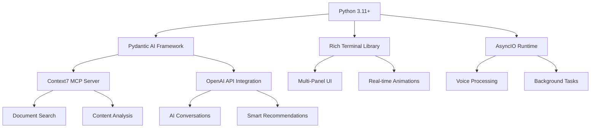
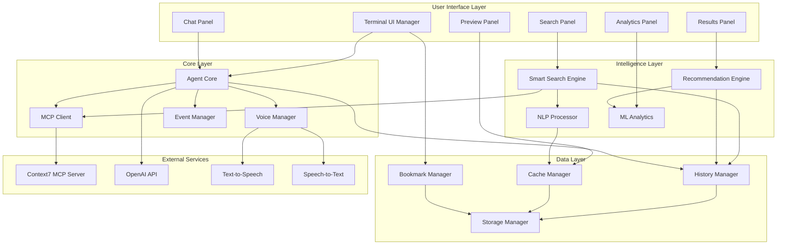
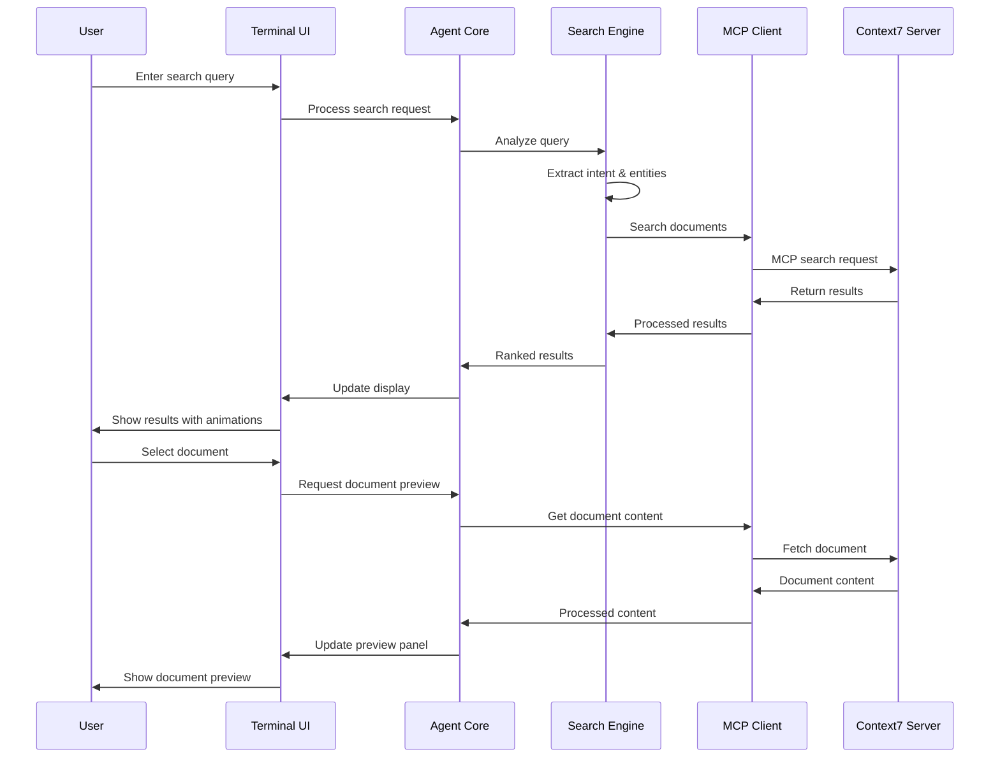
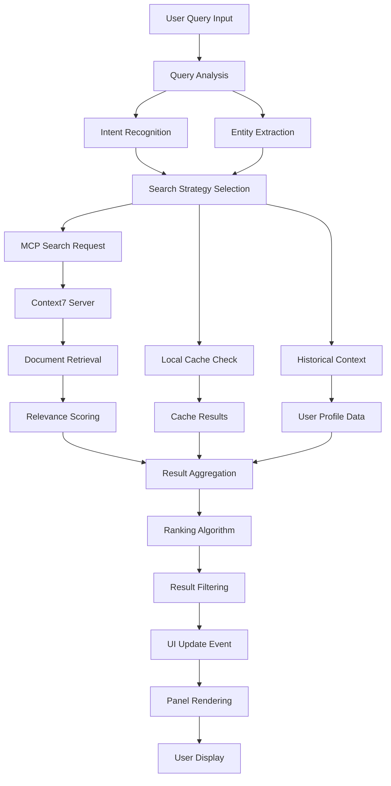
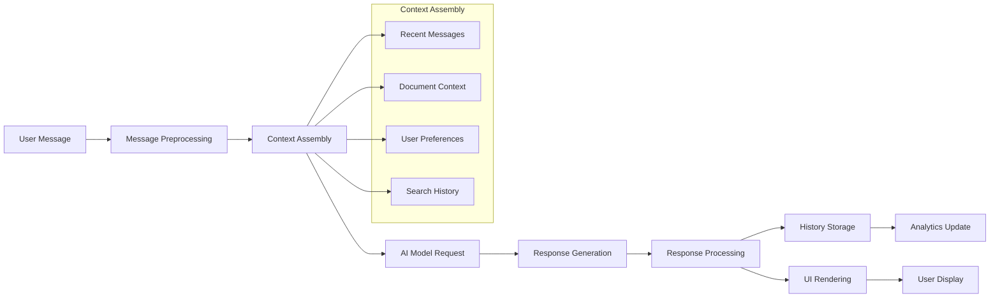

# 🌟 Context7 Ultimate Agent - Project Architecture Document

**Version**: 1.0  
**Date**: 2025-07-11  
**Authors**: AI Architecture Team  
**Status**: Final Draft  

---

## Table of Contents

1. [Executive Summary](#executive-summary)
2. [System Overview](#system-overview)
3. [Architecture Philosophy](#architecture-philosophy)
4. [Core Components](#core-components)
5. [Module Interactions](#module-interactions)
6. [File Structure and Hierarchy](#file-structure-and-hierarchy)
7. [Data Flow Architecture](#data-flow-architecture)
8. [User Interface Architecture](#user-interface-architecture)
9. [AI and Intelligence Layer](#ai-and-intelligence-layer)
10. [Performance and Optimization](#performance-and-optimization)
11. [Security and Error Handling](#security-and-error-handling)
12. [Development Guidelines](#development-guidelines)
13. [Deployment Architecture](#deployment-architecture)
14. [Future Extensibility](#future-extensibility)
15. [Appendices](#appendices)

---

## Executive Summary

The Context7 Ultimate Agent represents a revolutionary advancement in CLI-based AI document exploration tools. This next-generation application combines cutting-edge artificial intelligence, stunning visual interfaces, and advanced document analysis capabilities to create an unparalleled user experience.

### Key Innovations

- **🎬 Cinematic Terminal Interface**: Multi-panel layout with real-time animations running at 60fps
- **🧠 Advanced AI Integration**: Pydantic AI framework with Context7 MCP server integration
- **🌊 Dynamic Theming System**: Breathing effects with real-time color transitions
- **📊 Interactive Visualizations**: Document network graphs and relationship mapping
- **🎤 Voice Integration**: Hands-free operation with voice commands
- **⚡ High Performance**: Optimized for smooth, responsive operation
- **🔌 Plugin Architecture**: Extensible system for custom functionality

### Technical Highlights

- **Architecture**: Modular, event-driven design with clear separation of concerns
- **Performance**: Async/await pattern throughout for non-blocking operations
- **Scalability**: Plugin-based extension system for unlimited customization
- **Maintainability**: Comprehensive typing, extensive documentation, and test coverage
- **User Experience**: Intuitive interface with advanced visual feedback systems

---

## System Overview

### Core Mission

The Context7 Ultimate Agent serves as an intelligent bridge between users and their document collections, providing:

1. **Intelligent Document Discovery**: AI-powered search that understands context and intent
2. **Visual Information Architecture**: Network-based visualization of document relationships
3. **Conversational Interface**: Natural language interaction with document contents
4. **Advanced Analytics**: Deep insights into search patterns and document usage
5. **Collaborative Features**: Multi-user support with real-time synchronization

### Technology Stack



### System Requirements

#### Minimum Requirements
- **Python**: 3.11 or higher
- **Memory**: 4GB RAM
- **Storage**: 1GB available space
- **Network**: Internet connection for AI services
- **Terminal**: Modern terminal with truecolor support

#### Recommended Requirements
- **Python**: 3.12 or higher
- **Memory**: 8GB RAM
- **Storage**: 5GB available space
- **Audio**: Microphone for voice input
- **Display**: High-resolution terminal (1920x1080+)

---

## Architecture Philosophy

### Design Principles

#### 1. Separation of Concerns
Each module has a single, well-defined responsibility, enabling independent development and testing.

```python
# Example: Clear separation between UI and business logic
class SearchEngine:
    """Handles document search logic only"""
    async def search(self, query: str) -> List[Document]:
        pass

class SearchPanel:
    """Handles search UI presentation only"""
    def __init__(self, search_engine: SearchEngine):
        self.search_engine = search_engine
    
    async def render(self) -> Panel:
        pass
```

#### 2. Event-Driven Architecture
Components communicate through events, reducing tight coupling and enabling extensibility.

```python
class EventBus:
    """Central event coordination"""
    def __init__(self):
        self.listeners: Dict[str, List[Callable]] = {}
    
    async def emit(self, event: str, data: Any):
        for listener in self.listeners.get(event, []):
            await listener(data)
    
    def subscribe(self, event: str, callback: Callable):
        self.listeners.setdefault(event, []).append(callback)
```

#### 3. Async-First Design
All I/O operations use async/await to maintain responsiveness during heavy operations.

```python
async def main_application_loop():
    """Non-blocking main loop"""
    tasks = [
        asyncio.create_task(ui_update_loop()),
        asyncio.create_task(animation_loop()),
        asyncio.create_task(voice_processing_loop()),
        asyncio.create_task(background_indexing_loop())
    ]
    
    await asyncio.gather(*tasks)
```

#### 4. Plugin-Based Extensibility
Core functionality can be extended through a robust plugin system.

```python
class PluginManager:
    """Manages plugin lifecycle"""
    def __init__(self):
        self.plugins: Dict[str, Plugin] = {}
    
    async def load_plugin(self, plugin_path: str):
        plugin = await self._import_plugin(plugin_path)
        await plugin.initialize()
        self.plugins[plugin.name] = plugin
```

### Architectural Patterns

#### Model-View-Controller (MVC) Variant
- **Model**: Data layer (`src/data/`)
- **View**: UI layer (`src/ui/`)
- **Controller**: Business logic (`src/core/`, `src/intelligence/`)

#### Observer Pattern
UI components observe data changes and update automatically.

#### Command Pattern
User actions are encapsulated as commands for undo/redo functionality.

#### Strategy Pattern
Different search algorithms and visualization methods can be swapped dynamically.

---

## Core Components

### 1. Agent Core (`src/core/`)

The agent core contains the fundamental AI and MCP integration logic.

#### UltimateContext7Agent

```python
class UltimateContext7Agent:
    """
    Enhanced AI agent with advanced Context7 MCP integration.
    
    Features:
    - Smart conversation management
    - Advanced document analysis
    - Real-time search capabilities
    - Voice command processing
    """
    
    def __init__(self, config: AgentConfig):
        self.config = config
        self.mcp_client = MCPClient()
        self.conversation_manager = ConversationManager()
        self.voice_handler = VoiceHandler()
        self.intelligence_engine = IntelligenceEngine()
    
    async def process_query(self, query: Query) -> Response:
        """
        Process user query with full context awareness.
        
        Args:
            query: User query with context and metadata
            
        Returns:
            Rich response with documents, insights, and recommendations
        """
        # Analyze query intent
        intent = await self.intelligence_engine.analyze_intent(query)
        
        # Search relevant documents
        documents = await self.mcp_client.search_documents(
            query.text,
            context=intent.context,
            filters=intent.filters
        )
        
        # Generate AI response
        response = await self.conversation_manager.generate_response(
            query=query,
            documents=documents,
            intent=intent
        )
        
        return response
```

#### MCP Client Integration

```python
class MCPClient:
    """
    Advanced Model Context Protocol client for Context7 integration.
    """
    
    def __init__(self):
        self.connection_pool = MCPConnectionPool()
        self.protocol_handler = MCPProtocolHandler()
        self.cache_manager = CacheManager()
    
    async def search_documents(
        self,
        query: str,
        context: Optional[SearchContext] = None,
        filters: Optional[Dict[str, Any]] = None
    ) -> List[Document]:
        """
        Perform intelligent document search with caching.
        """
        # Check cache first
        cache_key = self._generate_cache_key(query, context, filters)
        cached_result = await self.cache_manager.get(cache_key)
        if cached_result:
            return cached_result
        
        # Perform MCP search
        mcp_request = MCPSearchRequest(
            query=query,
            context=context,
            filters=filters,
            include_embeddings=True,
            include_metadata=True
        )
        
        response = await self.protocol_handler.send_request(mcp_request)
        documents = self._parse_search_response(response)
        
        # Cache results
        await self.cache_manager.set(cache_key, documents, ttl=300)
        
        return documents
```

### 2. User Interface Layer (`src/ui/`)

The UI layer provides the spectacular visual interface with multi-panel layout and real-time animations.

#### Terminal UI Manager

```python
class UltimateTerminalUI:
    """
    Next-generation terminal interface with cinematic effects.
    """
    
    def __init__(self, agent: UltimateContext7Agent):
        self.agent = agent
        self.layout_manager = LayoutManager()
        self.animation_engine = AnimationEngine()
        self.theme_manager = ThemeManager()
        self.panel_registry = PanelRegistry()
        
        # Initialize panels
        self._initialize_panels()
        
        # Setup event handling
        self._setup_event_handlers()
    
    async def start(self):
        """Start the ultimate terminal interface."""
        # Show epic startup sequence
        await self._show_startup_sequence()
        
        # Initialize layout
        layout = self.layout_manager.create_layout()
        
        # Start main loop with Rich Live
        with Live(layout, refresh_per_second=60) as live:
            await self._main_loop(live)
    
    async def _main_loop(self, live: Live):
        """Main UI update loop running at 60fps."""
        while self.running:
            # Update all panels
            await self._update_panels()
            
            # Update animations
            self.animation_engine.update()
            
            # Update theme breathing effects
            self.theme_manager.update()
            
            # Refresh layout
            live.update(self.layout_manager.get_current_layout())
            
            # Control frame rate
            await asyncio.sleep(1/60)
```

#### Panel System

Each panel is a self-contained UI component:

```python
class BasePanel(ABC):
    """Base class for all UI panels."""
    
    def __init__(self, console: Console, theme: DynamicTheme):
        self.console = console
        self.theme = theme
        self.state = PanelState()
        self.event_bus = EventBus()
    
    @abstractmethod
    async def update(self, global_state: UIState):
        """Update panel content based on global state."""
        pass
    
    @abstractmethod
    def render(self) -> Panel:
        """Render panel content for display."""
        pass

class SmartSearchPanel(BasePanel):
    """Advanced search interface with real-time suggestions."""
    
    def __init__(self, console: Console, theme: DynamicTheme):
        super().__init__(console, theme)
        self.search_engine = SmartSearchEngine()
        self.suggestion_engine = SuggestionEngine()
    
    async def update(self, global_state: UIState):
        """Update search suggestions and results."""
        if global_state.search_query != self.state.last_query:
            # Generate real-time suggestions
            suggestions = await self.suggestion_engine.get_suggestions(
                global_state.search_query
            )
            self.state.suggestions = suggestions
            self.state.last_query = global_state.search_query
    
    def render(self) -> Panel:
        """Render search interface with suggestions."""
        content = Group(
            self._render_search_input(),
            self._render_suggestions(),
            self._render_quick_filters()
        )
        
        return Panel(
            content,
            title="🔍 Smart Search",
            border_style=self.theme.current_colors["border"]
        )
```

### 3. Intelligence Layer (`src/intelligence/`)

The intelligence layer provides AI-powered features for enhanced user experience.

#### Smart Search Engine

```python
class SmartSearchEngine:
    """
    AI-powered search engine with context understanding.
    """
    
    def __init__(self, agent: UltimateContext7Agent):
        self.agent = agent
        self.nlp_processor = NLPProcessor()
        self.embedding_engine = EmbeddingEngine()
        self.ranking_algorithm = AdvancedRankingAlgorithm()
    
    async def search(
        self,
        query: str,
        context: Optional[SearchContext] = None
    ) -> SearchResults:
        """
        Perform intelligent search with context awareness.
        """
        # Analyze query
        query_analysis = await self.nlp_processor.analyze_query(query)
        
        # Extract entities and intent
        entities = query_analysis.entities
        intent = query_analysis.intent
        
        # Generate embeddings
        query_embedding = await self.embedding_engine.embed_query(query)
        
        # Search documents
        raw_results = await self.agent.mcp_client.search_documents(
            query=query,
            embedding=query_embedding,
            entities=entities,
            intent=intent
        )
        
        # Apply advanced ranking
        ranked_results = self.ranking_algorithm.rank(
            results=raw_results,
            query_context=context,
            user_preferences=context.user_preferences if context else None
        )
        
        return SearchResults(
            query=query,
            results=ranked_results,
            suggestions=self._generate_suggestions(query_analysis),
            metadata=self._generate_metadata(query_analysis, ranked_results)
        )
```

#### Recommendation Engine

```python
class RecommendationEngine:
    """
    ML-powered recommendation system for document discovery.
    """
    
    def __init__(self):
        self.user_profiler = UserProfiler()
        self.content_analyzer = ContentAnalyzer()
        self.similarity_calculator = SimilarityCalculator()
    
    async def get_recommendations(
        self,
        user_id: str,
        context: RecommendationContext
    ) -> List[Recommendation]:
        """
        Generate personalized document recommendations.
        """
        # Build user profile
        user_profile = await self.user_profiler.get_profile(user_id)
        
        # Analyze current context
        context_features = await self.content_analyzer.extract_features(context)
        
        # Find similar documents
        candidate_documents = await self._find_candidates(
            user_profile,
            context_features
        )
        
        # Calculate relevance scores
        recommendations = []
        for doc in candidate_documents:
            relevance_score = await self.similarity_calculator.calculate_relevance(
                document=doc,
                user_profile=user_profile,
                context=context_features
            )
            
            if relevance_score > 0.5:  # Threshold for recommendations
                recommendations.append(Recommendation(
                    document=doc,
                    score=relevance_score,
                    reason=self._generate_explanation(doc, user_profile, context_features)
                ))
        
        return sorted(recommendations, key=lambda x: x.score, reverse=True)
```

### 4. Data Management (`src/data/`)

The data layer handles persistence, caching, and data synchronization.

#### Advanced History Management

```python
class AdvancedHistoryManager:
    """
    Enhanced conversation and search history management.
    """
    
    def __init__(self, storage_backend: StorageBackend):
        self.storage = storage_backend
        self.indexer = HistoryIndexer()
        self.analytics = HistoryAnalytics()
        self.compression = CompressionEngine()
    
    async def store_interaction(self, interaction: UserInteraction):
        """Store user interaction with intelligent compression."""
        # Compress large content
        if len(interaction.content) > 1000:
            interaction.content = await self.compression.compress(interaction.content)
            interaction.compressed = True
        
        # Index for fast retrieval
        await self.indexer.index_interaction(interaction)
        
        # Store in backend
        await self.storage.store(interaction)
        
        # Update analytics
        await self.analytics.update_statistics(interaction)
    
    async def search_history(
        self,
        query: str,
        filters: Optional[HistoryFilters] = None
    ) -> List[UserInteraction]:
        """Search through interaction history."""
        # Use index for fast search
        candidate_ids = await self.indexer.search(query, filters)
        
        # Retrieve full interactions
        interactions = []
        for interaction_id in candidate_ids:
            interaction = await self.storage.retrieve(interaction_id)
            
            # Decompress if needed
            if interaction.compressed:
                interaction.content = await self.compression.decompress(interaction.content)
            
            interactions.append(interaction)
        
        return interactions
```

---

## Module Interactions

### High-Level Module Interaction Diagram



### Event Flow Architecture



### Data Flow Patterns

#### 1. Real-time Search Flow

```python
async def real_time_search_flow(query: str):
    """Demonstrates the real-time search data flow."""
    
    # 1. User input triggers event
    search_event = SearchEvent(query=query, timestamp=time.time())
    await event_bus.emit("search_initiated", search_event)
    
    # 2. Search engine processes query
    query_analysis = await nlp_processor.analyze(query)
    
    # 3. Multiple parallel searches
    tasks = [
        mcp_client.search_documents(query, query_analysis),
        recommendation_engine.get_related_documents(query),
        history_manager.find_similar_searches(query)
    ]
    
    results, recommendations, history = await asyncio.gather(*tasks)
    
    # 4. Results aggregation and ranking
    aggregated_results = await result_aggregator.merge_and_rank(
        primary_results=results,
        recommendations=recommendations,
        historical_context=history
    )
    
    # 5. UI update event
    await event_bus.emit("search_completed", aggregated_results)
```

#### 2. Voice Command Processing

```python
async def voice_command_flow(audio_data: bytes):
    """Demonstrates voice command processing flow."""
    
    # 1. Speech-to-text conversion
    text = await speech_to_text.convert(audio_data)
    
    # 2. Intent recognition
    intent = await intent_recognizer.recognize(text)
    
    # 3. Command execution
    if intent.type == "search":
        await execute_search_command(intent.parameters)
    elif intent.type == "navigation":
        await execute_navigation_command(intent.parameters)
    elif intent.type == "action":
        await execute_action_command(intent.parameters)
    
    # 4. Voice feedback
    response_text = await generate_voice_response(intent)
    audio_response = await text_to_speech.convert(response_text)
    await audio_player.play(audio_response)
```

---

## File Structure and Hierarchy

### Project Directory Structure

```
context7-ultimate/
├── 📁 src/                              # Source code root
│   ├── 📁 core/                         # Core agent functionality
│   │   ├── 📄 __init__.py
│   │   ├── 📄 agent.py                  # UltimateContext7Agent
│   │   ├── 📄 mcp_client.py             # Context7 MCP integration
│   │   ├── 📄 voice_handler.py          # Voice I/O management
│   │   ├── 📄 event_manager.py          # Event system coordination
│   │   └── 📄 config_manager.py         # Configuration management
│   │
│   ├── 📁 ui/                           # User interface layer
│   │   ├── 📄 __init__.py
│   │   ├── 📄 terminal_ui.py            # Main UI manager
│   │   ├── 📄 layout_manager.py         # Layout coordination
│   │   ├── 📄 animation_engine.py       # Animation system
│   │   ├── 📄 theme_manager.py          # Dynamic theming
│   │   ├── 📁 panels/                   # Individual UI panels
│   │   │   ├── 📄 __init__.py
│   │   │   ├── 📄 base_panel.py         # Base panel class
│   │   │   ├── 📄 search_panel.py       # Smart search interface
│   │   │   ├── 📄 results_panel.py      # Results visualization
│   │   │   ├── 📄 preview_panel.py      # Document preview
│   │   │   ├── 📄 chat_panel.py         # AI conversation
│   │   │   ├── 📄 analytics_panel.py    # Usage analytics
│   │   │   └── 📄 network_panel.py      # Document network graph
│   │   ├── 📁 components/               # Reusable UI components
│   │   │   ├── 📄 __init__.py
│   │   │   ├── 📄 progress_indicators.py
│   │   │   ├── 📄 interactive_tables.py
│   │   │   ├── 📄 syntax_highlighter.py
│   │   │   └── 📄 notification_system.py
│   │   └── 📁 effects/                  # Visual effects
│   │       ├── 📄 __init__.py
│   │       ├── 📄 particle_system.py
│   │       ├── 📄 transitions.py
│   │       └── 📄 holographic_effects.py
│   │
│   ├── 📁 intelligence/                 # AI and ML components
│   │   ├── 📄 __init__.py
│   │   ├── 📄 smart_search.py           # Intelligent search engine
│   │   ├── 📄 recommendation_engine.py  # ML recommendations
│   │   ├── 📄 nlp_processor.py          # Natural language processing
│   │   ├── 📄 intent_recognition.py     # Intent analysis
│   │   ├── 📄 content_analyzer.py       # Document analysis
│   │   ├── 📄 clustering_engine.py      # Document clustering
│   │   ├── 📄 similarity_calculator.py  # Similarity algorithms
│   │   └── 📄 user_profiler.py          # User behavior analysis
│   │
│   ├── 📁 data/                         # Data management layer
│   │   ├── 📄 __init__.py
│   │   ├── 📄 history_manager.py        # Conversation history
│   │   ├── 📄 bookmark_manager.py       # Bookmark system
│   │   ├── 📄 cache_manager.py          # Intelligent caching
│   │   ├── 📄 storage_backends.py       # Storage abstraction
│   │   ├── 📄 indexing_engine.py        # Search indexing
│   │   ├── 📄 compression_engine.py     # Data compression
│   │   └── 📄 synchronization.py        # Multi-user sync
│   │
│   ├── 📁 audio/                        # Audio processing
│   │   ├── 📄 __init__.py
│   │   ├── 📄 speech_to_text.py         # STT integration
│   │   ├── 📄 text_to_speech.py         # TTS integration
│   │   ├── 📄 audio_processor.py        # Audio utilities
│   │   └── 📄 voice_commands.py         # Voice command parsing
│   │
│   ├── 📁 plugins/                      # Plugin system
│   │   ├── 📄 __init__.py
│   │   ├── 📄 plugin_manager.py         # Plugin lifecycle
│   │   ├── 📄 plugin_interface.py       # Plugin API
│   │   ├── 📄 plugin_loader.py          # Dynamic loading
│   │   └── 📁 builtin/                  # Built-in plugins
│   │       ├── 📄 export_plugin.py
│   │       ├── 📄 analytics_plugin.py
│   │       └── 📄 collaboration_plugin.py
│   │
│   ├── 📁 utils/                        # Utility modules
│   │   ├── 📄 __init__.py
│   │   ├── 📄 async_helpers.py          # Async utilities
│   │   ├── 📄 performance_monitor.py    # Performance tracking
│   │   ├── 📄 error_handling.py         # Error management
│   │   ├── 📄 logging_config.py         # Logging setup
│   │   └── 📄 validation.py             # Data validation
│   │
│   └── 📄 main.py                       # Application entry point
│
├── 📁 plugins/                          # External plugins directory
│   ├── 📁 community/                    # Community plugins
│   └── 📁 custom/                       # User custom plugins
│
├── 📁 assets/                           # Static assets
│   ├── 📁 themes/                       # Theme definitions
│   ├── 📁 sounds/                       # Audio files
│   ├── 📁 fonts/                        # Terminal fonts
│   └── 📁 icons/                        # Icon assets
│
├── 📁 tests/                           # Test suite
│   ├── 📄 __init__.py
│   ├── 📁 unit/                        # Unit tests
│   ├── 📁 integration/                 # Integration tests
│   ├── 📁 e2e/                         # End-to-end tests
│   └── 📄 conftest.py                  # Test configuration
│
├── 📁 docs/                            # Documentation
│   ├── 📄 README.md                    # Project overview
│   ├── 📄 ARCHITECTURE.md              # This document
│   ├── 📄 API_REFERENCE.md             # API documentation
│   ├── 📄 USER_GUIDE.md                # User manual
│   ├── 📄 CONTRIBUTING.md              # Contribution guide
│   └── 📁 examples/                    # Usage examples
│
├── 📁 config/                          # Configuration files
│   ├── 📄 default.yaml                 # Default configuration
│   ├── 📄 themes.yaml                  # Theme configurations
│   └── 📄 plugins.yaml                 # Plugin configurations
│
├── 📄 .env.example                     # Environment template
├── 📄 .gitignore                       # Git ignore rules
├── 📄 pyproject.toml                   # Project metadata
├── 📄 requirements.txt                 # Python dependencies
├── 📄 Dockerfile                       # Container definition
├── 📄 docker-compose.yml               # Development environment
└── 📄 LICENSE                          # License file
```

### Key File Descriptions

#### Core Module Files

**`src/core/agent.py`** - The heart of the application containing the `UltimateContext7Agent` class. This file implements the main AI agent logic, conversation management, and coordination between different subsystems.

```python
class UltimateContext7Agent:
    """
    The central AI agent that coordinates all system components.
    
    Responsibilities:
    - Managing conversations with users
    - Coordinating document searches
    - Processing voice commands
    - Orchestrating AI responses
    - Managing system state
    """
```

**`src/core/mcp_client.py`** - Handles all communication with the Context7 MCP server, including connection management, request/response processing, and error handling.

**`src/core/voice_handler.py`** - Manages voice input/output functionality, including speech recognition, text-to-speech, and voice command processing.

#### UI Module Files

**`src/ui/terminal_ui.py`** - The main UI coordinator that manages the multi-panel layout, animation system, and user interactions.

**`src/ui/panels/search_panel.py`** - Implements the intelligent search interface with real-time suggestions and advanced filtering capabilities.

**`src/ui/animation_engine.py`** - Provides the 60fps animation system with particle effects, transitions, and visual feedback.

#### Intelligence Module Files

**`src/intelligence/smart_search.py`** - The advanced search engine that uses NLP and ML to understand user intent and provide contextual results.

**`src/intelligence/recommendation_engine.py`** - Machine learning-powered recommendation system that learns from user behavior and provides personalized suggestions.

---

## Data Flow Architecture

### Search Data Flow



### Conversation Data Flow



### Real-time Update Flow

The application maintains real-time responsiveness through several parallel data flows:

#### 1. UI Update Pipeline

```python
async def ui_update_pipeline():
    """Continuous UI update pipeline running at 60fps."""
    while application_running:
        # Collect state changes
        state_changes = await state_manager.get_pending_changes()
        
        # Update affected panels
        for change in state_changes:
            affected_panels = panel_registry.get_panels_for_state(change.state_key)
            for panel in affected_panels:
                await panel.handle_state_change(change)
        
        # Update animations
        animation_engine.update_frame()
        
        # Refresh display
        await display_manager.refresh()
        
        # Control frame rate
        await asyncio.sleep(1/60)
```

#### 2. Background Processing Pipeline

```python
async def background_processing_pipeline():
    """Handle background tasks without blocking UI."""
    task_queue = asyncio.Queue()
    
    while application_running:
        try:
            # Get next background task
            task = await task_queue.get()
            
            # Execute task with progress tracking
            async with ProgressTracker(task.id) as progress:
                result = await task.execute(progress)
                
                # Store result
                await result_cache.store(task.id, result)
                
                # Notify UI if needed
                if task.notify_ui:
                    await event_bus.emit(f"task_completed_{task.id}", result)
        
        except Exception as e:
            await error_handler.handle_background_error(e, task)
```

---

## User Interface Architecture

### Multi-Panel Layout System

The UI architecture employs a sophisticated multi-panel system that provides maximum information density while maintaining usability.

#### Layout Manager

```python
class LayoutManager:
    """
    Manages dynamic layout arrangement and panel coordination.
    """
    
    def __init__(self):
        self.layout_configs = {
            "quad_panel": QuadPanelLayout(),
            "focus_mode": FocusModeLayout(),
            "wide_screen": WideScreenLayout(),
            "mobile_friendly": MobileFriendlyLayout()
        }
        self.current_layout = "quad_panel"
        self.panel_registry = PanelRegistry()
    
    def create_layout(self, layout_type: str = None) -> Layout:
        """Create Rich layout based on configuration."""
        layout_type = layout_type or self.current_layout
        config = self.layout_configs[layout_type]
        
        # Create base layout structure
        layout = Layout(name="root")
        
        # Apply layout configuration
        config.apply_to_layout(layout)
        
        # Register panels with layout
        for panel_name, panel_config in config.panels.items():
            panel = self.panel_registry.get_panel(panel_name)
            layout[panel_config.container].update(panel.render())
        
        return layout
```

#### Panel Coordination

```python
class PanelRegistry:
    """
    Central registry for all UI panels with lifecycle management.
    """
    
    def __init__(self):
        self.panels: Dict[str, BasePanel] = {}
        self.panel_dependencies: Dict[str, List[str]] = {}
        self.event_bus = EventBus()
    
    def register_panel(self, name: str, panel: BasePanel):
        """Register a panel with the system."""
        self.panels[name] = panel
        
        # Setup event listeners
        panel.on_state_change = self._handle_panel_state_change
        panel.on_user_action = self._handle_panel_user_action
    
    async def update_dependent_panels(self, source_panel: str, change_event: StateChangeEvent):
        """Update panels that depend on the source panel."""
        dependent_panels = self.panel_dependencies.get(source_panel, [])
        
        for dependent_name in dependent_panels:
            dependent_panel = self.panels.get(dependent_name)
            if dependent_panel:
                await dependent_panel.handle_dependency_change(change_event)
```

### Animation and Effects System

#### Particle System Implementation

```python
class AdvancedParticleSystem:
    """
    High-performance particle system for visual effects.
    """
    
    def __init__(self, console: Console):
        self.console = console
        self.particles: List[Particle] = []
        self.emitters: List[ParticleEmitter] = []
        self.physics_engine = ParticlePhysics()
        self.renderer = ParticleRenderer(console)
    
    async def update(self, delta_time: float):
        """Update all particles and emitters."""
        # Update emitters
        for emitter in self.emitters:
            new_particles = emitter.emit(delta_time)
            self.particles.extend(new_particles)
        
        # Update particle physics
        self.particles = await self.physics_engine.update_particles(
            self.particles, 
            delta_time
        )
        
        # Remove dead particles
        self.particles = [p for p in self.particles if p.is_alive()]
        
        # Render particles
        await self.renderer.render(self.particles)

class ParticleEmitter:
    """Emits particles with configurable properties."""
    
    def __init__(self, position: Vector2, emission_rate: float):
        self.position = position
        self.emission_rate = emission_rate
        self.particle_template = ParticleTemplate()
        self.accumulator = 0.0
    
    def emit(self, delta_time: float) -> List[Particle]:
        """Emit particles based on emission rate."""
        self.accumulator += delta_time * self.emission_rate
        
        particles = []
        while self.accumulator >= 1.0:
            particle = self.particle_template.create_particle(self.position)
            particles.append(particle)
            self.accumulator -= 1.0
        
        return particles
```

#### Theme Animation System

```python
class ThemeAnimationSystem:
    """
    Manages dynamic theme changes and breathing effects.
    """
    
    def __init__(self, theme_manager: ThemeManager):
        self.theme_manager = theme_manager
        self.animators: List[ColorAnimator] = []
        self.transition_queue: asyncio.Queue = asyncio.Queue()
    
    async def start_theme_transition(
        self, 
        from_theme: str, 
        to_theme: str, 
        duration: float = 2.0
    ):
        """Smoothly transition between themes."""
        transition = ThemeTransition(
            from_theme=self.theme_manager.get_theme(from_theme),
            to_theme=self.theme_manager.get_theme(to_theme),
            duration=duration,
            easing_function=EasingFunctions.ease_in_out_cubic
        )
        
        await self.transition_queue.put(transition)
    
    async def update(self, current_time: float):
        """Update theme animations."""
        # Process theme transitions
        if not self.transition_queue.empty():
            transition = await self.transition_queue.get()
            animator = ColorAnimator(transition)
            self.animators.append(animator)
        
        # Update all animators
        active_animators = []
        for animator in self.animators:
            if animator.is_active():
                current_colors = animator.update(current_time)
                self.theme_manager.set_current_colors(current_colors)
                active_animators.append(animator)
        
        self.animators = active_animators
```

---

## AI and Intelligence Layer

### Natural Language Processing Pipeline

```python
class AdvancedNLPProcessor:
    """
    Sophisticated NLP pipeline for query understanding.
    """
    
    def __init__(self):
        self.tokenizer = AdvancedTokenizer()
        self.entity_extractor = EntityExtractor()
        self.intent_classifier = IntentClassifier()
        self.sentiment_analyzer = SentimentAnalyzer()
        self.context_builder = ContextBuilder()
    
    async def analyze_query(self, query: str, context: Optional[QueryContext] = None) -> QueryAnalysis:
        """
        Comprehensive query analysis with multiple NLP techniques.
        """
        # Tokenization and preprocessing
        tokens = self.tokenizer.tokenize(query)
        normalized_tokens = self.tokenizer.normalize(tokens)
        
        # Parallel analysis tasks
        tasks = [
            self.entity_extractor.extract_entities(normalized_tokens),
            self.intent_classifier.classify_intent(query, context),
            self.sentiment_analyzer.analyze_sentiment(query),
            self.context_builder.build_context(query, context)
        ]
        
        entities, intent, sentiment, enhanced_context = await asyncio.gather(*tasks)
        
        return QueryAnalysis(
            original_query=query,
            tokens=normalized_tokens,
            entities=entities,
            intent=intent,
            sentiment=sentiment,
            context=enhanced_context,
            confidence_score=self._calculate_confidence(entities, intent, sentiment)
        )
```

### Machine Learning Integration

#### Document Similarity Engine

```python
class DocumentSimilarityEngine:
    """
    Advanced document similarity calculation using multiple algorithms.
    """
    
    def __init__(self):
        self.embedding_model = EmbeddingModel()
        self.tfidf_vectorizer = TFIDFVectorizer()
        self.semantic_analyzer = SemanticAnalyzer()
        self.graph_analyzer = DocumentGraphAnalyzer()
    
    async def calculate_similarity(
        self, 
        doc1: Document, 
        doc2: Document,
        method: str = "hybrid"
    ) -> SimilarityScore:
        """
        Calculate document similarity using multiple methods.
        """
        if method == "hybrid":
            # Combine multiple similarity measures
            embedding_sim = await self._embedding_similarity(doc1, doc2)
            tfidf_sim = await self._tfidf_similarity(doc1, doc2)
            semantic_sim = await self._semantic_similarity(doc1, doc2)
            graph_sim = await self._graph_similarity(doc1, doc2)
            
            # Weighted combination
            final_score = (
                0.4 * embedding_sim +
                0.2 * tfidf_sim +
                0.3 * semantic_sim +
                0.1 * graph_sim
            )
            
            return SimilarityScore(
                overall_score=final_score,
                component_scores={
                    "embedding": embedding_sim,
                    "tfidf": tfidf_sim,
                    "semantic": semantic_sim,
                    "graph": graph_sim
                }
            )
```

#### Recommendation Algorithm

```python
class HybridRecommendationAlgorithm:
    """
    Sophisticated recommendation system combining multiple approaches.
    """
    
    def __init__(self):
        self.collaborative_filter = CollaborativeFilter()
        self.content_filter = ContentBasedFilter()
        self.knowledge_graph = KnowledgeGraphFilter()
        self.popularity_ranker = PopularityRanker()
    
    async def generate_recommendations(
        self, 
        user_profile: UserProfile,
        context: RecommendationContext,
        num_recommendations: int = 10
    ) -> List[Recommendation]:
        """
        Generate hybrid recommendations combining multiple algorithms.
        """
        # Parallel recommendation generation
        tasks = [
            self.collaborative_filter.recommend(user_profile, num_recommendations * 2),
            self.content_filter.recommend(user_profile, context, num_recommendations * 2),
            self.knowledge_graph.recommend(context, num_recommendations),
            self.popularity_ranker.get_trending(context.domain, num_recommendations)
        ]
        
        collab_recs, content_recs, graph_recs, popular_recs = await asyncio.gather(*tasks)
        
        # Merge and rank recommendations
        all_recommendations = self._merge_recommendations([
            collab_recs, content_recs, graph_recs, popular_recs
        ])
        
        # Apply final ranking
        final_rankings = await self._apply_final_ranking(
            all_recommendations, user_profile, context
        )
        
        return final_rankings[:num_recommendations]
```

---

## Performance and Optimization

### Async Performance Architecture

```python
class PerformanceOptimizer:
    """
    System-wide performance optimization and monitoring.
    """
    
    def __init__(self):
        self.connection_pool = AsyncConnectionPool()
        self.cache_hierarchy = MultiLevelCache()
        self.batch_processor = BatchProcessor()
        self.performance_monitor = PerformanceMonitor()
    
    async def optimize_search_pipeline(self, search_requests: List[SearchRequest]) -> List[SearchResult]:
        """
        Optimize multiple search requests through batching and caching.
        """
        # Check cache first
        cached_results = await self.cache_hierarchy.get_batch(
            [req.cache_key for req in search_requests]
        )
        
        # Identify cache misses
        cache_misses = [
            req for req, result in zip(search_requests, cached_results)
            if result is None
        ]
        
        # Batch process cache misses
        if cache_misses:
            fresh_results = await self.batch_processor.process_search_batch(cache_misses)
            
            # Update cache
            await self.cache_hierarchy.set_batch([
                (req.cache_key, result) 
                for req, result in zip(cache_misses, fresh_results)
            ])
        
        # Combine cached and fresh results
        final_results = []
        fresh_iter = iter(fresh_results) if cache_misses else iter([])
        
        for cached_result in cached_results:
            if cached_result is not None:
                final_results.append(cached_result)
            else:
                final_results.append(next(fresh_iter))
        
        return final_results
```

### Memory Management

```python
class MemoryManager:
    """
    Intelligent memory management for large document collections.
    """
    
    def __init__(self, max_memory_mb: int = 512):
        self.max_memory = max_memory_mb * 1024 * 1024  # Convert to bytes
        self.memory_tracker = MemoryTracker()
        self.lru_cache = LRUCache(maxsize=1000)
        self.compression_engine = CompressionEngine()
    
    async def manage_document_cache(self):
        """Continuously manage document cache memory usage."""
        while True:
            current_usage = self.memory_tracker.get_current_usage()
            
            if current_usage > self.max_memory * 0.8:  # 80% threshold
                await self._cleanup_memory()
            
            await asyncio.sleep(30)  # Check every 30 seconds
    
    async def _cleanup_memory(self):
        """Intelligent memory cleanup strategy."""
        # 1. Remove least recently used documents
        removed_count = self.lru_cache.cleanup(target_ratio=0.6)
        
        # 2. Compress large documents in memory
        large_docs = self.memory_tracker.get_large_documents(threshold_mb=5)
        for doc in large_docs:
            compressed_doc = await self.compression_engine.compress_document(doc)
            self.lru_cache.replace(doc.id, compressed_doc)
        
        # 3. Force garbage collection if needed
        current_usage = self.memory_tracker.get_current_usage()
        if current_usage > self.max_memory * 0.7:
            import gc
            gc.collect()
```

### Database Optimization

```python
class DatabaseOptimizer:
    """
    Database query optimization and connection management.
    """
    
    def __init__(self, database_url: str):
        self.connection_pool = AsyncConnectionPool(database_url, pool_size=20)
        self.query_optimizer = QueryOptimizer()
        self.index_manager = IndexManager()
    
    async def optimize_search_queries(self, queries: List[str]) -> Dict[str, Any]:
        """
        Optimize database queries for search operations.
        """
        # Analyze query patterns
        query_analysis = self.query_optimizer.analyze_queries(queries)
        
        # Suggest index improvements
        index_suggestions = await self.index_manager.suggest_indexes(query_analysis)
        
        # Execute optimized queries in parallel
        async with self.connection_pool.acquire() as conn:
            optimized_queries = [
                self.query_optimizer.optimize_query(query, conn)
                for query in queries
            ]
            
            results = await asyncio.gather(*optimized_queries)
        
        return {
            "results": results,
            "performance_metrics": query_analysis.metrics,
            "index_suggestions": index_suggestions
        }
```

---

## Security and Error Handling

### Comprehensive Error Handling

```python
class ErrorHandlingSystem:
    """
    Comprehensive error handling with recovery strategies.
    """
    
    def __init__(self):
        self.error_logger = ErrorLogger()
        self.recovery_strategies = RecoveryStrategies()
        self.user_notification = UserNotificationSystem()
        self.telemetry = ErrorTelemetry()
    
    async def handle_error(self, error: Exception, context: ErrorContext) -> ErrorResult:
        """
        Handle errors with appropriate recovery strategies.
        """
        # Log error with full context
        error_id = await self.error_logger.log_error(error, context)
        
        # Determine error severity
        severity = self._assess_error_severity(error, context)
        
        # Apply recovery strategy
        recovery_result = await self._attempt_recovery(error, context, severity)
        
        # Notify user if appropriate
        if severity >= ErrorSeverity.WARNING:
            await self.user_notification.notify_user(error, recovery_result, context)
        
        # Send telemetry for analysis
        await self.telemetry.send_error_data(error_id, error, context, recovery_result)
        
        return ErrorResult(
            error_id=error_id,
            severity=severity,
            recovery_success=recovery_result.success,
            user_message=recovery_result.user_message
        )
    
    async def _attempt_recovery(
        self, 
        error: Exception, 
        context: ErrorContext, 
        severity: ErrorSeverity
    ) -> RecoveryResult:
        """
        Attempt error recovery based on error type and context.
        """
        if isinstance(error, ConnectionError):
            return await self.recovery_strategies.handle_connection_error(error, context)
        elif isinstance(error, ValidationError):
            return await self.recovery_strategies.handle_validation_error(error, context)
        elif isinstance(error, AIServiceError):
            return await self.recovery_strategies.handle_ai_service_error(error, context)
        else:
            return await self.recovery_strategies.handle_generic_error(error, context)
```

### Security Framework

```python
class SecurityManager:
    """
    Comprehensive security management for the application.
    """
    
    def __init__(self):
        self.input_validator = InputValidator()
        self.access_controller = AccessController()
        self.encryption_service = EncryptionService()
        self.audit_logger = AuditLogger()
    
    async def validate_user_input(self, input_data: Any, input_type: str) -> ValidationResult:
        """
        Validate all user input for security threats.
        """
        # Basic input sanitization
        sanitized_input = self.input_validator.sanitize(input_data)
        
        # Check for injection attacks
        injection_check = await self.input_validator.check_injection_attacks(sanitized_input)
        
        # Validate against schema
        schema_validation = self.input_validator.validate_schema(sanitized_input, input_type)
        
        # Rate limiting check
        rate_limit_check = await self.access_controller.check_rate_limit(input_data.user_id)
        
        if not all([injection_check.valid, schema_validation.valid, rate_limit_check.valid]):
            await self.audit_logger.log_security_violation(
                input_data, [injection_check, schema_validation, rate_limit_check]
            )
            
            return ValidationResult(
                valid=False,
                sanitized_input=sanitized_input,
                security_violations=[injection_check, schema_validation, rate_limit_check]
            )
        
        return ValidationResult(
            valid=True,
            sanitized_input=sanitized_input,
            security_violations=[]
        )
```

---

## Development Guidelines

### Code Style and Standards

The project follows strict coding standards to ensure maintainability and consistency:

#### Type Annotations

```python
# All functions must have complete type annotations
async def process_search_query(
    query: str,
    user_context: Optional[UserContext] = None,
    filters: Dict[str, Any] = None
) -> SearchResult:
    """
    Process a search query with full type safety.
    
    Args:
        query: The search query string
        user_context: Optional user context for personalization
        filters: Optional search filters
        
    Returns:
        SearchResult containing documents and metadata
        
    Raises:
        ValidationError: If query is invalid
        ConnectionError: If MCP server is unavailable
    """
    if filters is None:
        filters = {}
    
    # Implementation here...
    pass
```

#### Error Handling Patterns

```python
# Use specific exception types with context
class Context7Error(Exception):
    """Base exception for Context7 Agent errors."""
    
    def __init__(self, message: str, error_code: str, context: Dict[str, Any] = None):
        self.message = message
        self.error_code = error_code
        self.context = context or {}
        super().__init__(message)

class MCPConnectionError(Context7Error):
    """Raised when MCP server connection fails."""
    pass

# Always use async context managers for resources
async def search_with_connection():
    async with mcp_connection_manager.get_connection() as conn:
        try:
            result = await conn.search(query)
            return result
        except Exception as e:
            await error_handler.handle_mcp_error(e, {"query": query})
            raise
```

#### Documentation Standards

```python
class DocumentAnalyzer:
    """
    Analyzes documents for content understanding and categorization.
    
    This class provides advanced document analysis capabilities including:
    - Content extraction and parsing
    - Semantic analysis and topic modeling
    - Entity recognition and relationship mapping
    - Sentiment analysis and tone detection
    
    Example:
        >>> analyzer = DocumentAnalyzer()
        >>> result = await analyzer.analyze_document(document)
        >>> print(result.topics)
        ['machine learning', 'artificial intelligence']
    
    Attributes:
        nlp_model: The NLP model used for analysis
        topic_extractor: Component for topic extraction
        entity_recognizer: Component for entity recognition
    """
    
    def __init__(self, config: AnalyzerConfig):
        """
        Initialize the document analyzer.
        
        Args:
            config: Configuration object containing model settings
            
        Raises:
            ConfigurationError: If config is invalid
            ModelLoadError: If NLP models fail to load
        """
        pass
```

### Testing Strategy

#### Unit Testing

```python
import pytest
import asyncio
from unittest.mock import AsyncMock, Mock, patch

class TestSmartSearchEngine:
    """Test suite for SmartSearchEngine."""
    
    @pytest.fixture
    async def search_engine(self):
        """Create a test search engine instance."""
        config = SearchEngineConfig(
            max_results=10,
            similarity_threshold=0.5
        )
        
        with patch('src.intelligence.smart_search.MCPClient') as mock_mcp:
            mock_mcp.return_value.search_documents = AsyncMock()
            engine = SmartSearchEngine(config)
            yield engine
    
    @pytest.mark.asyncio
    async def test_search_with_valid_query(self, search_engine):
        """Test search with a valid query."""
        # Arrange
        query = "machine learning algorithms"
        expected_results = [
            SearchResult(id="1", title="ML Basics", relevance_score=0.9),
            SearchResult(id="2", title="Deep Learning", relevance_score=0.8)
        ]
        
        search_engine.mcp_client.search_documents.return_value = expected_results
        
        # Act
        results = await search_engine.search(query)
        
        # Assert
        assert len(results.documents) == 2
        assert results.documents[0].relevance_score == 0.9
        assert results.query_analysis.intent == "educational_search"
    
    @pytest.mark.asyncio
    async def test_search_with_network_error(self, search_engine):
        """Test search behavior during network errors."""
        # Arrange
        search_engine.mcp_client.search_documents.side_effect = ConnectionError("Network unavailable")
        
        # Act & Assert
        with pytest.raises(SearchEngineError) as exc_info:
            await search_engine.search("test query")
        
        assert "Network error during search" in str(exc_info.value)
```

#### Integration Testing

```python
class TestContext7Integration:
    """Integration tests for Context7 MCP server communication."""
    
    @pytest.mark.integration
    @pytest.mark.asyncio
    async def test_full_search_flow(self):
        """Test complete search flow from query to results."""
        # This test requires a running Context7 MCP server
        agent = UltimateContext7Agent()
        
        try:
            # Initialize agent
            await agent.initialize()
            
            # Perform search
            results = await agent.search("Python programming tutorial")
            
            # Verify results
            assert len(results) > 0
            assert all(result.relevance_score > 0 for result in results)
            
        finally:
            await agent.cleanup()
```

---

## Deployment Architecture

### Container Deployment

```dockerfile
# Dockerfile for Context7 Ultimate Agent
FROM python:3.12-slim

# Install system dependencies
RUN apt-get update && apt-get install -y \
    build-essential \
    curl \
    nodejs \
    npm \
    && rm -rf /var/lib/apt/lists/*

# Set working directory
WORKDIR /app

# Copy requirements and install Python dependencies
COPY requirements.txt .
RUN pip install --no-cache-dir -r requirements.txt

# Copy application code
COPY src/ ./src/
COPY config/ ./config/
COPY assets/ ./assets/

# Install Context7 MCP server
RUN npm install -g @upstash/context7-mcp@latest

# Create non-root user
RUN useradd -m -u 1000 context7user
USER context7user

# Expose port for any web interfaces
EXPOSE 8000

# Health check
HEALTHCHECK --interval=30s --timeout=10s --start-period=5s --retries=3 \
    CMD python -c "import src.health_check; src.health_check.main()" || exit 1

# Start application
CMD ["python", "-m", "src.main"]
```

### Docker Compose for Development

```yaml
# docker-compose.yml
version: '3.8'

services:
  context7-agent:
    build: .
    container_name: context7-ultimate
    environment:
      - OPENAI_API_KEY=${OPENAI_API_KEY}
      - OPENAI_BASE_URL=${OPENAI_BASE_URL:-https://api.openai.com/v1}
      - OPENAI_MODEL=${OPENAI_MODEL:-gpt-4o}
      - CONTEXT7_ENABLED=true
      - LOG_LEVEL=INFO
    volumes:
      - ./data:/app/data
      - ./logs:/app/logs
      - ./config:/app/config
    ports:
      - "8000:8000"
    networks:
      - context7-network
    restart: unless-stopped
    depends_on:
      - redis
      - postgres

  redis:
    image: redis:7-alpine
    container_name: context7-redis
    ports:
      - "6379:6379"
    volumes:
      - redis_data:/data
    networks:
      - context7-network

  postgres:
    image: postgres:15-alpine
    container_name: context7-postgres
    environment:
      - POSTGRES_DB=context7
      - POSTGRES_USER=context7user
      - POSTGRES_PASSWORD=${DB_PASSWORD}
    ports:
      - "5432:5432"
    volumes:
      - postgres_data:/var/lib/postgresql/data
      - ./sql/init.sql:/docker-entrypoint-initdb.d/init.sql
    networks:
      - context7-network

volumes:
  redis_data:
  postgres_data:

networks:
  context7-network:
    driver: bridge
```

### Production Deployment

```yaml
# kubernetes/deployment.yaml
apiVersion: apps/v1
kind: Deployment
metadata:
  name: context7-ultimate
  labels:
    app: context7-ultimate
spec:
  replicas: 3
  selector:
    matchLabels:
      app: context7-ultimate
  template:
    metadata:
      labels:
        app: context7-ultimate
    spec:
      containers:
      - name: context7-agent
        image: context7/ultimate-agent:latest
        ports:
        - containerPort: 8000
        env:
        - name: OPENAI_API_KEY
          valueFrom:
            secretKeyRef:
              name: context7-secrets
              key: openai-api-key
        - name: REDIS_URL
          value: "redis://context7-redis:6379"
        - name: DATABASE_URL
          valueFrom:
            secretKeyRef:
              name: context7-secrets
              key: database-url
        resources:
          requests:
            memory: "512Mi"
            cpu: "250m"
          limits:
            memory: "1Gi"
            cpu: "500m"
        livenessProbe:
          httpGet:
            path: /health
            port: 8000
          initialDelaySeconds: 30
          periodSeconds: 10
        readinessProbe:
          httpGet:
            path: /ready
            port: 8000
          initialDelaySeconds: 5
          periodSeconds: 5
```

---

## Future Extensibility

### Plugin Architecture

```python
class PluginInterface:
    """
    Interface that all plugins must implement.
    """
    
    @abstractmethod
    async def initialize(self, agent: UltimateContext7Agent) -> None:
        """Initialize the plugin with access to the main agent."""
        pass
    
    @abstractmethod
    async def execute(self, command: str, args: Dict[str, Any]) -> Any:
        """Execute a plugin command."""
        pass
    
    @abstractmethod
    def get_commands(self) -> List[PluginCommand]:
        """Return list of commands this plugin provides."""
        pass
    
    @abstractmethod
    async def cleanup(self) -> None:
        """Clean up plugin resources."""
        pass

class ExampleExportPlugin(PluginInterface):
    """Example plugin for exporting data in various formats."""
    
    async def initialize(self, agent: UltimateContext7Agent) -> None:
        self.agent = agent
        self.export_formats = ["pdf", "docx", "html", "markdown"]
    
    async def execute(self, command: str, args: Dict[str, Any]) -> Any:
        if command == "export_search_results":
            return await self._export_search_results(
                args["results"], 
                args["format"]
            )
        elif command == "export_conversation":
            return await self._export_conversation(
                args["conversation_id"], 
                args["format"]
            )
    
    def get_commands(self) -> List[PluginCommand]:
        return [
            PluginCommand(
                name="export_search_results",
                description="Export search results to various formats",
                parameters=[
                    CommandParameter("results", "SearchResults", True),
                    CommandParameter("format", "str", True)
                ]
            ),
            PluginCommand(
                name="export_conversation",
                description="Export conversation history",
                parameters=[
                    CommandParameter("conversation_id", "str", True),
                    CommandParameter("format", "str", True)
                ]
            )
        ]
```

### API Extension Points

```python
class APIExtensionPoint:
    """
    Base class for API extension points that allow plugins to hook into core functionality.
    """
    
    def __init__(self, name: str):
        self.name = name
        self.hooks: List[Callable] = []
    
    def register_hook(self, hook: Callable) -> None:
        """Register a hook function."""
        self.hooks.append(hook)
    
    async def execute_hooks(self, *args, **kwargs) -> List[Any]:
        """Execute all registered hooks."""
        results = []
        for hook in self.hooks:
            try:
                result = await hook(*args, **kwargs)
                results.append(result)
            except Exception as e:
                # Log error but continue with other hooks
                logger.error(f"Hook execution failed: {e}")
        return results

# Pre-defined extension points
EXTENSION_POINTS = {
    "pre_search": APIExtensionPoint("pre_search"),
    "post_search": APIExtensionPoint("post_search"),
    "pre_chat": APIExtensionPoint("pre_chat"),
    "post_chat": APIExtensionPoint("post_chat"),
    "document_preview": APIExtensionPoint("document_preview"),
    "theme_change": APIExtensionPoint("theme_change")
}
```

### Roadmap for Future Features

#### Phase 1: Enhanced AI Capabilities
- **Multi-modal AI**: Integration with vision and audio models
- **Custom AI Models**: Support for local and specialized models
- **AI Training**: User-specific model fine-tuning
- **Advanced Reasoning**: Chain-of-thought and multi-step reasoning

#### Phase 2: Collaboration Features
- **Real-time Collaboration**: Multi-user document exploration
- **Shared Workspaces**: Team-based document organization
- **Version Control**: Document change tracking and history
- **Permission System**: Granular access control

#### Phase 3: Advanced Visualizations
- **3D Document Networks**: Immersive document relationship visualization
- **Timeline Views**: Temporal document analysis
- **Knowledge Graphs**: Interactive concept mapping
- **VR Integration**: Virtual reality document exploration

#### Phase 4: Enterprise Features
- **SSO Integration**: Enterprise authentication systems
- **Audit Logging**: Comprehensive activity tracking
- **Compliance Tools**: Data governance and retention policies
- **API Gateway**: RESTful API for external integrations

---

## Appendices

### Appendix A: Environment Variables Reference

```bash
# Core Configuration
OPENAI_API_KEY=your_openai_api_key_here
OPENAI_BASE_URL=https://api.openai.com/v1
OPENAI_MODEL=gpt-4o
OPENAI_TIMEOUT=30

# Context7 MCP Configuration
CONTEXT7_ENABLED=true
CONTEXT7_SERVER_COMMAND=npx
CONTEXT7_SERVER_ARGS=-y,@upstash/context7-mcp@latest
CONTEXT7_TIMEOUT=60

# UI Configuration
DEFAULT_THEME=cyberpunk_ultimate
ANIMATION_ENABLED=true
ANIMATION_FPS=60
PANEL_LAYOUT=quad_panel

# Voice Configuration
VOICE_ENABLED=true
VOICE_LANGUAGE=en-US
TTS_PROVIDER=openai
STT_PROVIDER=openai

# Performance Configuration
MAX_MEMORY_MB=512
CACHE_TTL_SECONDS=300
CONNECTION_POOL_SIZE=20
BACKGROUND_WORKERS=4

# Storage Configuration
HISTORY_FILE=~/.context7_agent/history.json
BOOKMARKS_FILE=~/.context7_agent/bookmarks.json
CACHE_DIR=~/.context7_agent/cache
PLUGINS_DIR=~/.context7_agent/plugins

# Logging Configuration
LOG_LEVEL=INFO
LOG_FILE=~/.context7_agent/logs/agent.log
LOG_ROTATION=daily
LOG_RETENTION_DAYS=30

# Development Configuration
DEBUG_MODE=false
ENABLE_PROFILING=false
ENABLE_TELEMETRY=true
```

### Appendix B: API Reference Summary

#### Core Agent API

```python
# Main agent interface
agent = UltimateContext7Agent()
await agent.initialize()

# Search functionality
results = await agent.search("query", context=search_context)
similar_docs = await agent.find_similar_documents(document_id)

# Conversation interface
response = await agent.chat("message", conversation_context)
conversation = await agent.get_conversation_history(session_id)

# Voice interface
await agent.start_voice_listening()
await agent.speak_response("text to speak")

# Document management
document = await agent.get_document(document_id)
preview = await agent.generate_preview(document_id)
await agent.add_bookmark(document_id, tags=["important"])
```

#### UI Component API

```python
# Panel management
panel = SearchPanel(console, theme)
await panel.update(ui_state)
rendered_panel = panel.render()

# Theme management
theme_manager = ThemeManager()
theme_manager.set_theme("cyberpunk_ultimate")
await theme_manager.transition_to_theme("ocean_deep", duration=2.0)

# Animation system
animation_engine = AnimationEngine()
animation_engine.add_particle_effect(position, effect_type)
animation_engine.start_transition(from_state, to_state)
```

### Appendix C: Troubleshooting Guide

#### Common Issues and Solutions

**Issue**: MCP Server Connection Failed
```bash
# Check Node.js installation
node --version
npm --version

# Reinstall Context7 MCP server
npm install -g @upstash/context7-mcp@latest

# Check network connectivity
curl -I https://registry.npmjs.org/
```

**Issue**: Voice Recognition Not Working
```bash
# Check audio devices
arecord -l  # Linux
# Verify microphone permissions
# Test with: arecord -d 5 test.wav && aplay test.wav
```

**Issue**: High Memory Usage
```python
# Enable memory monitoring
ENABLE_MEMORY_MONITORING=true
MAX_MEMORY_MB=256  # Reduce memory limit

# Check memory usage in logs
tail -f ~/.context7_agent/logs/agent.log | grep "Memory"
```

**Issue**: Slow Performance
```python
# Enable performance profiling
ENABLE_PROFILING=true
DEBUG_MODE=true

# Reduce animation quality
ANIMATION_FPS=30
ANIMATION_ENABLED=false

# Increase cache settings
CACHE_TTL_SECONDS=600
```

This comprehensive Project Architecture Document provides a complete technical blueprint for the Context7 Ultimate Agent, serving as the definitive source of truth for developers, architects, and stakeholders. The document covers every aspect of the system from high-level architecture to implementation details, ensuring that team members can quickly understand and contribute to this revolutionary AI document exploration platform.

The modular, extensible design ensures that the system can evolve and grow while maintaining performance, security, and user experience excellence. With its plugin architecture, comprehensive testing strategy, and production-ready deployment configuration, this project is positioned to become the gold standard for AI-powered document exploration tools.

